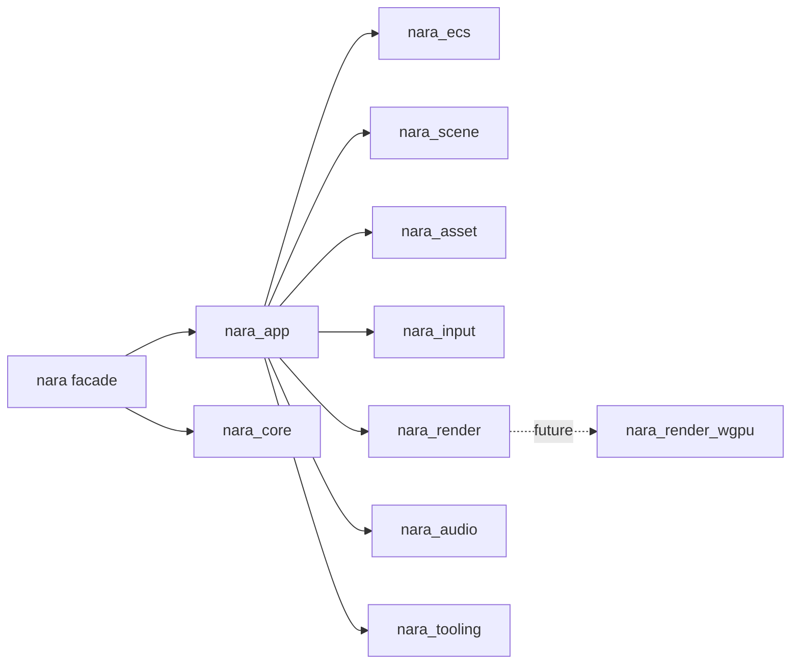

# ADR 0001: Runtime Workspace Boundaries

**Status**: Accepted
**Date**: 2026-07-08

## Context

nara is starting from an empty Rust repository but targets a long-lived engine architecture: strict ECS, code-first authoring, backend isolation, and future AI-generated scene/gameplay data. The first architectural decision is therefore the crate boundary, not a renderer feature.

## Decision

Use a multi-crate workspace with a small `nara` facade and focused runtime crates:

`nara_render` exposes renderer-facing data and a `RenderBackend` trait. It does not own wgpu directly. Scene hierarchy remains ECS data (`Parent`, `Children`) rather than a runtime object tree.

## Alternatives Considered

### Option A: Multi-crate workspace with facade (Chosen)

**Pros**: Enforces boundaries early, keeps backend dependencies local, gives users a stable `nara::prelude::*`, and lets AI agents reason about small modules.

**Cons**: More Cargo files and coordination overhead at the start.

### Option B: Single crate with modules

**Pros**: Fastest initial implementation.

**Cons**: Backend/tooling dependencies can leak into runtime code, and boundaries become convention-only.

### Option C: Godot-style scene tree as the primary model

**Pros**: Familiar editor mental model and easy tree inspection.

**Cons**: Conflicts with strict ECS, encourages callback-heavy objects, and weakens Rust-native typed data flow.

## Consequences

- `nara_ecs` can evolve storage internals without forcing renderer or tooling changes.
- `nara_render_wgpu`, `nara_winit`, and editor crates can be added later without changing gameplay component APIs.
- The facade must stay disciplined: it re-exports stable user-facing concepts but does not become an implementation crate.

## Success Metrics

| Metric | Target | Measurement |
|---|---:|---|
| Workspace health | `cargo check --workspace` passes | CI/local |
| Test health | `cargo nextest run --workspace` passes | CI/local |
| Backend isolation | No `wgpu::` usage in core gameplay crates | `rg "wgpu::" crates src` |
| API smoke test | `examples/hello_world.rs` compiles | CI/local |

## Risks and Mitigations

| Risk | Severity | Likelihood | Mitigation |
|---|---|---:|---|
| Crate sprawl before product value | Medium | Medium | Keep crates empty/light until an interface is exercised |
| Facade hides too much complexity | Medium | Low | Keep direct crate imports supported |
| Renderer seam misses real wgpu constraints | High | Medium | Build `nara_render_wgpu` next and revise only the backend trait if needed |
