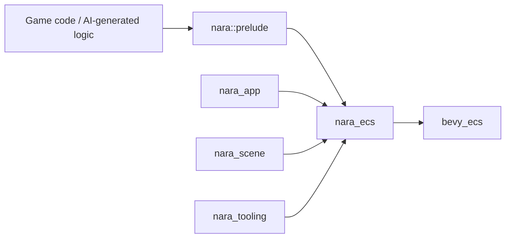

# ADR 0002: Use Bevy ECS as the ECS Substrate

**Status**: Accepted
**Date**: 2026-07-08

## Context

nara targets a strict data-driven runtime where components are pure data, systems are pure logic,
and scene hierarchy is represented by ECS relation components. The hard engineering question is
whether nara should self-build the ECS core or stand on an existing Rust-native ECS.

Rust makes ECS ergonomics expensive to implement correctly. A production ECS must handle typed
queries, mutable borrow conflicts, resources, commands, system parameter extraction, scheduling,
change detection, and parallel execution without leaking unsoundness into user code.

## Decision

Use `bevy_ecs` as nara's Phase 1 ECS substrate.

`nara_ecs` should be a thin product-facing layer over `bevy_ecs`, not an independent ECS
implementation. nara may re-export common authoring types such as `World`, `Entity`, `Query`,
`Res`, `ResMut`, `Commands`, `Component`, `Resource`, and `Schedule` through `nara::prelude::*`.

The boundary is:

nara owns the product layer around the ECS:

- `nara_app` owns app lifecycle, plugin policy, schedules, and runner integration.
- `nara_scene` owns scene/prefab serialization semantics.
- `nara_asset` owns asset identity and typed handles.
- `nara_tooling` owns inspector and AI-facing metadata.
- `nara_render` owns extraction and renderer backend seams.

## Alternatives Considered

### Option A: Use `bevy_ecs` through `nara_ecs` (Chosen)

**Pros**: Mature Rust-native system model, strong query ergonomics, schedule support, resource
borrowing, commands, change detection, and a clear path to reflection integration.

**Cons**: nara inherits part of Bevy ECS's mental model, and deep future replacement becomes
harder once public APIs expose Bevy-shaped types.

**Decision**: Chosen. The ECS is not nara's differentiator in Phase 1; nara's differentiator is the
product boundary, scene/data workflow, AI-friendly schema, and focused 2D/3D runtime experience.

### Option B: Self-build a nara ECS

**Pros**: Full control over API shape, storage, schedule semantics, and serialization hooks.

**Cons**: High risk, long timeline, easy to underbuild query safety and scheduling, delays the
actual engine experience.

**Decision**: Rejected for Phase 1. Revisit only if a concrete nara requirement cannot be met by
`bevy_ecs` without unacceptable public API cost.

### Option C: Use a smaller ECS such as `hecs` or `shipyard`

**Pros**: Smaller dependency surface and more library-like feel, closer to EnTT's minimal runtime
style.

**Cons**: nara would still need to build more app scheduling, reflection, and tooling integration
itself.

**Decision**: Rejected for the default path, but useful as references for EnTT-like ergonomics.

### Option D: Bind to a C/C++ ECS such as Flecs-style APIs

**Pros**: Mature ECS runtime concepts and ecosystem experience outside Rust.

**Cons**: Weaker Rust-native type story, more FFI/runtime boundary complexity, and less natural
integration with Rust derives and reflection.

**Decision**: Rejected for nara's Rust-native product goal.

## Consequences

- `nara_ecs` should stop growing a separate placeholder ECS once this ADR is implemented.
- Public examples should teach the Bevy ECS system style through nara imports.
- nara should avoid pretending ECS internals are portable if it exposes `bevy_ecs` semantics.
- A future ECS replacement would be a major compatibility event, not an incidental refactor.

## Success Metrics

| Metric | Target | Measurement |
|---|---:|---|
| Authoring ergonomics | User can write `fn system(q: Query<...>, commands: Commands)` | Example compiles |
| Dependency scope | Only ECS-related crates depend on `bevy_ecs` directly | `cargo tree` / `rg "bevy_ecs"` |
| Runtime health | Workspace checks and tests pass | `cargo check --workspace`, `cargo nextest run --workspace` |
| Product ownership | `nara_app` does not depend on `bevy_app` | `cargo tree -p nara_app` |
| ECS replacement honesty | ADR documents compatibility cost | This ADR remains linked from docs |

## Risks and Mitigations

| Risk | Severity | Likelihood | Mitigation |
|---|---|---:|---|
| nara becomes a Bevy facade instead of its own engine | High | Medium | Do not adopt `bevy_app`, `bevy_render`, or `bevy_asset` by default |
| Public API leaks too many Bevy-specific names | Medium | Medium | Re-export intentionally through `nara_ecs` and document what is stable |
| Bevy ECS version churn affects nara users | Medium | Medium | Pin versions, expose migration notes, and keep nara examples as compatibility tests |
| Self-built placeholder code diverges from the chosen substrate | High | Medium | Replace placeholder ECS code early with a thin `bevy_ecs` layer |

