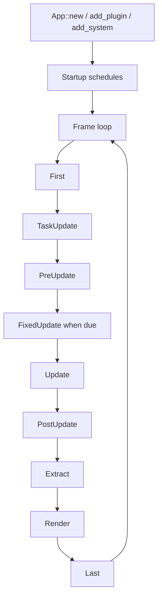

# ADR 0003: Own App, Plugin, and Schedule Lifecycle

**Status**: Accepted
**Date**: 2026-07-08
**Last Revised**: 2026-07-14
**Refined By**: ADR 0010: Plugin Lifecycle, Dependencies, and Failure Containment; ADR 0046:
Plugin Metadata and Default Plugin Groups; ADR 0056: Headless Runtime and Dedicated Server Readiness

## Context

nara will use `bevy_ecs` for the ECS substrate, but the engine's product boundary should not be
defined by Bevy's full application stack. nara needs a smaller, code-first lifecycle that stays
friendly to AI-generated code, headless runs, future editor inspection, and focused runtime
backends.

The app layer is where engine identity accumulates: plugin policy, startup stages, frame stages,
runner ownership, fixed timestep, extraction boundaries, error handling, and feature defaults.

## Decision

nara owns `App`, `Plugin`, schedule labels, and runner integration in `nara_app`.

Do not adopt `bevy_app` as the application layer. nara may learn from Bevy's plugin shape, but the
runtime lifecycle remains nara-owned.

The initial lifecycle should stay small:



Recommended stage vocabulary:

| Area | Stage Names | Purpose |
|---|---|---|
| Startup | `Core`, `Platform`, `Runtime`, `Scene`, `Tooling` | One-time initialization order |
| Frame | `First`, `TaskUpdate`, `PreUpdate`, `FixedUpdate`, `Update`, `PostUpdate`, `Extract`, `Prepare`, `Queue`, `Sort`, `Render`, `Cleanup`, `Last` | Repeated runtime flow |

Plugin shape:

```rust
pub trait Plugin {
    fn build(&self, app: &mut App) -> Result<(), PluginError>;
}
```

Plugin setup is fallible. Pure group/slot/duplicate/prerequisite closure returns structured
`PluginPlanError` values before App mutation. App-level preflight/build/finish failures return
structured `PluginError` values instead of panic-based helpers, as refined by ADRs 0010 and 0046.

## Alternatives Considered

### Option A: nara-owned app lifecycle with Bevy ECS schedules (Chosen)

**Pros**: Keeps product semantics under nara control while relying on mature ECS scheduling
primitives underneath.

**Cons**: Requires nara to define and maintain lifecycle conventions.

**Decision**: Chosen. This gives nara a stable identity without rebuilding ECS internals.

### Option B: Use `bevy_app`

**Pros**: Mature plugin and schedule ecosystem, fewer lines of nara infrastructure.

**Cons**: Pulls nara toward Bevy's product model, default plugin assumptions, sub-app behavior, and
schedule vocabulary.

**Decision**: Rejected. nara should not become a thin Bevy engine distribution.

### Option C: Minimal manual loop with no plugin abstraction

**Pros**: Very simple early implementation.

**Cons**: Backends, tooling, scene loading, and tests would invent ad hoc setup paths.

**Decision**: Rejected. Plugins are a core composition boundary for engines.

## Consequences

- `nara_app` is the owner of engine startup and frame semantics.
- `nara_app` can use `bevy_ecs::Schedule` internally or through `nara_ecs`.
- Window, renderer, audio, input, and tooling integrations should arrive as nara plugins.
- Headless and test runners should be first-class enough that engine systems can run without a
  window.
- Background task results apply through the `TaskUpdate` frame stage before gameplay update stages.

## Success Metrics

| Metric | Target | Measurement |
|---|---:|---|
| Minimal app | A user can create an app, add a plugin, and run/update | Example compiles |
| Headless support | Core schedules can run without winit/wgpu | Unit or smoke test |
| Product boundary | `nara_app` does not depend on `bevy_app` | `cargo tree -p nara_app` |
| Schedule clarity | All built-in stages are documented | Public docs and ADR |
| Backend readiness | Renderer/window plugins can own fallible init later | Interface review |

## Risks and Mitigations

| Risk | Severity | Likelihood | Mitigation |
|---|---|---:|---|
| Lifecycle becomes too Bevy-like without the ecosystem benefits | Medium | Medium | Keep stage set small and document nara-specific reasons |
| Plugins need dependency ordering earlier than expected | Medium | Medium | Add plugin labels/dependencies only when real plugins need them |
| Fallible backend initialization conflicts with `Plugin::build` | Medium | Medium | Reserve a later `Runner`/backend init phase rather than overloading ECS setup |
| Fixed timestep policy becomes hard to change | Medium | Low | Keep fixed update as an app policy, not a renderer policy |
