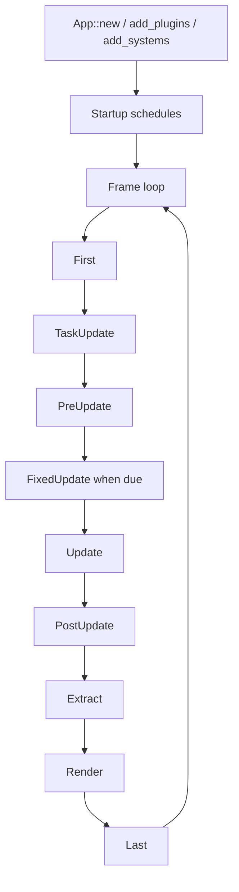

# ADR 0003: Own App, Plugin, and Schedule Lifecycle

**Status**: Accepted
**Date**: 2026-07-08
**Last Revised**: 2026-07-16
**Refined By**: ADR 0010: Plugin Lifecycle, Dependencies, and Failure Containment; ADR 0046:
Plugin Metadata and Default Plugin Groups; ADR 0056: Headless Runtime and Dedicated Server Readiness

## Context

nara will use `bevy_ecs` for the ECS substrate, but the engine's product boundary should not be
defined by Bevy's full application stack. nara needs a smaller, code-first lifecycle that stays
friendly to AI-generated code, headless runs, future editor inspection, and focused runtime
backends.

The app layer is where engine identity accumulates: plugin policy, startup stages, frame stages,
runner ownership, fixed timestep, extraction boundaries, error handling, and feature defaults.

## Decision

nara owns `App`, `Plugin`, schedule labels, and runner integration in `nara_app`.

Do not adopt `bevy_app` as the application layer. nara may learn from Bevy's plugin shape, but the
runtime lifecycle remains nara-owned.

The initial lifecycle should stay small:



Recommended stage vocabulary:

| Area | Stage Names | Purpose |
|---|---|---|
| Startup | `Core`, `Platform`, `Runtime`, `Scene`, `Tooling` | One-time initialization order |
| Frame | `First`, `TaskUpdate`, `PreUpdate`, `FixedUpdate`, `Update`, `PostUpdate`, `Extract`, `Prepare`, `Queue`, `Sort`, `Render`, `Cleanup`, `Last` | Repeated runtime flow |

These labels define the engine-owned schedules that the standard runner drives automatically; they
are not the only schedules an `App` may contain. The schedule registry must accept arbitrary typed
`ScheduleLabel` values and expose one `add_systems(label, systems)` shape for startup, frame, and
custom schedules. It must also support type-safe set configuration and explicit custom-schedule
initialization/inspection without exposing Bevy `NodeId` values as durable identity.

A custom schedule is inert until an owner explicitly runs it. This ADR does not let third-party
code splice arbitrary schedules into the standard main loop: the engine-owned automatic order
remains closed until a concrete domain proves an insertion policy. Keeping the registry open while
the automatic driver stays closed preserves extension capability without making frame order an
ambient plugin side effect.

Only schedule labels and system sets explicitly documented as **public semantic anchors** are
extension compatibility promises. A built-in schedule label or domain-owned system set becomes an
anchor only when its owning domain documents the contract. A schedule-label anchor is a typed
registration/participation point; a joinable set anchor supports membership and documented
before/after ordering. Extensions do not order against a schedule label, concrete first-party system
function, private subset, or incidental registration order.

The first-playable compatibility inventory is deliberately small:

| Anchor | Owning schedule | Participation | Supported purpose |
|---|---|---|---|
| `CoreStage::FixedUpdate` | Engine main loop | Schedule label | Register work in the exact fixed-tick schedule |
| `FixedUpdateSet::Simulate` | `CoreStage::FixedUpdate` | Joinable phase | Run authoritative fixed-tick simulation |
| `GameplayCommandSet::Consume` | `CoreStage::FixedUpdate` | Joinable phase | Consume the current authoritative gameplay-command batch |
| `GameplayCommandSet::Capture` | `CoreStage::FixedUpdate` | Joinable phase | Observe consumed commands for replay/debug capture before engine acknowledgement |

Unlisted public enum variants remain callable Rust API during pre-1.0 development but are not
third-party ordering promises. A later product unit, including desktop input work, must extend this
inventory and the external conformance fixture before relying on another public edge.

Every public anchor must document:

- its owning schedule and the state visible when the anchor begins;
- the consumer-visible completion point and deferred-command flush behavior;
- run-condition and skip behavior;
- App/domain error behavior and whether a later runtime layer escalates it; and
- its relation to transient cleanup or retention.

A domain owns ordering inside its private sets. Concrete product composition owns cross-domain
ordering and verifies that every referenced set anchor is installed in the intended schedule and
that the schedule-label participation point exists. An absent set or a set in another schedule does
not silently create an ordering edge. Renaming, splitting,
merging, or changing the semantic completion point of a public anchor is a compatibility change.
Before `App::seal` succeeds, the App must build and validate every schedule containing a public
anchor, including the required set graph and deferred-command insertion policy. A plugin may
configure an App before sealing, but a graph/settings change that invalidates an anchor contract
rejects sealing; after sealing, public APIs expose no schedule-configuration mutation. Custom
schedules remain owner-defined and are not constrained by this validation unless their owner
publishes its own semantic anchors. This policy does not add another scheduler wrapper, a global
stage DSL, or public access to every first-party system.

For the first-playable anchors in `CoreStage::FixedUpdate`, seal validation specifically requires
automatic deferred insertion to remain enabled and reasserts the schedule's final deferred
application before configuration closes. A relation that uses Bevy's `before_ignore_deferred`,
`after_ignore_deferred`, or equivalent ignore-deferred chaining explicitly opts out of the public
anchor visibility contract and cannot be presented as a supported compatibility edge. Nara does not
add a scheduler wrapper solely to discover and reject that trusted advanced opt-out. Custom
schedules without Nara public anchors may choose different policies.

This is not a total-order promise for every system inside a joinable phase. Unordered peer systems
remain unordered unless their owner declares a relation; general Bevy ambiguity detection is not
silently promoted into a Nara compatibility guarantee. Seal certifies the published anchor graph,
its required lifecycle edges, and deferred visibility, not incidental ordering among unrelated
members.

```rust
app.add_systems(StartupStage::Scene, load_level)?;
app.add_systems(CoreStage::Update, gameplay)?;
app.add_systems(MyDomainSchedule, domain_work)?;
app.configure_sets(MyDomainSchedule, DomainSet::Simulate)?;
```

Plugin shape:

```rust
pub trait Plugin {
    fn declaration() -> &'static PluginDeclaration
    where
        Self: Sized;

    fn preflight(&self, context: &PluginPreflightContext<'_>) -> Result<(), PluginError>;
    fn build(&self, app: &mut App) -> Result<(), PluginError>;
    fn finish(&self, app: &mut App) -> Result<(), PluginError>;
    fn shutdown(&self, context: &mut PluginShutdownContext<'_>) -> Result<(), PluginError>;
}
```

Plugin setup is fallible. Pure group/slot/duplicate/prerequisite closure returns structured
`PluginPlanError` values before App mutation, repeatable factory preparation returns
`PluginPrepareError`, and App-level preflight/build/finish failures return structured `PluginError`
values instead of panic-based helpers. `App::seal` closes configuration and returns a `SealedApp`;
terminal teardown uses `shutdown`, not the frame/startup-overloaded `cleanup` vocabulary. ADRs 0010
and 0046 define the detailed lifecycle and composition contracts.

The implemented code-first managed path consumes a sealed, unstarted `App` through
`RuntimeCandidate` and then `RuntimeInstance`. The wrapper owns generation, control, fault, and
registered close-obligation state only; the enclosed `App` remains the sole `World`, schedule,
plugin, time, and tracker authority. A raw `App::set_runner` / `App::run` route remains available for
embedding and is mutually exclusive with candidate admission. Dropping a raw `App` gives registered
close participants one best-effort begin/poll pass, while retryable and truthfully observable close
belongs to `RuntimeInstance`.

## Alternatives Considered

### Option A: nara-owned app lifecycle with Bevy ECS schedules (Chosen)

**Pros**: Keeps product semantics under nara control while relying on mature ECS scheduling
primitives underneath.

**Cons**: Requires nara to define and maintain lifecycle conventions.

**Decision**: Chosen. This gives nara a stable identity without rebuilding ECS internals.

### Option B: Use `bevy_app`

**Pros**: Mature plugin and schedule ecosystem, fewer lines of nara infrastructure.

**Cons**: Pulls nara toward Bevy's product model, default plugin assumptions, sub-app behavior, and
schedule vocabulary.

**Decision**: Rejected. nara should not become a thin Bevy engine distribution.

### Option C: Minimal manual loop with no plugin abstraction

**Pros**: Very simple early implementation.

**Cons**: Backends, tooling, scene loading, and tests would invent ad hoc setup paths.

**Decision**: Rejected. Plugins are a core composition boundary for engines.

### Option D: Treat every public label, set, or system as a stable ordering point

**Pros**: Third-party code can attach itself to any visible implementation detail immediately.

**Cons**: Ordinary refactors become ecosystem breaks, system-function paths become accidental ABI,
and ordering against absent or cross-schedule targets can look valid while doing nothing.

**Decision**: Rejected. Compatibility is explicit and semantic rather than inferred from Rust
visibility.

## Consequences

- `nara_app` is the owner of engine startup and frame semantics.
- `nara_app` can use `bevy_ecs::Schedule` internally or through `nara_ecs`.
- Built-in startup/frame schedules and arbitrary custom schedules share one type-directed authoring
  Interface. `run_schedule` is the explicit custom driver, seals before executing a registered
  custom schedule, and rejects built-in schedule labels; built-in schedules remain exclusively
  driven by the App lifecycle.
- Third-party domains order against documented semantic anchors. Concrete first-party systems,
  private subsets, and registration order remain implementation details.
- Window, renderer, audio, input, and tooling integrations should arrive as nara plugins.
- Headless and test runners should be first-class enough that engine systems can run without a
  window.
- Background task results apply through the `TaskUpdate` frame stage before gameplay update stages.
- First-party platform adapters drive `RuntimeInstance` rather than retaining raw `&mut App`
  authority. Short-lived driver scopes may project normalized platform state into the enclosed
  world without exposing the `App` or its schedules.
- ADR 0084 remains Proposed: the landed code-first candidate/runtime slice is evidence for that
  decision, not acceptance of its future product Host and reconstruction topology.

## Success Metrics

| Metric | Target | Measurement |
|---|---:|---|
| Minimal app | A user can create an app, add a plugin, and run/update | Example compiles |
| Headless support | Core schedules can run without winit/wgpu | Unit or smoke test |
| Product boundary | `nara_app` does not depend on `bevy_app` | `cargo tree -p nara_app` |
| Schedule clarity | All built-in stages are documented | Public docs and ADR |
| Schedule extension | A third-party domain can register systems and sets in its own typed schedule without modifying `nara_app` | Public compile and schedule-run test |
| Schedule compatibility | A renamed-dependency external domain registers in the public schedule anchor, joins/orders only against public set anchors, and observes their deferred, skip, fault, and cleanup contracts | External conformance fixture |
| Driver authority | A custom schedule does not enter the automatic frame order without an explicit admitted owner | Order and negative tests |
| Managed runtime authority | A platform adapter cannot bypass runtime control/fault/close state by calling `App::run_once` directly | Runtime driver boundary tests |
| Backend readiness | Renderer/window plugins can own fallible init later | Interface review |

## Risks and Mitigations

| Risk | Severity | Likelihood | Mitigation |
|---|---|---:|---|
| Lifecycle becomes too Bevy-like without the ecosystem benefits | Medium | Medium | Keep stage set small and document nara-specific reasons |
| Closed built-in stages become a closed extension ecosystem | High | Medium | Keep the schedule registry open while separating registration from automatic-drive admission |
| Arbitrary custom schedules silently perturb frame order | High | Medium | Custom schedules are inert by default; add automatic insertion only through an explicit future contract |
| Packages depend on incidental systems or ambiguous set edges | High | Medium | Publish a small semantic-anchor surface and test absent, cross-schedule, deferred, skipped, faulted, and cleanup behavior from an external crate |
| Plugins need dependency ordering earlier than expected | Medium | Medium | Add plugin labels/dependencies only when real plugins need them |
| Fallible backend initialization conflicts with `Plugin::build` | Medium | Medium | Reserve a later `Runner`/backend init phase rather than overloading ECS setup |
| Fixed timestep policy becomes hard to change | Medium | Low | Keep fixed update as an app policy, not a renderer policy |

## Citations

- Bevy main-schedule ordering: `repo-ref/bevy/crates/bevy_app/src/main_schedule.rs`
- Bevy schedule ordering and deferred semantics: `repo-ref/bevy/crates/bevy_ecs/src/schedule/config.rs`
- Bevy render semantic sets: `repo-ref/bevy/crates/bevy_render/src/lib.rs`
- Comparative research note:
  `../../knowledge/engineering/subagents/2026-07/2026-07-16-bevy-godot-early-architecture-research.md`
