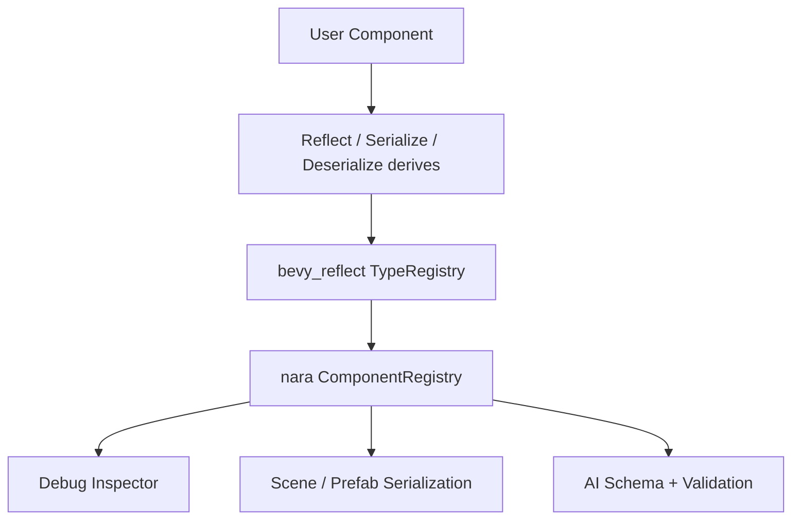

# ADR 0004: Use Bevy Reflect-Backed Component Metadata

**Status**: Accepted
**Date**: 2026-07-08

## Context

nara's roadmap depends on inspecting, serializing, validating, and editing ECS data:

- Scene and prefab serialization.
- Component inspector and debug UI.
- AI-generated scene/component data.
- Future editor tooling and hot reload.

Rust's static type system is a strength for gameplay code, but editor/tooling workflows need runtime metadata. nara needs a component metadata layer without weakening normal typed systems.

## Decision

Use Bevy's reflection ecosystem as the metadata substrate and define a nara-owned `ComponentRegistry` concept above it.

The lower layer can use `bevy_reflect::TypeRegistry` and derived reflection. The nara layer defines what the engine promises to tools and AI: serializable components, inspectable fields, default construction, schema export, and migration/version rules.

Important distinction: gameplay systems should stay strongly typed. Reflection is for tooling, serialization, and data interchange, not normal runtime logic.

## Alternatives Considered

### Option A: Use `bevy_reflect` under nara metadata (Chosen)

**Pros**: Mature Rust reflection ecosystem, integrates well with Bevy ECS direction, supports field inspection and serialization workflows.

**Cons**: nara inherits Bevy reflection semantics and derive constraints.

**Decision**: Chosen because reflection is central to tooling and too expensive to invent early.

### Option B: Use Serde only

**Pros**: Familiar, stable, simple for file formats.

**Cons**: Does not provide enough runtime field/type metadata for inspectors, patching, or schema-driven editing.

**Decision**: Rejected as the only metadata layer; Serde remains useful for file IO.

### Option C: Custom nara reflection

**Pros**: Full control over schema and editor semantics.

**Cons**: High implementation cost and duplicate ecosystem work.

**Decision**: Rejected for Phase 1.

## Consequences

- Serializable/inspectable components should opt into reflection metadata.
- Some runtime-only components may remain non-reflectable.
- Scene/prefab data should be designed around registered component metadata, not arbitrary untyped blobs.
- AI-facing schema generation should be a nara layer, not raw Bevy reflection exposed directly.

## Success Metrics

| Metric | Target | Measurement |
|---|---:|---|
| Metadata registration | Components can be registered once and inspected | Unit/example test |
| Strong typed runtime | Normal gameplay uses typed `Query`/`Res`, not reflection | Code review |
| Scene readiness | Registered components can be serialized/deserialized through nara scene pipeline | Future test |
| AI validation | Component schemas can be exported from registry | Future test |

## Risks and Mitigations

| Risk | Severity | Likelihood | Mitigation |
|---|---|---:|---|
| Reflection infects gameplay code | High | Medium | Keep typed ECS APIs primary; reflection only in tooling/serialization layers |
| Registry becomes too generic | Medium | Medium | Define concrete use cases first: inspector, scene IO, schema export |
| Version migration ignored | Medium | High | Add component version/migration design before stable scene files |

## Citations

- ECS substrate decision: [0002-use-bevy-ecs-as-ecs-substrate.md](0002-use-bevy-ecs-as-ecs-substrate.md)
- Session memory: [../../knowledge/engineering/decisions/2026-07-08T020051Z-nara-ecs-substrate-discussion.md](../../knowledge/engineering/decisions/2026-07-08T020051Z-nara-ecs-substrate-discussion.md)
