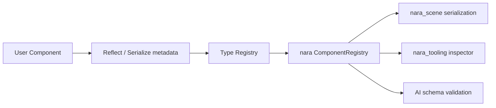

# ADR 0004: Use Reflection-Backed Component Metadata

**Status**: Proposed
**Date**: 2026-07-08

## Context

nara's Phase 2 and Phase 3 goals depend on runtime-accessible component metadata:

- Scene and prefab serialization.
- Component Inspector and debug panels.
- AI-generated JSON/RON data validation.
- Hot reload and patching.
- Future editor state inspection.

Rust's static type system is a major advantage for gameplay code, but editor/tooling workflows need
a controlled reflection surface. nara should define this surface early so serialization and tooling
do not grow separate incompatible registries.

## Decision

Adopt a reflection-backed `ComponentRegistry` concept in nara.

The preferred implementation direction is to use Bevy's reflection ecosystem, especially
`bevy_reflect`, because it is already designed to pair with `bevy_ecs` and Rust derives. nara should
not expose the full reflection implementation as its product contract until a small spike verifies
the exact derive and serialization flow.

Conceptual shape:

Initial registry responsibilities:

- Register component type names and stable schema identifiers.
- Mark whether a component is serializable, inspectable, spawnable from data, or runtime-only.
- Provide enough metadata for scene loading and inspector editing.
- Keep runtime-only components possible without forcing every component to serialize.

## Alternatives Considered

### Option A: Bevy-reflect-backed registry (Recommended)

**Pros**: Aligns with `bevy_ecs`, supports derive-based metadata, and gives nara a credible path to
inspector and serialization tooling.

**Cons**: Adds another Bevy-shaped substrate and may expose complex reflection details if not
carefully wrapped.

**Decision**: Recommended, pending a small spike that proves scene serialization and inspector field
editing against real components.

### Option B: Serde-only component serialization

**Pros**: Simple, familiar, and excellent for file formats.

**Cons**: Serde alone does not provide rich runtime field inspection, patching, type registry, or
editor metadata.

**Decision**: Rejected as the only metadata layer. Serde can remain part of the file-format story.

### Option C: Custom nara reflection system

**Pros**: Full control over schema shape and AI-facing constraints.

**Cons**: High implementation burden, duplicates mature Rust ecosystem work, and risks becoming a
parallel type system.

**Decision**: Rejected for Phase 1/2 unless Bevy reflection fails a concrete nara requirement.

### Option D: No reflection; generated schemas only

**Pros**: Strong static artifacts and potentially very AI-friendly files.

**Cons**: Inspector and runtime patching become awkward, and schema generation still needs a type
metadata source.

**Decision**: Deferred as a supplement, not a replacement.

## Consequences

- Components should be categorized as runtime-only or data-facing.
- Scene/prefab files should not require all ECS components to be serializable.
- The registry should become the bridge between ECS, scene loading, tooling, and AI validation.
- nara needs an early spike before marking this ADR accepted.

## Success Metrics

| Metric | Target | Measurement |
|---|---:|---|
| Component registration | A custom component can be registered once and discovered by tooling | Unit test |
| Scene serialization | A simple entity with data-facing components round-trips | Serialization test |
| Runtime-only support | A non-serializable component can still exist in ECS | Compile/test |
| Inspector path | Tooling can enumerate fields for at least one component | Smoke test |
| AI schema path | Registry can emit or validate a minimal component schema | Design spike |

## Risks and Mitigations

| Risk | Severity | Likelihood | Mitigation |
|---|---|---:|---|
| Reflection API leaks too much complexity into users' first hour | Medium | Medium | Keep reflection derives optional for runtime-only components |
| Registry duplicates Bevy's `TypeRegistry` poorly | Medium | Medium | Treat nara registry as policy metadata over the substrate registry |
| Serialized type names become unstable | High | Medium | Define stable schema IDs instead of relying only on Rust paths |
| AI-generated data bypasses validation | High | Medium | Make scene loading go through registry validation |

