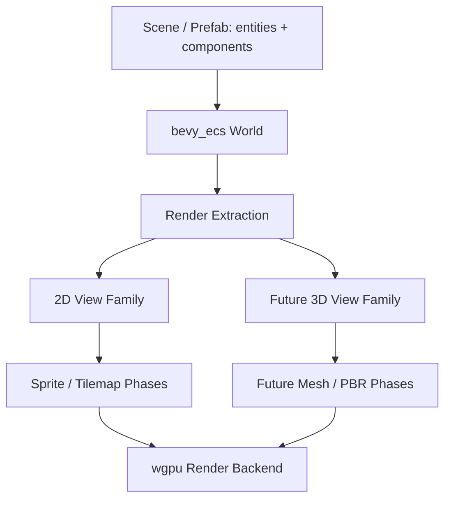

# ADR 0005: Dimension-Aware Runtime with 2D-First Authoring

**Status**: Accepted
**Date**: 2026-07-08
**Refined By**: ADR 0053: Visibility, Culling, and Tilemap Render Cache (Superseded); ADR 0096:
Evidence-Gated Render Scaling and Upload Policy; ADR 0097: Future-Capable 2D and 3D Spatial
Transform Model

## Context

nara wants an excellent 2D authoring experience, but it is intended to grow into a mature game engine rather than a small 2D framework. The architecture must not make future 3D support a retrofit.

The tension:

- 2D-first authoring keeps Phase 1 approachable for independent developers, AI-generated games, sprite workflows, and tilemaps.
- Mature engine foundations need extension points for 3D cameras, meshes, materials, visibility, culling, render phases, lighting, animation, physics, and editor tooling.

The goal is not to avoid complexity. The goal is to put complexity behind deep modules with stable interfaces so users get a simple 2D experience while the engine keeps room for 3D.

## Decision

nara will use a **dimension-aware runtime** with **2D-first authoring**.

This means:

- User-facing Phase 1 APIs optimize for 2D: `Transform2d`, `Camera2d`, `Sprite`, `Tilemap`, `Layer`, `SortKey`, `Handle<ImageAsset>`, and `TextureRegion`.
- Runtime infrastructure must be designed as multi-domain from the start: scene storage, asset handles, render extraction, view/camera targets, render phases, and plugin lifecycle must not assume 2D only.
- 3D support should be added as parallel domain modules later: `Transform3d`, `Camera3d`, `Mesh`, `Material3d`, `Light`, `SpatialBounds`, `Visibility3d`, and 3D render phases.
- Scene and prefab files remain component-based and dimension-neutral. A scene is entities plus registered components, not a "2D scene" or "3D scene" file type.
- Public transform authoring is split by domain: `Transform2d`/`GlobalTransform2d` now, `Transform3d`/`GlobalTransform3d` later. Internal hierarchy and propagation mechanisms should share infrastructure where practical.
- Public cameras are split by domain: `Camera2d` now, `Camera3d` later. Rendering internals meet at a shared `View`/`ExtractedView` abstraction.
- Rendering uses a phase-based pipeline from day one: `Extract -> Prepare -> Queue -> Sort -> Render -> Cleanup`. A full render graph is deferred.
- Tilemap is a first-class 2D authoring model, not a mesh concept exposed to users. Internally it can lower to chunked mesh/instance/batch render data.



## Architectural Rules

### Rule 1: Separate authoring concepts where users benefit

`Transform2d` and `Camera2d` are allowed to be first-class because 2D authoring is clearer when users do not constantly think in quaternions, perspective projection, or 3D depth.

Future 3D should add `Transform3d` and `Camera3d` rather than forcing 2D users into a universal 3D transform too early.

The propagation infrastructure should still be mature: shared hierarchy traversal, dirty tracking, and scheduling are allowed when they reduce duplication without weakening the 2D authoring interface.

### Rule 2: Cameras split publicly and converge into internal views

`Camera2d` and `Camera3d` should be distinct authoring components. A 2D camera can expose pixel-perfect options, zoom, orthographic defaults, layers, and snap behavior without carrying 3D projection vocabulary.

Renderer internals should extract both camera families into a common view description:

```text
View / ExtractedView
RenderTarget
ViewportRect
ClearColor
RenderLayers
RenderOrder
```

This gives the renderer a mature path for multi-camera and future 3D without making the public 2D API generic and vague.

### Rule 3: Share infrastructure below authoring components

These mechanisms must be dimension-neutral or multi-domain from the start:

- Entity identity and hierarchy relations.
- Scene/prefab storage.
- Asset handles and asset server.
- Component registry and reflection metadata.
- App/plugin lifecycle.
- Render extraction and backend scheduling.
- View targets, frame graph concepts, and frame diagnostics.

### Rule 4: Do not expose a vague universal `Renderable`

Avoid a user-facing "render anything" component too early. It usually becomes a shallow abstraction that leaks every pipeline detail.

Prefer explicit authoring components:

```text
Sprite
Tilemap
Mesh3d
Light
Camera2d
Camera3d
```

Internally, extraction can translate these into compact render items and render phases.

### Rule 5: Build mature internal seams even if Phase 1 only renders sprites

The 2D renderer should not be a one-off draw loop. It should sit behind a renderer module with phases that can later host 3D:

```text
Extract -> Prepare -> Queue -> Sort -> Render -> Cleanup
```

Phase 1 can implement only the sprite/tilemap path, but the interface should make future mesh/material phases additive.

### Rule 6: Make tilemap a first-class 2D domain

Tilemap should be authored as tile data, not as user-facing mesh data:

```text
Tilemap
TileLayer
Tileset
TileCoord
TileIndex
```

Internally, tilemap rendering can lower into chunked meshes, instance buffers, atlas batches, or other GPU-friendly data. That lowering is an implementation detail of the 2D render domain.

## Alternatives Considered

### Option A: 2D-only engine core

**Pros**: Simplest implementation, fastest sprite MVP, smallest public surface.

**Cons**: High future migration cost; scene, transform, renderer, and asset assumptions may need replacement when 3D arrives.

**Decision**: Rejected. nara should not become a 2D toy engine by accident.

### Option B: Unity-style universal 3D transform from day one

**Pros**: 3D arrives naturally; one transform/camera/visibility model can serve both 2D and 3D.

**Cons**: 2D users inherit 3D mental overhead; AI-generated 2D code becomes noisier; sprite/tilemap ergonomics suffer.

**Decision**: Not chosen for the authoring layer. Some internal mechanisms may still use shared math and view abstractions.

### Option C: Dimension-aware runtime with 2D-first authoring (Chosen)

**Pros**: Preserves simple 2D API while keeping mature 3D extension points. Matches nara's code-first and AI-friendly goals without closing off a full engine future.

**Cons**: More internal design work early; transform, camera, visibility, and rendering need clear domain separation.

**Decision**: Chosen.

## Consequences

- The renderer architecture must be more mature than a minimal sprite example, even before 3D is implemented.
- 2D and 3D may have parallel components and systems, but they should share scene, asset, app, reflection, and backend infrastructure.
- Documentation and examples should present the 2D path first while keeping names explicit enough for later 3D additions.
- Future editor/tooling must inspect component domains rather than assume all spatial entities are 2D.
- nara should not introduce a separate ADR only for the "do not fear complexity" principle. That principle is captured here as a constraint on mature runtime foundations: complex internals are acceptable when they create a deeper, more stable interface.

## Success Metrics

| Metric | Target | Measurement |
|---|---:|---|
| 2D authoring simplicity | Sprite scene can be declared with `Transform2d`, `Camera2d`, `Sprite` | Example compile test |
| 3D extensibility | Adding `Transform3d`/`Camera3d` does not require changing scene file identity or app lifecycle | Design/code review |
| Renderer maturity | Sprite renderer uses extract/prepare/queue/sort/render/cleanup phases | Architecture review |
| No vague render abstraction | No public universal `Renderable` component in Phase 1 | API review |
| Scene neutrality | Scene/prefab storage is component-based, not 2D-file-specific | Scene schema review |

## Risks and Mitigations

| Risk | Severity | Likelihood | Mitigation |
|---|---|---:|---|
| Parallel 2D/3D domains duplicate code | Medium | Medium | Share infrastructure below authoring components; duplicate only where user semantics differ |
| Phase 1 over-engineers render internals | Medium | Medium | Implement minimal phases with clear interfaces; defer full render graph |
| 3D needs force redesign anyway | High | Medium | Validate seams early with a small future `Mesh3d` design spike before locking renderer internals |
| 2D UX degrades from future-proofing | High | Medium | Keep 2D examples and prelude focused on `Transform2d`, `Camera2d`, `Sprite`, and `Tilemap` |

## Follow-Up Questions

- What exact data lives in `View` versus `Camera2d`?
- Should transform propagation be implemented as one generic internal traversal or two systems sharing utilities?
- How should tilemap chunks choose between generated mesh buffers and instanced quads?
- Which parts of the render phase model belong in `nara_render` versus `nara_render_wgpu`?

## Citations

- Bevy reference findings: `repo-ref/bevy/crates/bevy_transform`, `repo-ref/bevy/crates/bevy_camera`, `repo-ref/bevy/crates/bevy_sprite`, `repo-ref/bevy/crates/bevy_sprite_render`, `repo-ref/bevy/crates/bevy_mesh`, `repo-ref/bevy/crates/bevy_pbr`
- Godot reference findings: `repo-ref/godot/scene/2d`, `repo-ref/godot/scene/3d`, `repo-ref/godot/scene/main/viewport.h`, `repo-ref/godot/servers/rendering/rendering_server.h`
- Open discussion tracker: [../open-questions.md](../open-questions.md)
