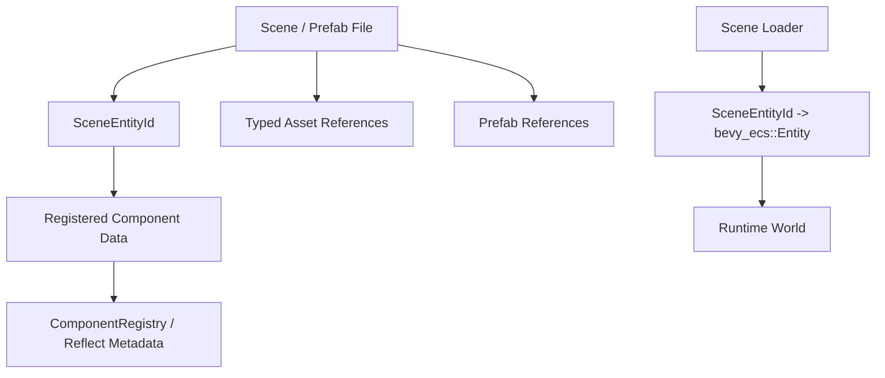

# ADR 0006: Scene and Prefab Data Model

**Status**: Accepted
**Date**: 2026-07-08
**Refined By**: ADR 0038: Scene/Prefab Authoring Identity and Provenance

## Context

nara is code-first and data-driven. Scene and prefab files must support human-authored Rust workflows, AI-generated data, future visual tooling, hot reload, and stable serialization.

The scene model is also where several core decisions meet:

- `bevy_ecs` provides runtime `Entity` values, but those are not stable file identifiers.
- `bevy_reflect`-backed metadata can describe component fields for serialization and tooling.
- Scene hierarchy must remain ECS data, not a Godot-style object tree.
- 2D and future 3D should share the same scene/prefab format.

## Decision

nara scenes and prefabs are **dimension-neutral ECS data documents**.

They store stable scene-local entity identities, component data, hierarchy relationship components, asset handles, and prefab references. They do not store runtime `Entity` values.



Initial principles:

- `SceneEntityId` is stable within a scene or prefab document.
- Runtime `Entity` values are created during instantiation and stored only in an instantiate-time map.
- Hierarchy is represented by components such as `Parent`, `Children`, and `Name`; there is no runtime `Node` base type.
- Scene files are component-based, not 2D-specific or 3D-specific.
- JSON and RON should both be supported by the data model: JSON for AI/tooling interoperability, RON for Rust-native readability.
- Prefab nesting should be supported by the model, but complex override workflows can be phased in after the core instantiate path.

## Data Shape

Conceptually:

```text
SceneDocument
  format_version
  entities: Vec<SceneEntityRecord>
  roots: Vec<SceneEntityId>
  assets: optional asset reference table

SceneEntityRecord
  id: SceneEntityId
  name: optional string
  components: map ComponentTypeId -> ComponentData
  prefab: optional PrefabInstance

PrefabInstance
  source: AssetRef<PrefabDocument>
  overrides: ScenePatchDocument
```

The exact serialized syntax can evolve, but these semantic fields should remain.

Implementation notes as of 2026-07-08:

- `SceneEntityId` is a validated path-like stable ID.
- `SceneComponentRecord` stores `ComponentSchemaVersion` plus `ComponentValue`.
- `PrefabInstance.overrides` is a `ScenePatchDocument`, not a whole-component override map.
- Nested prefab expansion uses `PrefabSourceResolver`; the first adapter is
  `InMemoryPrefabSourceResolver`.
- A prefab instance remains as an anchor entity. Expanded source entities are namespaced as
  `anchor/source_entity`, and source roots are parented to the anchor.

## Alternatives Considered

### Option A: Store runtime `Entity` IDs in scene files

**Pros**: Simple loader prototype.

**Cons**: Runtime entities are allocator-dependent and not stable across loads, hot reloads, prefab instantiation, or AI-generated edits.

**Decision**: Rejected.

### Option B: Godot-style node tree as the serialized model

**Pros**: Familiar editor model and direct parent/child structure.

**Cons**: Pulls nara toward object inheritance and callback-oriented architecture; conflicts with strict ECS.

**Decision**: Rejected. Hierarchy remains ECS relation data.

### Option C: ECS data document with stable scene IDs (Chosen)

**Pros**: Fits strict ECS, supports AI generation, enables prefab instantiation maps, and works for 2D and 3D.

**Cons**: Requires component registry, validation, and migration machinery before scene files can be stable.

**Decision**: Chosen.

## Consequences

- Scene loading requires a validation phase before spawning into the runtime `World`.
- Component serialization depends on registered metadata, not arbitrary type names floating in files.
- Prefab instantiation must create an ID remap from `SceneEntityId` to runtime `Entity`.
- Editor/tooling can inspect and patch scene data without requiring runtime entities to exist.
- AI agents can generate scene documents that are checked against exported schemas before instantiation.

## Success Metrics

| Metric | Target | Measurement |
|---|---:|---|
| Runtime ID isolation | No scene/prefab file stores `bevy_ecs::Entity` | Schema/code review |
| Dimension neutrality | Same document model supports 2D sprite scene and future 3D mesh scene | Design test |
| AI validation | Invalid component fields are caught before spawning | Scene/prefab preflight and patch tests |
| Prefab mapping | Instantiation returns `SceneEntityId -> Entity` map | Scene spawn tests |
| Format flexibility | JSON and RON serialize the same semantic document | Scene/prefab and patch roundtrip examples |

## Risks and Mitigations

| Risk | Severity | Likelihood | Mitigation |
|---|---|---:|---|
| Component type IDs become unstable | High | Medium | Define stable nara component type IDs through `ComponentRegistry` |
| Prefab overrides become complex | Medium | High | Use `ScenePatchDocument` for field-level overrides and share validation with scene editing |
| JSON/RON divergence | Medium | Medium | Keep one semantic model and format adapters |
| Scene validation slows iteration | Medium | Low | Provide fast diagnostics and partial validation for tooling |
| AI emits structurally valid but bad scenes | Medium | High | Add schema constraints, defaults, and semantic validation passes |

## Follow-Up Questions

- Should `SceneEntityId` be a compact integer, UUID, or path-like stable ID?
- Should scene documents eventually contain an asset reference table, or keep inline `AssetRef`
  values per component?
- Which format is the default for hand-authored files: RON or JSON?

## Citations

- ECS substrate decision: [0002-use-bevy-ecs-as-ecs-substrate.md](0002-use-bevy-ecs-as-ecs-substrate.md)
- Reflection metadata decision: [0004-use-bevy-reflect-backed-component-metadata.md](0004-use-bevy-reflect-backed-component-metadata.md)
- Dimension-aware runtime decision: [0005-dimension-aware-runtime-with-2d-first-authoring.md](0005-dimension-aware-runtime-with-2d-first-authoring.md)
