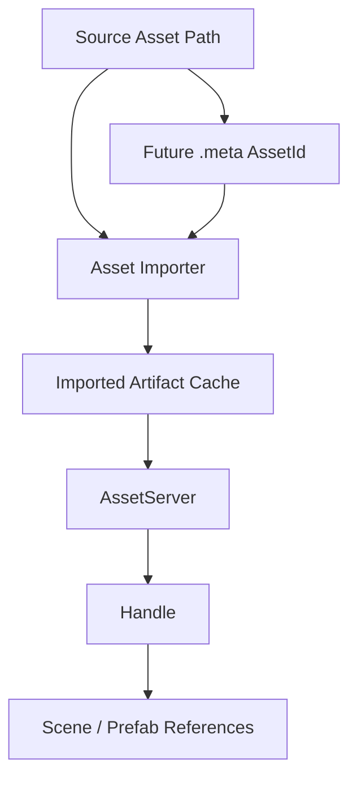

# ADR 0007: Asset Identity and Import Pipeline

**Status**: Accepted
**Date**: 2026-07-08

## Context

nara scenes and prefabs need stable references to textures, audio, tilemaps, scripts, prefabs, and future meshes/materials. Asset identity affects hot reload, import caches, AI-generated scene data, editor workflows, and package portability.

The engine should support a fast Phase 1 path without locking itself into path-only identity forever.

## Decision

nara will use **typed handles with UUID-ready asset identity**.

Phase 1 may resolve assets by project-relative path, but the data model and APIs must be designed for stable asset IDs and importer metadata.

Core rules:

- User code and scene data refer to assets through typed `Handle<T>` or serialized asset references, not raw filesystem access.
- Phase 1 can use path-first identity for speed.
- The model must be UUID-ready so Phase 2 can add `.meta` files without changing scene/prefab semantics.
- Hot reload changes asset versions behind stable handles; it should not require all scenes to rewrite references.
- Source assets and imported artifacts are distinct concepts.

## Alternatives Considered

### Option A: Path-only identity forever

**Pros**: Simple, human readable, easy for AI to generate.

**Cons**: Rename/move breaks references; import cache identity is fragile; editor workflows become difficult.

**Decision**: Rejected as a long-term model.

### Option B: UUID-first from day one

**Pros**: Mature editor-friendly identity, robust renames, better cache keys.

**Cons**: Requires `.meta` lifecycle, importer cache, and project database before the runtime MVP.

**Decision**: Deferred. APIs should be ready for UUIDs, but Phase 1 does not need the full pipeline.

### Option C: Path-first now, UUID-ready model (Chosen)

**Pros**: Fast Phase 1 implementation while preserving a mature future importer/editor path.

**Cons**: Requires discipline to avoid hardcoding path identity into scene semantics.

**Decision**: Chosen.

## Consequences

- `AssetRef` in scene data should be able to represent both path and future stable ID forms.
- `Handle<T>` should remain stable across reloads; asset data may carry an internal generation/version.
- Import cache design is deferred but not ignored.
- Asset loading can begin synchronous/path-based, but the API must allow asynchronous load states later.

## Success Metrics

| Metric | Target | Measurement |
|---|---:|---|
| Typed handles | Asset references are typed in Rust APIs | API review |
| UUID readiness | Scene asset references can evolve from path to ID without semantic rewrite | Schema review |
| Reload stability | Handle identity survives asset content reload | Future test |
| Source/artifact split | Import cache can be added without changing source asset references | Design review |
| AI usability | JSON scene can still express readable asset references | Example scene |

## Risks and Mitigations

| Risk | Severity | Likelihood | Mitigation |
|---|---|---:|---|
| Path-first leaks into stable file format | High | Medium | Define `AssetRef` as an enum-like semantic model, not just `String` |
| UUID/meta adds editor burden too early | Medium | Medium | Keep `.meta` Phase 2; write APIs now, not full implementation |
| Hot reload invalidates handles | High | Medium | Separate handle identity from loaded asset version |
| AI emits broken paths | Medium | High | Validate asset references before instantiation |

## Follow-Up Questions

- What exact serialized shape should `AssetRef` use?
- Do `.meta` files live beside source assets or in a project database?
- Are imported artifacts content-addressed by source hash, importer version, and settings?
- Does Phase 1 `AssetServer` expose async states now or only reserve the states in types?

## Citations

- Scene/prefab decision: [0006-scene-and-prefab-data-model.md](0006-scene-and-prefab-data-model.md)
