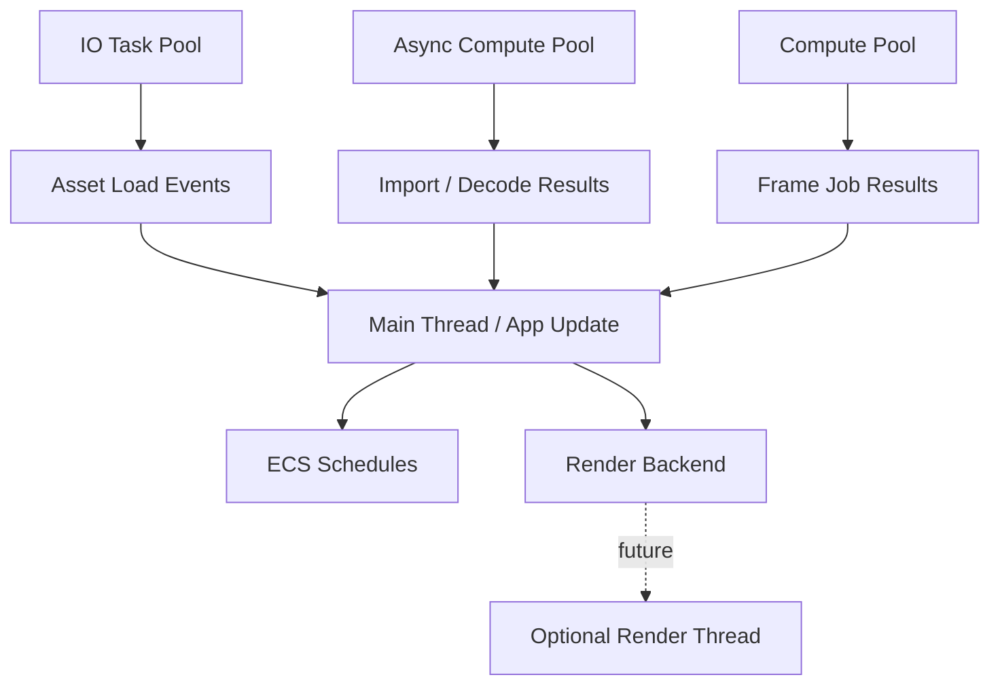

# ADR 0008: Runtime Concurrency and Task Pools

**Status**: Accepted
**Date**: 2026-07-08
**Refined By**: ADR 0042: Runtime Service and Backend Boundary; ADR 0052: Task Backpressure,
Cancellation, and Long-Running Diagnostics; ADR 0080: Domain-Owned TaskUpdate Integration Sets

## Context

A mature game engine needs asynchronous IO, background asset loading/importing, compute jobs, hot reload, audio, optional render threading, and deterministic main-world updates.

Rust offers many async runtimes, but a game engine should not force gameplay systems to become general async application code. The main ECS `World` must remain deterministic and safely scheduled. Async work should enter the world through explicit channels, commands, resources, or asset state transitions.

Reference engines split responsibilities:

- Bevy uses task pools such as IO, async compute, and compute.
- Godot has a worker thread pool, threaded resource loading, and configurable render threading.

## Decision

nara will use an **engine-owned task pool model** with explicit main-thread integration.

Initial task classes:

```text
Main Thread
  App lifecycle, world mutation, window event loop, plugin lifecycle

Compute Pool
  CPU-heavy parallel jobs with bounded frame integration

Io Pool
  Asset file IO, watchers, non-blocking resource reads

Async Compute Pool
  Long-running background preparation, imports, decompression, procedural generation

Render Backend Thread
  Deferred. wgpu backend starts single-threaded/main-thread integrated, but the render seam must allow a future render thread.
```



Core rules:

- ECS world mutation happens on the main app schedule unless a system is explicitly scheduled by `bevy_ecs` for safe parallel execution.
- Background tasks do not hold direct mutable references into the main `World`.
- Asset loading and import work report results through asset state transitions/events.
- The engine owns task pools; nara does not expose Tokio as the user-facing runtime contract.
- Headless/server execution uses real bounded workers without blocking a simulation tick; domains
  choose explicit ordered main-thread integration when completion order must not affect state.
- Render threading is a future optimization, not a Phase 1 requirement.

## Alternatives Considered

### Option A: Use Tokio as the public engine async model

**Pros**: Mature async ecosystem, easy networking/server patterns.

**Cons**: Poor fit as the main gameplay scheduling model; can leak async lifetimes and runtime assumptions into user code.

**Decision**: Rejected as the public engine model. Tokio or async runtimes may still appear behind adapters if needed.

### Option B: Single-threaded runtime only

**Pros**: Simple deterministic behavior.

**Cons**: Asset IO, import, hot reload, procedural generation, and editor tooling will block or become ad hoc.

**Decision**: Rejected for a mature engine target.

### Option C: Engine-owned task pools with explicit integration (Chosen)

**Pros**: Mature engine shape, clear main-world ownership, easy to reason about, compatible with asset pipeline and future render threading.

**Cons**: More infrastructure than a minimal runtime; requires task lifecycle and diagnostics.

**Decision**: Chosen.

## Consequences

- `nara_tasks` or equivalent task infrastructure should exist before serious asset loading/importing.
- `nara_app` defines `CoreStage::TaskUpdate` as the main-thread integration point; each business
  domain owns and orders its integration sets inside that stage.
- Asset and scene loading APIs should model pending/loading/ready/failed states.
- Render backend seams should avoid assuming all GPU work always happens inside gameplay systems.
- Tests should support an explicitly test-only inline driver that exercises the same admission,
  queue, cancellation, and terminal state machine as threaded execution.

## Implementation Notes

- `nara_tasks` exposes bounded `TaskPools`, per-kind `TaskPoolConfig`, monotonic `TaskId`, explicit
  `TaskDomainKey`/`TaskOrderKey`, typed `TaskHandle<T>` terminals, cancellation tokens, and pressure
  statistics. Production/project configuration is threaded only.
- `TaskPools::inline_for_tests` plus `run_pending_for_tests` is an explicit test harness. It admits
  work through the same bounded queue and terminal state machine; it is not a server/project mode.
- The std worker backend owns IO, compute, and async-compute workers. Tokio and async-std remain
  possible private adapters, not gameplay-facing contracts.
- Each domain polls typed handles and applies terminals at its declared main-thread stage. Domains
  that require completion-order independence use an ordered-prefix stream; domains that accept
  asynchronous availability may sort a ready snapshot. No type-erased global result bus exists.
- `nara_app::CoreStage::TaskUpdate` is the first scheduled integration point for background work.
  The app crate owns only that stage. Business domains define and configure their own integration
  sets, while `nara_tasks` provides execution mechanics without installing domain schedule phases.
- Background tasks own their inputs and return data through `TaskHandle<T>`. They do not borrow or
  mutate `World`.
- Cancellation is cooperative through `TaskCancellationToken`. Asset reload uses generations to
  ignore stale results before mutating asset state.

## Success Metrics

| Metric | Target | Measurement |
|---|---:|---|
| Main world safety | Background tasks cannot mutate `World` directly | API review and task handle API |
| Asset async path | Asset load results integrate through scheduled events/states | Image reload tests |
| Deterministic tests | Explicit inline driver exercises the production admission state machine | `nara_tasks` tests |
| Runtime independence | User code is not forced to use Tokio | Dependency/API review |
| Render extensibility | Render backend can later move to separate thread without changing gameplay components | Design review |

## Risks and Mitigations

| Risk | Severity | Likelihood | Mitigation |
|---|---|---:|---|
| Task pools overcomplicate Phase 1 | Medium | Medium | Define interfaces now; implement minimal single-thread executor first if needed |
| Async tasks outlive assets/world state | High | Medium | Use handles, generations, cancellation tokens, and scheduled apply points |
| Render thread design conflicts with wgpu constraints | High | Medium | Start single-threaded; validate wgpu ownership before enabling separate render thread |
| Tests become nondeterministic | Medium | Medium | Use the explicit inline driver and ordered typed integration streams |

## Follow-Up Questions

- Should networking/scripting use a separate runtime model later?
- Should latency-sensitive networking/scripting work add priority classes, or use separate bounded
  pools after real workloads demonstrate the need?

## Citations

- Bevy reference: `repo-ref/bevy/crates/bevy_app/src/task_pool_plugin.rs`
- Godot reference: `repo-ref/godot/main/main.cpp`, `repo-ref/godot/core/io/resource_loader.h`
- Asset identity decision: [0007-asset-identity-and-import-pipeline.md](0007-asset-identity-and-import-pipeline.md)
