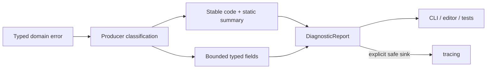

# ADR 0009: Diagnostics, Errors, and Logging

**Status**: Accepted
**Date**: 2026-07-08
**Refined By**: ADR 0048: Runtime Diagnostics and Observability Bus; ADR 0049: Untrusted
Project Input and Parse Budget Policy; ADR 0068: Global Resource Budgets, Metrics, and
Diagnostic Privacy

## Context

nara validates scenes, prefabs, assets, plugins, renderer setup, and generated project data.
These operations often need to return several actionable findings, while their typed errors still
carry control-flow meaning for the caller. Plain strings are unsuitable as a shared diagnostic
contract: they are unbounded, unstable, and can copy credentials, host paths, environment values,
or arbitrary `Error::to_string()` output into tools and logs.

## Decision

nara treats diagnostics as bounded, inspectable data with a privacy-safe content model.

Rules:

- Library internals use typed errors for control flow and structured diagnostics for bounded,
  user-actionable findings. Recoverable failures do not panic.
- A diagnostic has a validated stable ASCII code, severity, a validated static safe summary, and a
  bounded list of typed fields. It has no arbitrary `message: String` or context string map.
- Runtime-derived text cannot become a summary. A producer chooses a static summary and lowers
  dynamic context into an explicit field class from ADR 0068.
- Dynamic public values are limited to validated public identifiers, integers, and booleans.
  Static display text is source-authored and validated. Project paths use a lexically validated
  project-relative field. Sensitive and secret fields retain only their class, field key, and the
  fixed `[REDACTED]` marker.
- There is no blanket conversion from `Error`, `Display`, debug output, or an untyped map into a
  diagnostic. Producers must select a code, summary, and fields deliberately.
- `DiagnosticReport` applies entry, retained-byte, field-count, summary-byte, and field-text limits.
  UTF-8 truncation stops at a scalar boundary and is counted; stable identities are rejected rather
  than truncated.
- Observed severity is sticky. An error or warning remains visible through `has_errors` or
  `has_warnings` after its entry is rejected or evicted. `len`/`is_empty` describe observations,
  while `retained_len`/`is_retained_empty` describe the bounded deque.
- `DiagnosticReport::extend` republishes retained entries through the target report's settings,
  propagates sticky source severity, and adds the source report's logical published, rejected,
  evicted, dropped, and truncated accounting exactly once. Only additional target-side rejection,
  eviction, drop, and truncation effects are added; retained entries are not counted again as new
  observations or publications. Owned iteration intentionally yields retained entries only.
- All stored fields are private and exposed through read-only accessors. Diagnostic entries and
  snapshots are serialization outputs only; unbounded deserialization is not an input API.
- Collecting a diagnostic has no implicit logging side effect. `Diagnostic::emit_to_tracing` and
  `DiagnosticReport::emit_to_tracing` are explicit safe sinks and do not log dynamic field values.
- Tests assert stable codes and structured safe fields, not prose assembled from runtime errors.
- nara does not install or replace a process-global panic hook. A host may compose panic reporting
  after applying its own privacy policy.

## Alternatives Considered

### Option A: Plain `anyhow::Error` or strings everywhere

**Pros**: Minimal producer code.

**Cons**: No stable identity, no aggregate findings, unbounded retention, and no enforceable privacy
boundary.

**Decision**: Rejected as an engine-wide model. Application binaries may use `anyhow` outside the
diagnostic data boundary.

### Option B: Typed errors only

**Pros**: Strong Rust control-flow semantics.

**Cons**: A validation operation often needs multiple warnings and errors for editor, CLI, and
automation consumers.

**Decision**: Insufficient alone.

### Option C: Typed errors plus bounded privacy-safe reports

**Pros**: Keeps control flow typed while giving every tool the same stable, inspectable findings.

**Cons**: Producers must classify every dynamic value and cannot forward arbitrary error text.

**Decision**: Chosen.

## Consequences

- `nara_diagnostic` owns `Diagnostic`, `DiagnosticField`, `DiagnosticReport`, their settings,
  outcomes, and statistics.
- Scene, asset, project, and tooling callers must replace dynamic message formatting with static
  summaries plus typed fields. This is an intentional pre-1.0 break, not a compatibility seam.
- A local report is safe to inspect without a tracing subscriber, but it remains bounded and is not
  a durable project format.
- Runtime aggregation uses the separate contract in ADR 0048; privacy and pressure vocabulary live
  in ADR 0068.

## Success Metrics

| Metric | Target | Measurement |
|---|---:|---|
| Stable identity | Every finding has a validated code | API and unit tests |
| Bounded memory | Entry and retained text budgets are enforced | Limit and eviction tests |
| Privacy | No arbitrary runtime text or raw sensitive field is retained | Debug/serialization/tracing tests |
| Tooling reuse | CLI/editor/debug models consume the same report shape | Integration tests |
| Explicit logging | Collection works without tracing and logging is opt-in | Unit tests |
| Validation integrity | Rejected/evicted errors cannot turn a failed report into success | Sticky severity tests |

## Risks and Mitigations

| Risk | Severity | Likelihood | Mitigation |
|---|---|---:|---|
| Producer migration is verbose | Medium | High | Reuse stable codes, summaries, and typed field constructors; do not weaken the boundary with a string shim. |
| A public field is misclassified | High | Medium | Restrict dynamic public value types and review field classification at producer bridges. |
| Truncation hides useful detail | Medium | Medium | Count truncation and preserve stable identity so tools can link to richer domain state. |
| Static summaries become vague | Low | Medium | Put actionable identity in typed fields and keep producer-local typed errors for full control-flow detail. |
