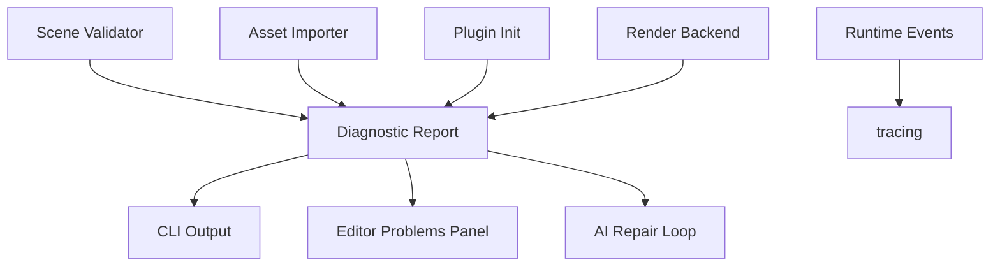

# ADR 0009: Diagnostics, Errors, and Logging

**Status**: Accepted
**Date**: 2026-07-08

## Context

nara will validate scenes, prefabs, assets, plugins, renderer setup, and AI-generated data. A mature engine cannot let every module invent its own error style. Diagnostics must be readable by humans, editor UI, CLI, tests, and future AI agents.

## Decision

nara will treat diagnostics as first-class data.

Rules:

- Library internals use typed errors and structured diagnostics; avoid panic for recoverable failures.
- Panics are acceptable for programmer bugs and violated invariants.
- User/project data failures return diagnostics with context: path, span/range when available, entity ID, component ID, asset reference, plugin name, and severity.
- Use `tracing` as the underlying event/logging layer.
- Scene/asset/component validation returns diagnostic collections instead of one string error.
- Editor, CLI, debug UI, and AI agents should consume the same diagnostics model.

## Alternatives Considered

### Option A: Plain `anyhow::Error` everywhere

**Pros**: Fast to write.

**Cons**: Weak structured context, poor editor/tooling integration.

**Decision**: Rejected as the engine-wide model. It may still be useful in binaries/tools.

### Option B: Typed errors only

**Pros**: Strong Rust ergonomics.

**Cons**: Diagnostics often need multiple warnings/errors and source locations.

**Decision**: Insufficient alone.

### Option C: Typed errors plus structured diagnostics (Chosen)

**Pros**: Strong internals and rich user-facing reports.

**Cons**: More upfront design.

**Decision**: Chosen.

## Consequences

- `nara_diagnostic` should eventually exist.
- Asset and scene APIs should return diagnostic reports for validation/import failures.
- Plugin/backend initialization can return typed errors that carry diagnostic reports.
- Tests should assert diagnostic codes, not only text.

## Success Metrics

| Metric | Target | Measurement |
|---|---:|---|
| Structured data | Diagnostics carry code, severity, message, and optional source context | API review |
| Tooling reuse | CLI/editor/debug UI consume the same report type | Future tests |
| AI repair loop | Validation output identifies fixable scene/component paths | Future integration test |
| Logging consistency | Runtime events use `tracing` | Code review |

## Risks and Mitigations

| Risk | Severity | Likelihood | Mitigation |
|---|---|---:|---|
| Diagnostics become verbose boilerplate | Medium | Medium | Provide helpers and derive-like utilities later |
| Error text becomes unstable for tests | Low | High | Test diagnostic codes and structured fields |
| Panic policy is unclear | Medium | Medium | Document panic only for programmer bugs/invariants |

