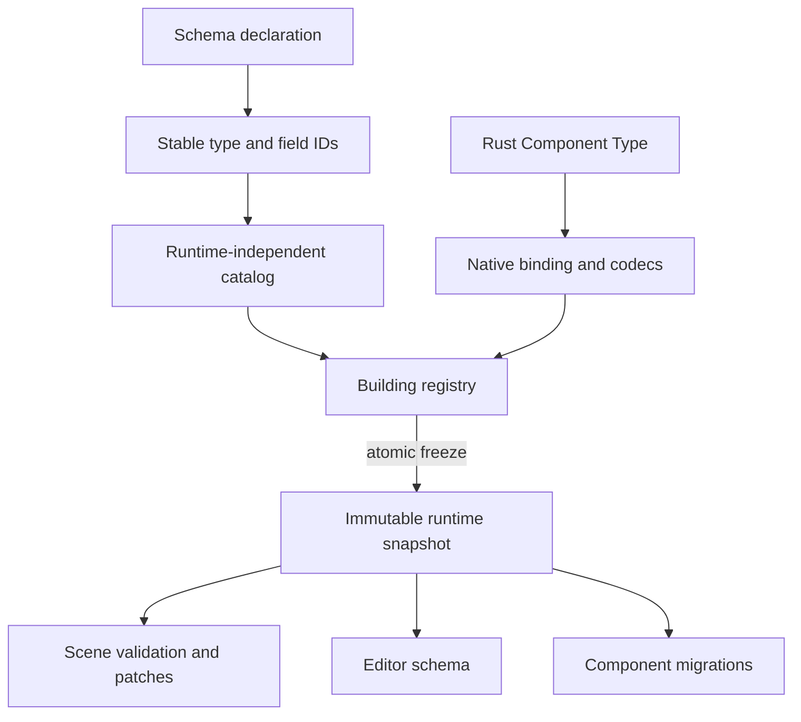

# ADR 0011: Component Schema IDs and Migrations

**Status**: Accepted
**Date**: 2026-07-08
**Amended**: 2026-07-12 by RGF-U1 for stable field identity and registry freeze
**Refined By**: ADR 0043: Scene, Prefab, and Patch Document Migration Policy; ADR 0045: Component
Schema Capability Metadata; ADR 0049: Untrusted Project Input and Parse Budget Policy; ADR 0051:
Persistent File Envelope, Migration, and Golden Fixtures; ADR 0081: Schema Source, Stable Identity,
Catalog, and Runtime Binding

## Context

nara will serialize scenes/prefabs and expose component schemas to editor tooling and AI agents. Rust type names are not stable enough as long-term file format identifiers.

## Decision

Data-facing components must have stable nara component schema identities.

Rules:

- Do not use raw Rust `type_name` as the stable file ID.
- Every persistent component has a `ComponentTypeId`, stable `ComponentFieldId` values, and a
  schema version. Runtime-only ECS components do not need schema registration.
- `ComponentRegistry` keeps the runtime-independent catalog separate from native Rust/Bevy
  bindings, codecs, reflection metadata, and migration functions.
- Migrations are registered per component type and version.
- Runtime-only components can opt out of serialization/schema.

## Alternatives Considered

### Option A: Rust type name as schema ID

**Pros**: Easy.

**Cons**: Breaks on module rename, crate rename, refactor, or re-export.

**Decision**: Rejected.

### Option B: UUID for every component type

**Pros**: Stable and rename-safe.

**Cons**: Less human-readable.

**Decision**: Viable, but exact format remains follow-up.

### Option C: Namespaced stable ID plus version (Chosen)

**Pros**: Human-readable, stable by convention, versionable.

**Cons**: Requires registry discipline.

**Decision**: Chosen. Built-in component IDs use reverse-domain-style strings such as
`nara.transform.Transform2d`, `nara.sprite.Sprite`, and `nara.tilemap.Tilemap`.

ADR 0081 refines these strings as opaque permanent identities rather than mutable names. It also
introduces stable field identity, separates the runtime-independent catalog from native runtime
bindings, and makes aliases independent from durable IDs.

## Implementation Notes

As of RGF-U1 on 2026-07-12:

- `ComponentTypeId` and `ComponentFieldId` are bounded opaque persistent identities. Aliases are
  mutable presentation data; removed IDs remain type or field tombstones and cannot be reused.
- `ComponentSchemaVersion` is stored with each `SceneComponentRecord`.
- `ComponentRegistry::catalog_candidate()` exposes build-time semantic data; `catalog()` and
  `snapshot()` require a successful atomic freeze. A loaded catalog can seed
  `from_catalog_candidate` before native bindings are registered.
- Component owners register explicit schemas and native codecs before freeze. Freeze validates
  catalog lineage, aliases, tombstones, capability scope, current field locators, defaults,
  migrations, and required bindings without publishing a partial snapshot.
- Every mutation path rejects after freeze. Failed freeze leaves the registry repairable in
  `Building`; repeated successful freeze is idempotent.
- `ComponentFieldId` is the durable address used by scene patches. Structured
  `ComponentFieldPath` values locate the field in the current `ComponentValue` layout only;
  display strings remain diagnostic/UI conveniences.
- `ComponentRegistry::register_component_migration` composes one-step `ComponentValue` migrations
  before scene/prefab preflight rejects older schema versions.
- A successor catalog is validated only against its exact direct predecessor: generation must be
  `previous + 1`, its predecessor fingerprint must match, and migrations must connect the
  predecessor's component version to the candidate version. RGF-U1 does not store or validate an
  arbitrary historical catalog chain.
- The persistent catalog contains no Rust path, Rust `TypeId`, Bevy `ComponentId`, codec, closure,
  or backend handle. Native debug metadata stays outside the wire catalog.
- An ordinary runtime-only component needs only the normal Rust/`bevy_ecs` component contract and
  is absent from the persistent registry.

## Success Metrics

| Metric | Target | Measurement |
|---|---:|---|
| Stable IDs | Scene files do not depend on Rust module paths | Schema review |
| Versioning | Component schemas include version | Registry schema catalog tests |
| Migration | Old component data can migrate before instantiation | `nara_reflect` and `nara_scene` migration tests |
| Runtime opt-out | Runtime-only components need no schema or reflection registration | `registry_contract::runtime_only_components_need_no_schema_or_reflection_registration` |

## Risks and Mitigations

| Risk | Severity | Likelihood | Mitigation |
|---|---|---:|---|
| IDs collide | High | Low | Use reverse-domain or crate-qualified namespace plus validation |
| Migrations are forgotten | Medium | High | Validate schema version changes in tests/tooling |
| AI schema diverges from runtime schema | High | Medium | Generate AI schema from `ComponentRegistry` |
