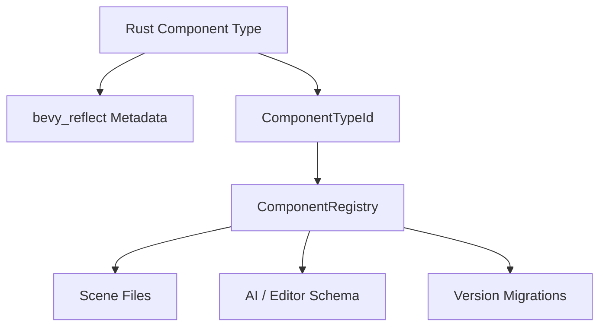

# ADR 0011: Component Schema IDs and Migrations

**Status**: Accepted
**Date**: 2026-07-08

## Context

nara will serialize scenes/prefabs and expose component schemas to editor tooling and AI agents. Rust type names are not stable enough as long-term file format identifiers.

## Decision

Data-facing components must have stable nara component schema identities.

Rules:

- Do not use raw Rust `type_name` as the stable file ID.
- Every serialized/inspectable component has a `ComponentTypeId` and schema version.
- `ComponentRegistry` maps stable IDs to Bevy reflection metadata and serialization hooks.
- Migrations are registered per component type and version.
- Runtime-only components can opt out of serialization/schema.

## Alternatives Considered

### Option A: Rust type name as schema ID

**Pros**: Easy.

**Cons**: Breaks on module rename, crate rename, refactor, or re-export.

**Decision**: Rejected.

### Option B: UUID for every component type

**Pros**: Stable and rename-safe.

**Cons**: Less human-readable.

**Decision**: Viable, but exact format remains follow-up.

### Option C: Namespaced stable ID plus version (Chosen)

**Pros**: Human-readable, stable by convention, versionable.

**Cons**: Requires registry discipline.

**Decision**: Chosen. Built-in component IDs use reverse-domain-style strings such as
`nara.transform.Transform2d`, `nara.sprite.Sprite`, and `nara.tilemap.Tilemap`.

## Implementation Notes

As of 2026-07-08:

- `ComponentTypeId` is the persistent component identity and serializes as a transparent string.
- `ComponentSchemaVersion` is stored with each `SceneComponentRecord`.
- `ComponentRegistry::schema_catalog()` exports a deterministic `ComponentSchemaCatalog`.
- Component owners register explicit `ComponentFieldSchema` metadata beside their codecs.
- Field paths use structured `ComponentFieldPath` / `ComponentFieldPathSegment` values rather than
  ad hoc dotted strings. Display strings are diagnostic/UI conveniences only.
- `ComponentRegistry::register_component_migration` composes one-step `ComponentValue` migrations
  before scene/prefab preflight rejects older schema versions.
- `rust_type_path` remains useful metadata for debugging, but it is not the stable file identity.

## Success Metrics

| Metric | Target | Measurement |
|---|---:|---|
| Stable IDs | Scene files do not depend on Rust module paths | Schema review |
| Versioning | Component schemas include version | Registry schema catalog tests |
| Migration | Old component data can migrate before instantiation | `nara_reflect` and `nara_scene` migration tests |
| Runtime opt-out | Non-serialized runtime components are allowed | `ComponentSchema.serializable` and codec registration boundary |

## Risks and Mitigations

| Risk | Severity | Likelihood | Mitigation |
|---|---|---:|---|
| IDs collide | High | Low | Use reverse-domain or crate-qualified namespace plus validation |
| Migrations are forgotten | Medium | High | Validate schema version changes in tests/tooling |
| AI schema diverges from runtime schema | High | Medium | Generate AI schema from `ComponentRegistry` |
