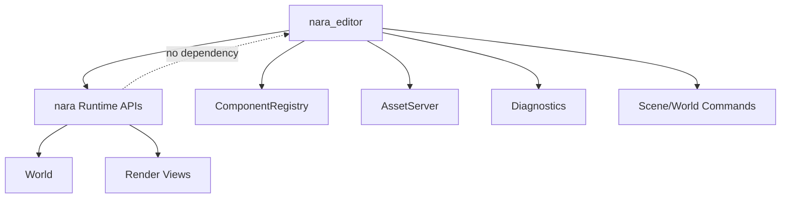

# ADR 0015: Editor, Tooling, and Dogfooding Boundary

**Status**: Accepted
**Date**: 2026-07-08
**Refined By**: ADR 0044: Root Facade and Prelude Layering Policy; ADR 0045: Component Schema
Capability Metadata; ADR 0047: Editor Workspace and Scene Document State; ADR 0095: Plugin-Owned
Specialized Domains and Project Configuration
**Related Design Draft**: [UI Product Boundaries, Editor Dogfooding, and Porting
Strategy](../ui-product-boundaries-editor-dogfood-and-porting-strategy.md)

## ADR 0095 Refinement

Toolkit-neutral tooling models and commands are a product boundary, not proof that complete editor
toolkits are interchangeable. One panel implemented in a second toolkit proves only that panel's
model/command separation. A reusable toolkit Adapter or replacement Editor Shell requires a real
second product workflow and its own admission evidence.

## Context

nara's editor is intentionally later than the core runtime, but editor boundaries must be clear
early. The editor should validate the engine experience without coupling runtime logic to editor UI.
Runtime/game UI and editor/tool UI serve different products; whether they eventually share a
retained implementation foundation must be decided by working game and editor workloads rather
than assumed from either product's first implementation.

The user wants nara to grow into a mature engine and asked whether the future editor UI should dogfood nara's own engine UI.

## Decision

The editor is a **client of the runtime**, not the owner of runtime logic.

Dogfooding policy:

- Runtime/game UI and editor/tool UI are separate product layers. They may share narrow services or
  a proven retained foundation later, but neither product requires a shared widget tree, authoring
  model, or toolkit now.
- The editor should dogfood nara runtime concepts: ECS world inspection, scene/prefab data model, asset handles, render views, diagnostics, and command/patch application.
- The editor should dogfood nara rendering where practical, especially viewport rendering, gizmos, overlays, scene preview, and in-engine debug panels.
- The editor UI toolkit can be phased. Early editor/debug UI may use egui or dear-imgui-rs for
  productivity. A future nara UI system may gradually take over complete panels when mature enough.
  Success with one panel proves that panel's tooling-model/command separation, not toolkit
  replaceability and not that the final editor must use the runtime UI toolkit.
- Docking, panel catalogs, workspace layout, and detached-window intent belong to the Editor Shell.
  Event-loop, native-window, surface, and GPU submission authority remain with the selected
  platform/window and render-execution authorities, never ordinary UI adapters or panel
  contributions.
- Runtime crates must not depend on editor crates.
- Editor mutations should go through explicit commands/patches and validation, not direct private storage access.
- UI adapters should render UI-agnostic tooling models and submit tooling commands. They should not
  own scene mutation semantics.

Implementation notes as of 2026-07-08:

- `nara_tooling::SceneInspectorState` is the first UI-agnostic inspector controller.
- `SceneInspectorModel` combines authoring entity rows, selected component schema fields,
  `ComponentSchemaCatalog`, `WorldSnapshot`, undo/redo status, live dirty state, and diagnostics.
- `SceneInspectorCommand` converts selected field/reparent edits into `ScenePatchDocument`
  transactions applied through `SceneAuthoringSession`.
- egui, dear-imgui-rs, or future nara UI adapters should render these models rather than owning
  separate inspector state machines.

## Alternatives Considered

### Option A: Editor owns runtime state directly

**Pros**: Fast editor development.

**Cons**: Couples runtime to editor assumptions and weakens code-first philosophy.

**Decision**: Rejected.

### Option B: Build editor UI only with nara UI from day one

**Pros**: Maximum dogfooding.

**Cons**: Blocks editor progress on a mature UI system that does not exist yet.

**Decision**: Rejected for early phases.

### Option C: Runtime-client editor with phased UI dogfooding (Chosen)

**Pros**: Validates runtime mechanisms while allowing pragmatic UI tech choices.

**Cons**: Requires adapters between editor UI toolkit and runtime commands/snapshots.

**Decision**: Chosen.

## Success Metrics

| Metric | Target | Measurement |
|---|---:|---|
| Dependency direction | Runtime crates do not depend on editor crates | Dependency review |
| Runtime dogfooding | Editor uses real scene/asset/diagnostic APIs | Code review |
| Safe mutation | Editor changes flow through commands/patches with validation | `scene_inspector` and `scene_authoring_session` tests |
| UI flexibility | A complete panel can use another adapter without changing its tooling model, commands, validation, or undo semantics | Cross-adapter fixtures and architecture review |
| Host exclusivity | UI adapters and panel contributions do not own event loops, native windows, surfaces, or GPU submission | Dependency/API audit and Host integration tests |
| Viewport fidelity | Editor view uses same render backend path as runtime where practical | Future integration test |

## Risks and Mitigations

| Risk | Severity | Likelihood | Mitigation |
|---|---|---:|---|
| Editor becomes a separate engine | High | Medium | Force editor to use runtime APIs and diagnostics |
| UI dogfooding slows core runtime | Medium | Medium | Phase UI dogfooding; start with egui/imgui if needed |
| Premature toolkit convergence pollutes game UI or editor delivery | High | Medium | Migrate complete panels and require heterogeneous workload evidence before choosing a final topology |
| Editor needs private access | High | Medium | Add explicit inspection/patch interfaces instead of breaking encapsulation |
