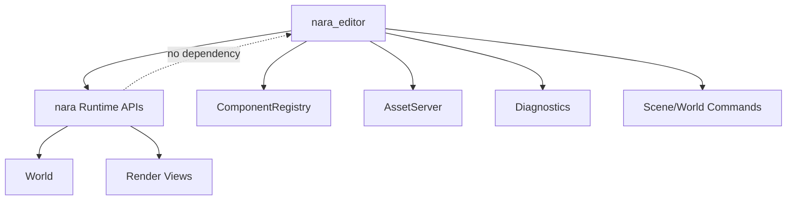

# ADR 0015: Editor, Tooling, and Dogfooding Boundary

**Status**: Accepted
**Date**: 2026-07-08

## Context

nara's editor is intentionally later than the core runtime, but editor boundaries must be clear early. The editor should validate the engine experience without coupling runtime logic to editor UI.

The user wants nara to grow into a mature engine and asked whether the future editor UI should dogfood nara's own engine UI.

## Decision

The editor is a **client of the runtime**, not the owner of runtime logic.

Dogfooding policy:

- The editor should dogfood nara runtime concepts: ECS world inspection, scene/prefab data model, asset handles, render views, diagnostics, and command/patch application.
- The editor should dogfood nara rendering where practical, especially viewport rendering, gizmos, overlays, scene preview, and in-engine debug panels.
- The editor UI toolkit can be phased. Early editor/debug UI may use egui or dear-imgui-rs for productivity. A future nara UI system can gradually take over when mature enough.
- Runtime crates must not depend on editor crates.
- Editor mutations should go through explicit commands/patches and validation, not direct private storage access.
- UI adapters should render UI-agnostic tooling models and submit tooling commands. They should not
  own scene mutation semantics.

Implementation notes as of 2026-07-08:

- `nara_tooling::SceneInspectorState` is the first UI-agnostic inspector controller.
- `SceneInspectorModel` combines authoring entity rows, selected component schema fields,
  `ComponentSchemaCatalog`, `WorldSnapshot`, undo/redo status, live dirty state, and diagnostics.
- `SceneInspectorCommand` converts selected field/reparent edits into `ScenePatchDocument`
  transactions applied through `SceneAuthoringSession`.
- egui, dear-imgui-rs, or future nara UI adapters should render these models rather than owning
  separate inspector state machines.

## Alternatives Considered

### Option A: Editor owns runtime state directly

**Pros**: Fast editor development.

**Cons**: Couples runtime to editor assumptions and weakens code-first philosophy.

**Decision**: Rejected.

### Option B: Build editor UI only with nara UI from day one

**Pros**: Maximum dogfooding.

**Cons**: Blocks editor progress on a mature UI system that does not exist yet.

**Decision**: Rejected for early phases.

### Option C: Runtime-client editor with phased UI dogfooding (Chosen)

**Pros**: Validates runtime mechanisms while allowing pragmatic UI tech choices.

**Cons**: Requires adapters between editor UI toolkit and runtime commands/snapshots.

**Decision**: Chosen.

## Success Metrics

| Metric | Target | Measurement |
|---|---:|---|
| Dependency direction | Runtime crates do not depend on editor crates | Dependency review |
| Runtime dogfooding | Editor uses real scene/asset/diagnostic APIs | Code review |
| Safe mutation | Editor changes flow through commands/patches with validation | `scene_inspector` and `scene_authoring_session` tests |
| UI flexibility | egui/imgui can be replaced or supplemented later | Architecture review |
| Viewport fidelity | Editor view uses same render backend path as runtime where practical | Future integration test |

## Risks and Mitigations

| Risk | Severity | Likelihood | Mitigation |
|---|---|---:|---|
| Editor becomes a separate engine | High | Medium | Force editor to use runtime APIs and diagnostics |
| UI dogfooding slows core runtime | Medium | Medium | Phase UI dogfooding; start with egui/imgui if needed |
| Editor needs private access | High | Medium | Add explicit inspection/patch interfaces instead of breaking encapsulation |
