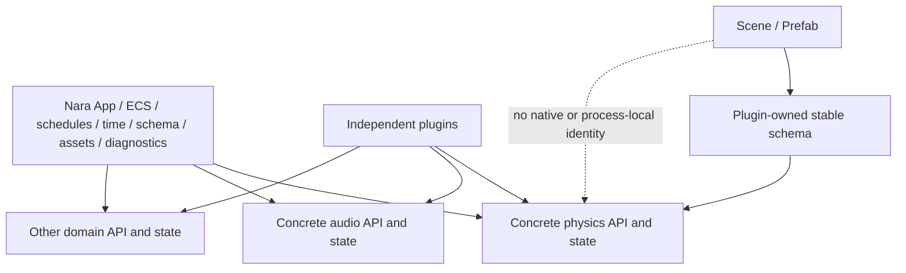

# ADR 0016: Extension Seams for Backends and Domain Modules

**Status**: Accepted
**Date**: 2026-07-08
**Last Revised**: 2026-07-16
**Refined By**: ADR 0042: Runtime Service and Backend Boundary; ADR 0094: Minimal Render Execution
Boundary and Evidence-Gated Extensions; ADR 0095: Plugin-Owned Specialized Domains and Project
Configuration

## ADR 0095 Refinement

An extension seam means that an independently owned plugin can join Nara's public substrate. It
does not imply that Nara owns portable domain components, scene schemas, or a provider trait.
Plugin-specific durable schemas are valid when stable and migration-aware; only native/runtime
handles are categorically excluded. The second-real-implementation rule applies before advertising
a Nara-owned portable Interface, not before shipping an ordinary plugin-owned integration.

## Context

nara's core interfaces will become expensive to change once games, examples, tools, and AI-generated content depend on them. The engine must support replaceable or optional domain modules such as physics, specialized rendering paths, serialization formats, audio backends, scripting runtimes, and editor UI adapters.

Examples:

- 2D physics may use Box2D, Rapier, Avian, or a custom deterministic backend.
- Rendering uses wgpu as its only accepted RHI but may need specialized renderer policies, passes,
  or exact-wgpu integration paths admitted independently under ADR 0094.
- Serialization may support JSON, RON, binary cache formats, and future editor patch formats.
- Plugins should install and replace capabilities without modifying core runtime code.

## Decision

nara defines **extension seams** by allowing independently owned plugins to join public product
substrate. An extension seam does not automatically create an engine-owned domain Interface.

A concrete integration may ship with its own strongly typed components, schema, systems, sets,
queries, commands, events, and configuration. Nara freezes a portable cross-implementation
Interface only after one production-shaped consumer creates real portability pressure, an
independent implementation challenges the proposed seam, and a second real implementation proves
the common semantics. Fakes remain useful conformance and fault-injection oracles, but do not prove
ecosystem replaceability.

Core rule:

> Durable user data belongs to its owning engine or plugin contract and uses stable, bounded,
> versioned semantics. Native handles and process-local identities remain transient. Replacement
> across different plugin contracts may require explicit source and data migration.

## Design Rules

### Rule 1: Specialized plugins own their domain contract

Physics, audio, text, animation, input policy, and similar plugins may expose their own semantic
types. A Rapier integration is not required to pretend that its bodies, queries, contacts, or
configuration are also Avian or Box2D semantics.

The owning plugin registers stable component IDs, codecs, migrations, authoring helpers, and
diagnostics when its data is persistent. Different plugins must not bind one stable component ID to
different meanings.

### Rule 2: Plugin-installed systems are the ordinary extension mechanism

A domain normally integrates by installing its own resources and systems into documented public
schedule anchors or custom schedules. It may keep private native/session state in transient
resources. Pure ECS plugins do not need a backend trait, Service object, queue, main-thread bridge,
or Host contribution.

### Rule 3: Persistent safety is not cross-plugin portability

Persistent records must not contain native handles, pointers, runtime `Entity`/`AssetId`, Rust or
Bevy runtime IDs, solver/session indices, callbacks, absolute Host authority, or opaque backend
blobs without a canonical bounded grammar. Plugin-specific semantic configuration is valid when it
is stable, canonical, versioned, bounded, and migration-aware.

Switching implementations may require an explicit cross-schema patch and Rust API migration. Scene
files are unchanged only when an Accepted portable contract explicitly guarantees that property.

### Rule 4: Scarce Host authority is explicit

Event loops, native windows, renderer surfaces/devices, filesystem capabilities, and comparable
process-scoped authority use explicit Host contributions and lifecycle ownership. This is a safety
property, not a template for ordinary physics/audio/text plugins.

### Rule 5: Shared traits follow evidence

Use a public trait only when multiple real participants require the same behavior and the semantics
are stronger than matching method names. A second implementation is required before compatibility
freeze for a portable Interface, not before the first concrete plugin can ship. Rendering follows
ADR 0094's narrower evidence ladder and wgpu-only RHI decision.

`PluginServiceId` can validate that a declared service is present. It is not a provider registry,
exclusive owner selector, or runtime dispatch Interface.

## Alternatives Considered

### Option A: Concrete Plugin-Owned Integration First

**Pros**: Preserves strong typing and full library behavior while reusing Nara's product substrate.

**Cons**: Replacement may require explicit source, schema, and configuration migration.

**Decision**: Chosen.

### Option B: Fully Abstract Every Domain from Day One

**Pros**: Maximum replaceability.

**Cons**: Premature shallow traits, unclear requirements, excessive boilerplate.

**Decision**: Rejected.

### Option C: Integrate Raw Libraries Without Plugins

**Pros**: Maximum expert freedom and no engine integration layer.

**Cons**: Every game repeats schedule, persistence, diagnostics, lifecycle, and tooling work.

**Decision**: Valid for expert embedding, rejected as the first-party default experience.

## Consequences

- A first official physics or audio integration is a concrete plugin, not proof of a portable core.
- Plugin-owned persistent schemas may be product-quality without being shared by competitors.
- Replacement documentation must state required source/data/configuration migration honestly.
- Native/process-local state remains private and non-persistent.
- Fake implementations prove one contract's faults; cross-implementation claims require real
  variation evidence.
- Render backend observation currently uses plugin-installed resources and `RenderBackendStatus`;
  ADR 0094 accepts only the stock serialized wgpu execution boundary today. A public feature,
  interop, replacement-Host, or other render-execution seam waits for its own tracer and decision.

## Success Metrics

| Metric | Target | Measurement |
|---|---:|---|
| Persistent isolation | Plugin schemas contain no native or process-local identity | Schema/golden review |
| Plugin integration | An external plugin owns data, systems, sets, diagnostics, and optional schema through public APIs | Clean-room fixture |
| Honest replacement | Domain replacement documentation names migrations and unsupported equivalence | Documentation review |
| No premature trait soup | A portable Interface cites real portability pressure and two challenged implementations | ADR/conformance review |
| Authoring ergonomics | Ordinary plugins do not require provider slots or advanced plan vocabulary | Independent example review |

## Risks and Mitigations

| Risk | Severity | Likelihood | Mitigation |
|---|---|---:|---|
| Plugin-specific schemas fragment content | High | Medium | Maintain one strong official default, stable namespaces, migrations, and demand-driven converters |
| Native state leaks into durable data | Critical | Medium | Enforce schema eligibility, canonical grammars, type audits, and hostile fixtures |
| Trait abstractions become shallow | Medium | Medium | Require real portability pressure and two challenged implementations before compatibility freeze |
| Replacement promise is overstated | High | Medium | Treat replacement as explicit migration unless an Accepted portable contract says otherwise |
| Host-only machinery burdens ordinary plugins | High | Medium | Reserve Host contributions for scarce process/native authority |

## Follow-Up Questions

- Which concrete physics plugin and workflow should OQ-005 trial first?
- Which plugin-owned persistent records need conversion tooling for asset-store content?
- Which real downstream consumer, if any, needs a portable cross-plugin layer?

## Citations

- ECS substrate decision: [0002-use-bevy-ecs-as-ecs-substrate.md](0002-use-bevy-ecs-as-ecs-substrate.md)
- Scene/prefab data model: [0006-scene-and-prefab-data-model.md](0006-scene-and-prefab-data-model.md)
- Render crate boundaries: [0012-render-crate-boundaries.md](0012-render-crate-boundaries.md)
- Plugin lifecycle: [0010-plugin-lifecycle-dependencies-and-failure.md](0010-plugin-lifecycle-dependencies-and-failure.md)
