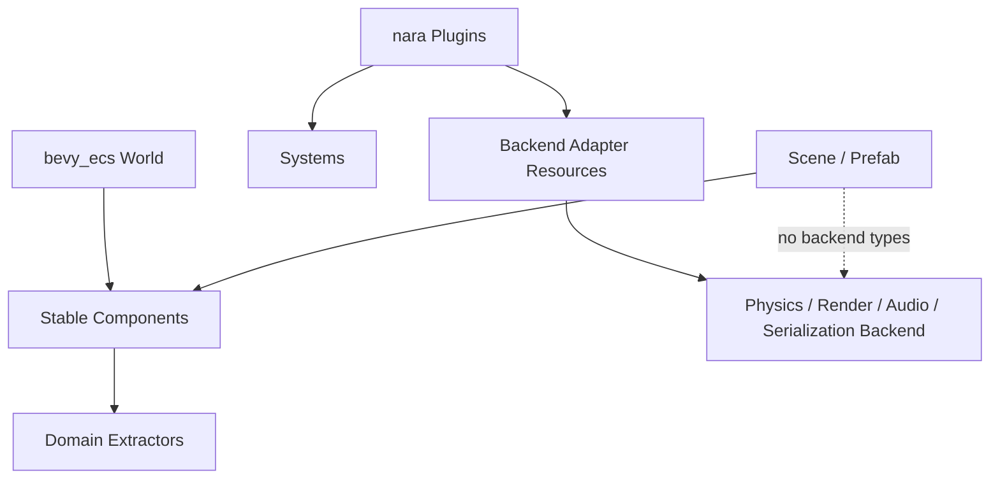

# ADR 0016: Extension Seams for Backends and Domain Modules

**Status**: Accepted
**Date**: 2026-07-08
**Refined By**: ADR 0042: Runtime Service and Backend Boundary

## Context

nara's core interfaces will become expensive to change once games, examples, tools, and AI-generated content depend on them. The engine must support replaceable or optional domain modules such as physics, rendering backends, serialization formats, audio backends, scripting runtimes, and editor UI adapters.

Examples:

- 2D physics may use Box2D, Rapier, Avian, or a custom deterministic backend.
- Rendering may start with wgpu but could need alternate backends or specialized render paths.
- Serialization may support JSON, RON, binary cache formats, and future editor patch formats.
- Plugins should install and replace capabilities without modifying core runtime code.

## Decision

nara will define **extension seams** around major backend/domain responsibilities, but will avoid making every feature a generic trait before there are at least two plausible adapters.

Core rule:

> Stable user data lives in ECS components/resources. Replaceable behavior lives behind plugin-installed systems, resources, and adapter traits. Backend-specific types must not leak into scene/prefab schemas or gameplay-facing core components.



## Design Rules

### Rule 1: Components are stable data, backends are adapters

Gameplay-facing components should express engine domain intent:

```text
RigidBody2d
Collider2d
Sprite
Camera2d
AudioSource
```

They should not expose backend-native handles such as Box2D body pointers, wgpu buffers, or audio device IDs.

Backend state belongs in resources or internal ECS components owned by the plugin.

### Rule 2: Plugin-installed systems are the default extension mechanism

A domain module should usually integrate by installing systems into known stages:

```text
PreUpdate / FixedUpdate / PostUpdate
Extract / Prepare / Queue / Render
```

Use traits for backend seams only where behavior truly varies, such as physics backend stepping, render backend submission, or serialization format adapters.

### Rule 3: Scene and prefab data must stay backend-neutral

Scene files should serialize stable nara component IDs and data. A project should be able to switch a physics backend without rewriting scene files, assuming the high-level physics component model is supported.

### Rule 4: Extraction maps stable data to backend data

Backend plugins translate stable ECS data into backend-native state:

```text
RigidBody2d + Collider2d -> Box2D bodies/fixtures
Sprite + Transform2d -> render items/batches
AudioSource -> backend voice/source state
```

The translation layer owns synchronization, handles, generation checks, and diagnostics.

### Rule 5: Prefer capability resources over global singletons

Backend capabilities should be represented by resources installed by plugins:

```text
PhysicsBackend2d
RenderBackendStatus / backend adapter resource
AudioBackend
SceneFormatRegistry
```

This keeps tests and headless runs replaceable.

## Alternatives Considered

### Option A: Hardcode first backend directly into core components

**Pros**: Fastest MVP.

**Cons**: Backend replacement becomes a scene/schema and gameplay API migration.

**Decision**: Rejected for mature engine foundations.

### Option B: Fully abstract every domain from day one

**Pros**: Maximum replaceability.

**Cons**: Premature shallow traits, unclear requirements, excessive boilerplate.

**Decision**: Rejected. Add seams where variation is real and costly.

### Option C: Stable data plus plugin/backend adapter seams (Chosen)

**Pros**: Keeps user data stable while letting implementations mature or swap.

**Cons**: Requires careful boundary discipline and adapter synchronization code.

**Decision**: Chosen.

## Consequences

- A future `nara_physics2d` crate can define stable components while `nara_physics2d_box2d` provides a concrete backend.
- Render, audio, serialization, and scripting should follow the same domain/adapter split.
- Core ECS data must avoid storing raw backend handles in serializable components.
- Backend plugins need diagnostics for unsupported component combinations or invalid data.
- Render backend observation currently uses plugin-installed resources and `RenderBackendStatus`;
  a public backend trait should wait for a real second adapter or a concrete test backend need.

## Success Metrics

| Metric | Target | Measurement |
|---|---:|---|
| Backend isolation | Scene schemas do not contain backend-native handles | Schema review |
| Physics replaceability | A Box2D adapter can be replaced without changing high-level `RigidBody2d` scene data | Future design test |
| Testability | Headless tests can install fake backends | Future unit tests |
| Plugin integration | Domain modules enter through documented schedules/resources | Code review |
| No premature trait soup | Traits exist only at real adapter seams | Design review |

## Risks and Mitigations

| Risk | Severity | Likelihood | Mitigation |
|---|---|---:|---|
| Stable high-level components underspecify backend needs | High | Medium | Start with concrete backend spikes before freezing component schemas |
| Adapter sync logic becomes complex | Medium | High | Use generation IDs, diagnostics, and clear ownership rules |
| Trait abstractions become shallow | Medium | Medium | Require at least two plausible adapters or a strong backend-isolation reason |
| Backend replacement promise is overstated | Medium | Medium | Document compatibility levels per domain module |

## Follow-Up Questions

- What is the first stable physics component set: `RigidBody2d`, `Collider2d`, `Sensor2d`, `PhysicsMaterial2d`, `CollisionLayers`?
- Should physics use fixed timestep only, or support variable stepping?
- How do backend plugins persist backend-created state across hot reload?
- What compatibility promise does nara make for domain components before 1.0?
- How are fake/test backends registered?

## Citations

- ECS substrate decision: [0002-use-bevy-ecs-as-ecs-substrate.md](0002-use-bevy-ecs-as-ecs-substrate.md)
- Scene/prefab data model: [0006-scene-and-prefab-data-model.md](0006-scene-and-prefab-data-model.md)
- Render crate boundaries: [0012-render-crate-boundaries.md](0012-render-crate-boundaries.md)
- Plugin lifecycle: [0010-plugin-lifecycle-dependencies-and-failure.md](0010-plugin-lifecycle-dependencies-and-failure.md)
