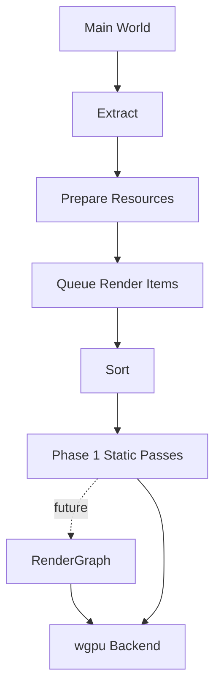

# ADR 0017: Render Graph Policy

**Status**: Accepted
**Date**: 2026-07-08

## Context

nara needs a renderer architecture mature enough for future 3D, post-processing, editor viewports, debug overlays, offscreen targets, and multi-pass rendering. A render graph is a common way to express pass dependencies and resource lifetimes, but a full graph system can add significant complexity before the engine has a first sprite/tilemap renderer.

ADR 0005 already accepted a phase-based pipeline:

```text
Extract -> Prepare -> Queue -> Sort -> Render -> Cleanup
```

This ADR decides how render graph concepts relate to that phase model.

## Decision

nara will **not require a full render graph in Phase 1**, but the render architecture must be **render-graph-ready**.

Phase 1 renderer:

- Uses explicit render phases for sprite/tilemap rendering.
- Supports views, render targets, extracted data, queued render items, sorting, and backend submission.
- Keeps pass ordering simple and mostly static.

Implementation note, 2026-07-09:

- `nara_render` now owns `RenderPassPlan`, `RenderPassStep`, `RenderPhaseInput`, and dependency
  validation. This is the static-pass contract between phase queues and backends.
- The first pass order is clear -> opaque 2D -> tilemap 2D -> transparent 2D -> UI -> gizmo per
  ordered view. `nara_render_wgpu` consumes the plan rather than owning the ordering policy.
- `nara_sprite_render` and `nara_ui_render` remain independent batch producers. A full render graph
  is still deferred until resource lifetime, post-processing, render-to-texture, editor viewport
  composition, or 3D depth/prepass needs exceed static pass planning.

Future renderer:

- Can introduce `RenderGraph` for multi-pass features such as post-processing, shadow maps, editor view composition, render-to-texture, UI composition, and 3D pipelines.
- Treats graph nodes as consumers/producers of render resources and views.
- Does not require game-facing authoring components to change.



## Render Graph Readiness Rules

### Rule 1: Views and targets are explicit from day one

Even without a graph, renderer data should model:

```text
View / ExtractedView
RenderTarget
ViewportRect
ClearColor
RenderLayers
RenderOrder
```

This prevents the first renderer from assuming a single window/single camera/single pass forever.

### Rule 2: Pass inputs and outputs should be named concepts

Phase 1 passes may be static code, but they should still name their major resources:

```text
surface color target
offscreen color target
depth target
sprite instance buffer
tile chunk buffer
view uniforms
```

This makes later graph migration a structural change, not a full conceptual rewrite.

### Rule 3: Render items are queued by phase

2D sprite/tilemap, debug gizmo, UI, and future 3D mesh items should enter named phases. A future graph may decide where those phases execute, but extraction/queueing should not be hardcoded to one monolithic draw loop.

### Rule 4: Full graph waits for a real second use case

Do not build a full graph only for the initial sprite pass. Introduce it when at least one of these arrives:

- Post-processing.
- Multiple viewports/render-to-texture.
- Editor viewport composition.
- 3D shadow/depth/prepass needs.
- UI composition requiring explicit pass ordering.

## Alternatives Considered

### Option A: Full render graph from day one

**Pros**: Maximum long-term rendering flexibility; aligns with advanced engines.

**Cons**: Large upfront complexity; easy to design abstractly without real pass pressure; slows Phase 1 2D renderer.

**Decision**: Rejected for Phase 1.

### Option B: Hardcoded sprite draw loop

**Pros**: Fastest first pixels.

**Cons**: Future post-processing, editor viewports, 3D, and render-to-texture become painful retrofits.

**Decision**: Rejected.

### Option C: Phase-based renderer, graph-ready internals (Chosen)

**Pros**: Mature enough for expansion while keeping first renderer tractable.

**Cons**: Requires discipline to name resources/views/phases before a graph exists.

**Decision**: Chosen.

## Consequences

- `nara_render` should define phases, views, targets, and render item concepts before `nara_render_wgpu` hardcodes pass flow.
- `nara_render_wgpu` can implement static passes first.
- A future `RenderGraph` should live in `nara_render` or a submodule, not in the wgpu adapter.
- Game-facing APIs such as `Sprite`, `Tilemap`, `Camera2d`, and future `Mesh3d` should not mention graph nodes.

## Success Metrics

| Metric | Target | Measurement |
|---|---:|---|
| First renderer simplicity | Sprite/tilemap renderer does not require authoring graph nodes | Example review |
| Graph readiness | Views, targets, phases, and major pass resources are explicit | Code/design review |
| Future migration | Adding post-processing does not change `Sprite`/`Camera2d` authoring APIs | Design test |
| Backend isolation | Graph concepts are not wgpu-only | Dependency review |

## Risks and Mitigations

| Risk | Severity | Likelihood | Mitigation |
|---|---|---:|---|
| Static passes become hidden hardcoding | High | Medium | Name pass resources and phases even before graph exists |
| Premature graph abstractions creep in | Medium | Medium | Require a second concrete use case before full graph implementation |
| Future graph conflicts with current phases | Medium | Medium | Treat phases as queue categories, not fixed pass ownership |

## Follow-Up Questions

- What concrete second pass/resource use case should promote `RenderPassPlan` into a full
  `RenderGraph`?
- Does editor viewport composition require graph earlier than runtime post-processing?
- Where should render resource lifetime tracking live once graph nodes produce and consume
  intermediate textures, depth targets, or UI composition targets?

## Citations

- Dimension-aware runtime decision: [0005-dimension-aware-runtime-with-2d-first-authoring.md](0005-dimension-aware-runtime-with-2d-first-authoring.md)
- Render crate boundaries: [0012-render-crate-boundaries.md](0012-render-crate-boundaries.md)
