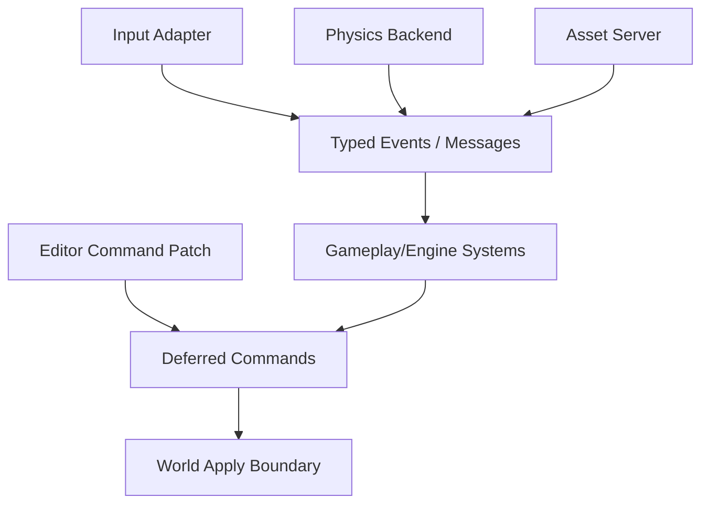

# ADR 0023: Event, Message, and Command Model

**Status**: Accepted
**Date**: 2026-07-08

## Context

nara needs a consistent communication model for input, physics contacts, asset loading, scene operations, editor patches, diagnostics, and plugin interactions. Without a shared model, each subsystem will invent its own queue and lifecycle.

`bevy_ecs` provides event/message and command mechanisms that nara can build on.

## Decision

nara will use ECS-native messages/events and deferred commands as the primary runtime communication model.

Rules:

- Use `bevy_ecs` message/event mechanisms as the substrate where possible.
- Events/messages are transient frame or fixed-step data, not persistent scene state.
- Commands mutate the ECS world at explicit schedule boundaries.
- Editor and tooling operations should compile down to validated command/patch operations, not direct private storage mutation.
- Asset/scene/physics/input subsystems publish typed messages with documented lifetime.
- Persistent intent belongs in components/resources; transient observations belong in events/messages.

## Alternatives Considered

### Option A: One global event bus

**Pros**: Familiar and simple conceptually.

**Cons**: Bypasses ECS scheduling and type-driven access; can become a hidden dependency graph.

**Decision**: Rejected.

### Option B: Every subsystem owns its own queue

**Pros**: Local control.

**Cons**: Inconsistent lifetimes, tooling, and diagnostics.

**Decision**: Rejected.

### Option C: ECS-native events/messages and deferred commands (Chosen)

**Pros**: Aligns with Bevy ECS substrate and schedule boundaries; easy to type and test.

**Cons**: Requires clear lifetime rules and editor patch mapping.

**Decision**: Chosen.

## Success Metrics

| Metric | Target | Measurement |
|---|---:|---|
| Typed communication | Input/physics/assets use typed messages | API review |
| Explicit mutation | Cross-system world mutation uses commands/apply points | Code review |
| Tooling compatibility | Editor patch maps to commands with diagnostics | Future test |
| No hidden bus | No global untyped event bus in core runtime | Code review |

## Risks and Mitigations

| Risk | Severity | Likelihood | Mitigation |
|---|---|---:|---|
| Event lifetime confusion | Medium | High | Document per-event retention and schedule stage |
| Commands hide ordering bugs | Medium | Medium | Keep apply points explicit and tested |
| Editor patch model needs more than commands | Medium | Medium | Add scene patch data model later, compiled into commands |

## Follow-Up Questions

- What exact event retention policy should nara use?
- Do fixed-update events and frame-update events use separate channels?
- What is the first editor command/patch data shape?
- How should diagnostics point to a failed command?

