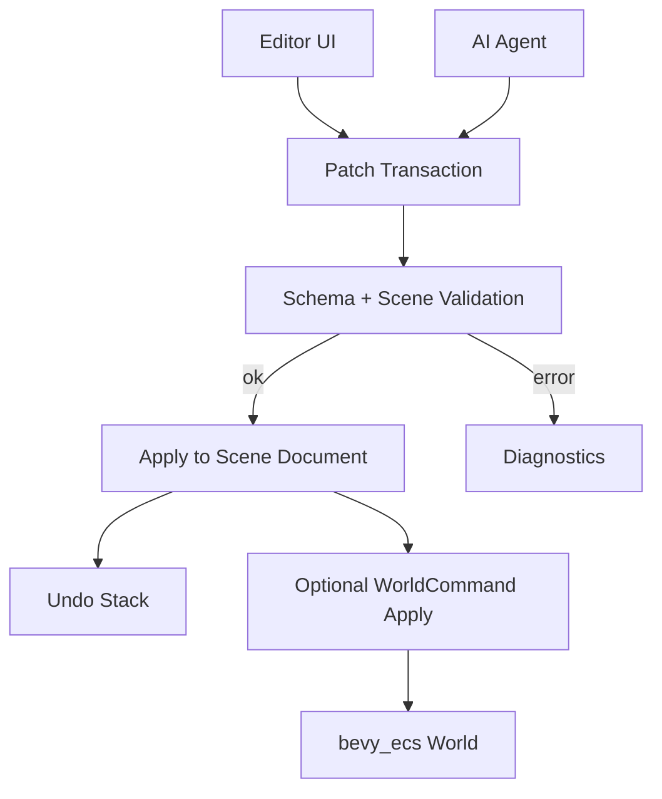

# ADR 0026: Editor Command, Patch, and Undo Model

**Status**: Accepted
**Date**: 2026-07-08
**Refined By**: ADR 0043: Scene, Prefab, and Patch Document Migration Policy

## Context

nara's editor is a client of runtime APIs. Scene/prefab files are data documents with stable `SceneEntityId` values, component schema IDs, diagnostics, and validation. AI agents should also be able to modify scenes and prefabs safely.

The missing layer is a consistent authoring mutation model:

```text
Editor / AI operation -> patch/command -> validate -> apply -> undo/redo -> diagnostics
```

## Decision

nara authoring tools will use **validated patch transactions** for scene/prefab editing and **deferred world commands** for runtime world mutation.

Rules:

- Editor and AI tools do not mutate private ECS storage directly.
- Scene/prefab edits are represented as `ScenePatch` operations over stable document IDs.
- Runtime world edits are represented as `WorldCommand` operations applied at explicit schedule boundaries.
- Undo/redo is built on patch transactions.
- Diagnostics are returned for validation and application failures.
- Patch paths are stable and schema-aware: `SceneEntityId + ComponentTypeId + field path`.
- Patches should be serializable so AI tools, editor UI, and tests can share the same mutation format.



## Patch Model

Implemented Rust types:

```text
ScenePatchDocument
  operations: Vec<ScenePatchOperation>

ScenePatchOperation
  AddEntity { entity }
  RemoveEntity { entity }
  AddComponent { entity, component, value }
  RemoveComponent { entity, component }
  ReplaceComponent { entity, component, value }
  SetField { entity, component, path, value }
  RemoveField { entity, component, path }
  Reparent { entity, parent }
  SetAssetRefField { entity, component, path, asset_ref }
```

Patch operations serialize as `op + args` so JSON and RON roundtrip with the same semantic shape.
Payloads use `ComponentValue`, stable `ComponentTypeId`, and structured `ComponentFieldPath`.

Implementation notes as of 2026-07-08:

- Patch apply is document-first and atomic: operations are applied to a scratch `SceneDocument`,
  validated, canonicalized, then committed only if the full transaction succeeds.
- Patch diagnostics include operation index plus entity/component/field context when available.
- Successful patch apply returns an inverse `ScenePatchDocument` for transaction-level undo.
- `RemoveEntity` removes the subtree and inverse data restores it parent-first.
- `RemoveField` is only allowed for optional fields or fields with registered defaults.
- Prefab overrides reuse `ScenePatchDocument`; overrides are applied relative to source prefab IDs
  before prefab expansion namespaces them.
- `SceneAuthoringSession` wraps a `SceneDocument`, records undo/redo stacks as inverse patches,
  tracks whether its live projection is dirty, and exposes sync methods for plain scenes,
  asset-aware scenes, and prefab-resolved scenes.
- The first live sync implementation is rebuild-style: spawn the current document projection,
  reject it if diagnostics contain errors, then despawn only the previous entities owned by the
  session. Unrelated runtime entities are preserved.
- Incremental `WorldCommand` synchronization remains a later optimization. Spawning still
  preflights expanded documents before mutating the ECS `World`.

## Undo / Redo

Undo/redo should be transaction-based:

- A user action creates one transaction.
- The editor/session stores inverse patches generated by successful patch application.
- Multi-operation edits must undo atomically.
- Failed patches do not enter undo history.
- Diagnostics should identify the failed operation and field path.

## Alternatives Considered

### Option A: Editor mutates ECS World directly

**Pros**: Fast to prototype.

**Cons**: Hard to validate, serialize, undo, replay, or share with AI tools.

**Decision**: Rejected.

### Option B: Editor mutates scene files directly with ad hoc JSON/RON edits

**Pros**: Simple file-level editing.

**Cons**: Weak schema validation and poor undo/redo semantics.

**Decision**: Rejected.

### Option C: Validated patch transactions (Chosen)

**Pros**: Supports editor, AI, diagnostics, undo/redo, tests, and future collaboration.

**Cons**: Requires a real patch data model and validation layer.

**Decision**: Chosen.

## Consequences

- `nara_editor` should operate on scene/prefab documents through patch transactions.
- Runtime commands and authoring patches are related but not identical.
- Scene validation and component schema systems must support field paths and typed values.
- Hot reload and conflict handling can reuse patch diagnostics and validation.
- AI agents can propose patches instead of rewriting entire scenes blindly.

## Success Metrics

| Metric | Target | Measurement |
|---|---:|---|
| Safe editing | Editor changes do not require private World access | Code review |
| Undo support | Multi-operation transaction can undo atomically | `scene_patch_transactions` and `scene_authoring_session` tests |
| AI compatibility | AI can emit JSON/RON patches and receive diagnostics | `scene_patch_roundtrip` example and patch diagnostics |
| Stable paths | Patch paths use `SceneEntityId`, `ComponentTypeId`, and `ComponentFieldPath` | Schema and patch tests |
| Validation | Invalid field edits fail before apply | patch and prefab override no-mutation tests |
| Live projection safety | Authoring sync does not remove unrelated runtime entities | `scene_authoring_session` tests |

## Risks and Mitigations

| Risk | Severity | Likelihood | Mitigation |
|---|---|---:|---|
| Patch model becomes too complex | Medium | Medium | Keep operations document-level and schema-aware; defer list splice and incremental live-world sync |
| Field paths break on schema migration | High | Medium | Run component migrations during scene/prefab preflight and version patch payloads if needed |
| Undo data is too large | Medium | Medium | Use inverse patches where cheap, snapshots for complex operations |
| Runtime command and scene patch diverge | Medium | Medium | Keep explicit conversion paths and tests |

## Remaining Follow-Up Questions

- How are patches versioned across component schema migrations?
- How does hot reload merge external file changes with editor undo history?
- What is the minimum patch op set for the first inspector?
- Which accepted patch operations deserve specialized incremental `WorldCommand` paths before
  rebuild-style projection becomes too expensive?

## Citations

- Scene/prefab data model: [0006-scene-and-prefab-data-model.md](0006-scene-and-prefab-data-model.md)
- Diagnostics decision: [0009-diagnostics-errors-and-logging.md](0009-diagnostics-errors-and-logging.md)
- Editor/tooling boundary: [0015-editor-tooling-and-dogfooding-boundary.md](0015-editor-tooling-and-dogfooding-boundary.md)
- Event/command model: [0023-event-message-and-command-model.md](0023-event-message-and-command-model.md)
