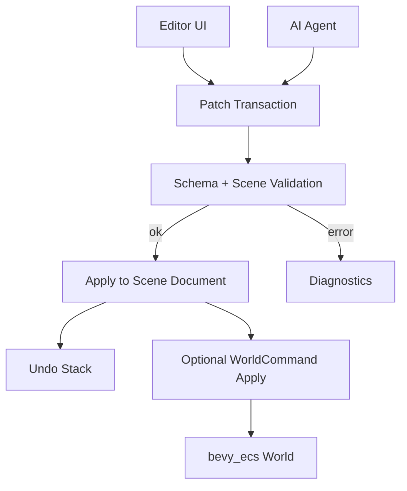

# ADR 0026: Editor Command, Patch, and Undo Model

**Status**: Accepted
**Date**: 2026-07-08

## Context

nara's editor is a client of runtime APIs. Scene/prefab files are data documents with stable `SceneEntityId` values, component schema IDs, diagnostics, and validation. AI agents should also be able to modify scenes and prefabs safely.

The missing layer is a consistent authoring mutation model:

```text
Editor / AI operation -> patch/command -> validate -> apply -> undo/redo -> diagnostics
```

## Decision

nara authoring tools will use **validated patch transactions** for scene/prefab editing and **deferred world commands** for runtime world mutation.

Rules:

- Editor and AI tools do not mutate private ECS storage directly.
- Scene/prefab edits are represented as `ScenePatch` operations over stable document IDs.
- Runtime world edits are represented as `WorldCommand` operations applied at explicit schedule boundaries.
- Undo/redo is built on patch transactions.
- Diagnostics are returned for validation and application failures.
- Patch paths are stable and schema-aware: `SceneEntityId + ComponentTypeId + field path`.
- Patches should be serializable so AI tools, editor UI, and tests can share the same mutation format.



## Patch Model

Conceptually:

```text
PatchTransaction
  id
  label
  operations: Vec<ScenePatchOp>

ScenePatchOp
  AddEntity { parent?, components }
  RemoveEntity { entity }
  AddComponent { entity, component_type, value }
  RemoveComponent { entity, component_type }
  SetField { entity, component_type, field_path, value }
  Reparent { entity, new_parent, index? }
  SetAssetRef { entity, component_type, field_path, asset_ref }
```

The exact Rust types can evolve, but this semantic shape should guide implementation.

## Undo / Redo

Undo/redo should be transaction-based:

- A user action creates one transaction.
- The editor stores either inverse patches or enough pre-change snapshots to derive inverse patches.
- Multi-operation edits must undo atomically.
- Failed patches do not enter undo history.
- Diagnostics should identify the failed operation and field path.

## Alternatives Considered

### Option A: Editor mutates ECS World directly

**Pros**: Fast to prototype.

**Cons**: Hard to validate, serialize, undo, replay, or share with AI tools.

**Decision**: Rejected.

### Option B: Editor mutates scene files directly with ad hoc JSON/RON edits

**Pros**: Simple file-level editing.

**Cons**: Weak schema validation and poor undo/redo semantics.

**Decision**: Rejected.

### Option C: Validated patch transactions (Chosen)

**Pros**: Supports editor, AI, diagnostics, undo/redo, tests, and future collaboration.

**Cons**: Requires a real patch data model and validation layer.

**Decision**: Chosen.

## Consequences

- `nara_editor` should operate on scene/prefab documents through patch transactions.
- Runtime commands and authoring patches are related but not identical.
- Scene validation and component schema systems must support field paths and typed values.
- Hot reload and conflict handling can reuse patch diagnostics and validation.
- AI agents can propose patches instead of rewriting entire scenes blindly.

## Success Metrics

| Metric | Target | Measurement |
|---|---:|---|
| Safe editing | Editor changes do not require private World access | Code review |
| Undo support | Multi-operation transaction can undo atomically | Future test |
| AI compatibility | AI can emit a patch and receive diagnostics | Future integration test |
| Stable paths | Patch paths use `SceneEntityId` and `ComponentTypeId` | Schema review |
| Validation | Invalid field edits fail before apply | Future test |

## Risks and Mitigations

| Risk | Severity | Likelihood | Mitigation |
|---|---|---:|---|
| Patch model becomes too complex | Medium | Medium | Start with whole-component and simple field patches |
| Field paths break on schema migration | High | Medium | Run migrations before patch apply and version patch payloads if needed |
| Undo data is too large | Medium | Medium | Use inverse patches where cheap, snapshots for complex operations |
| Runtime command and scene patch diverge | Medium | Medium | Keep explicit conversion paths and tests |

## Follow-Up Questions

- What typed value representation should patch payloads use?
- Should patches be JSON-compatible from day one?
- How are patches versioned across component schema migrations?
- How does hot reload merge external file changes with editor undo history?
- What is the minimum patch op set for the first inspector?

## Citations

- Scene/prefab data model: [0006-scene-and-prefab-data-model.md](0006-scene-and-prefab-data-model.md)
- Diagnostics decision: [0009-diagnostics-errors-and-logging.md](0009-diagnostics-errors-and-logging.md)
- Editor/tooling boundary: [0015-editor-tooling-and-dogfooding-boundary.md](0015-editor-tooling-and-dogfooding-boundary.md)
- Event/command model: [0023-event-message-and-command-model.md](0023-event-message-and-command-model.md)
