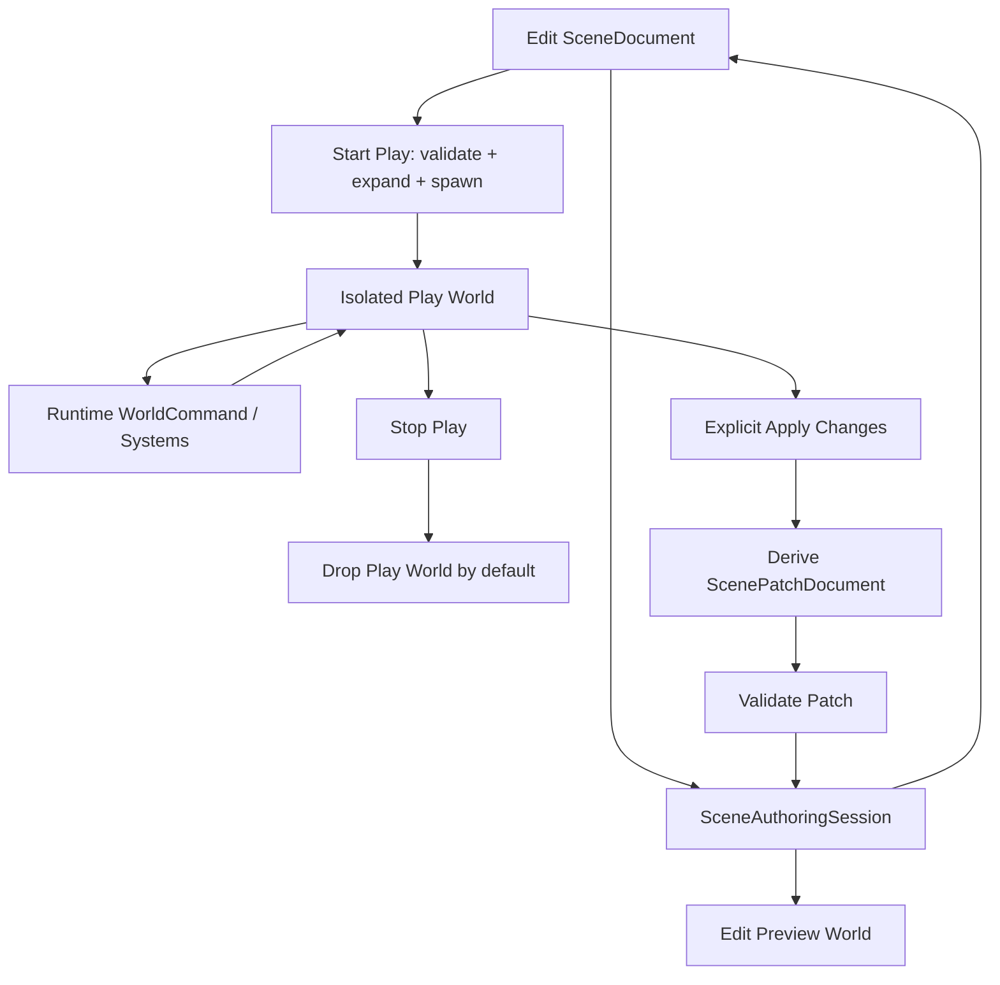
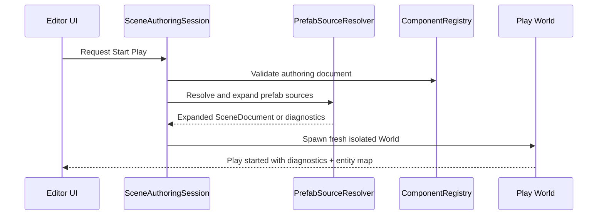
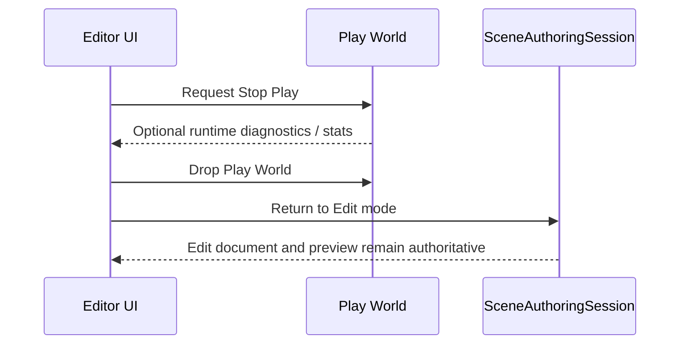
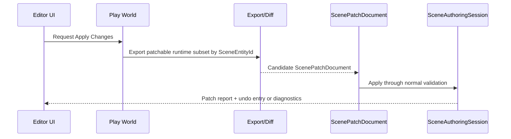

# ADR 0034: Editor Play Mode World Boundary

**Status**: Accepted
**Date**: 2026-07-08
**Refined By**: ADR 0047: Editor Workspace and Scene Document State

## Context

nara now has the first authoring stack:

- `SceneDocument` / `PrefabDocument` as persistent scene data.
- `ScenePatchDocument` as the editor/AI mutation format.
- `SceneAuthoringSession` as document-as-truth authoring state with undo/redo and live world
  projection.
- `SceneInspectorState` as a UI-agnostic inspector controller.

The next editor milestone is Play Mode. This boundary is high-risk because a mature editor must
separate authoring state from runtime simulation without making iteration slow. Unity, Godot, and
similar engines all expose the same product problem: users need fast play/stop iteration, but they
also need clear answers for whether runtime changes are temporary, persistent, undoable, or safe to
serialize.

The core question:

```text
When the user presses Play, which World is running, and what can write back to the SceneDocument?
```

## Decision

nara will use **isolated Play Mode worlds**.

The editor has three distinct state categories:

1. **Edit document**: the authoritative `SceneDocument` / `PrefabDocument` plus undo/redo stacks.
2. **Edit preview world**: a live projection owned by `SceneAuthoringSession` for inspection,
   gizmos, preview rendering, and debug tooling.
3. **Play world**: a separate runtime `World` fork spawned from the current validated document
   snapshot when Play starts.

Rules:

- The edit document is the only persistent authoring truth.
- The edit preview world is disposable. It can be rebuilt from the edit document at any time.
- The Play world is isolated from the edit preview world and must not share runtime `Entity`
  identities with it.
- Pressing Play snapshots the current edit document, validates it, expands prefab sources, then
  spawns a fresh Play world.
- Pressing Stop despawns or drops the Play world. Runtime changes are discarded by default.
- Runtime changes write back to the edit document only through an explicit **Apply Changes**
  operation that produces `ScenePatchDocument` values and runs the normal patch validation/undo
  path.
- Editor UI must show the current mode clearly: `Edit`, `Play`, or `Paused`.
- Editor inspector commands in Edit Mode target `SceneAuthoringSession`. Inspector commands in
  Play Mode target runtime/debug command surfaces and are not persistent unless converted into
  explicit scene patches.
- Save games remain separate from scene authoring data. Play Mode runtime state should not silently
  become scene data.



## Mode Model

Conceptual state:

```text
EditorMode
  Edit
  Play { paused: bool, source_revision: SceneRevision }
```

The exact Rust names can evolve, but these semantics should remain stable.

Current implementation:

- `nara_scene::SceneAuthoringRevision` is the source revision stamp.
- `nara_tooling::SceneEditorMode` represents `Edit`, `Play`, and `Paused`.
- `nara_tooling::SceneEditorState` owns the first UI-agnostic lifecycle controller.
- `nara_tooling::ScenePlaySession` stores the isolated runtime `World`, `SceneEntityMap`, and
  source revision.

Important invariants:

- A Play world records the edit document revision it was spawned from.
- Edit document patches made while Play is running do not automatically mutate the Play world.
- If nara later supports "edit while playing", those edits must be mode-aware commands with clear
  diagnostics rather than accidental shared-world mutation.
- Runtime-only components may exist in the Play world without appearing in the edit document.
- Persistent scene IDs (`SceneEntityId`) are the only durable bridge for deriving apply-back
  patches; runtime `Entity` values never cross the persistence boundary.

## Start Play Flow



Failure rules:

- If validation, prefab resolution, asset resolution, or spawn preflight reports errors, Play does
  not start.
- Failed Play start must not mutate the edit document, undo stack, or existing edit preview world.
- Diagnostics should identify scene entity IDs, component IDs, field paths, and asset references.

## Stop Play Flow



Default Stop never writes runtime state back to the edit document.

## Apply Changes Flow

Apply Changes is explicit and conservative:



Rules:

- The current implementation supports the first narrow Apply Changes subset: one selected
  `SceneEntityId` plus explicitly requested registered serializable component IDs.
- `SceneEditorState::export_apply_changes*` encodes requested Play world components through
  `ComponentRegistry` and `ComponentEncodeContext`, compares them with the authoring document, and
  returns a candidate `ScenePatchDocument` without mutating `SceneAuthoringSession`.
- `SceneEditorState::apply_changes*` applies exported patches through `SceneAuthoringSession` so
  validation, revision updates, inverse patches, and undo history stay on the normal authoring
  path.
- Apply Changes never copies raw runtime `Entity`, `AssetId`, backend handles, task handles, GPU
  resources, timers, or transient events into scene documents.
- Apply Changes must be component-schema-aware. Only serializable or explicitly authoring-mapped
  components can produce scene patches.
- Unsupported runtime changes, runtime-only components, missing entities, prefab-expanded entities,
  and duplicate component requests produce diagnostics instead of best-effort serialization.
- Supported no-op requests return no patch and do not create undo entries.
- Apply Changes enters undo history as normal patch transactions.
- If the edit document changed after Play started, apply-back must detect the revision mismatch and
  either reject with diagnostics or require a merge UI. It must not silently overwrite edits.
- Whole-scene runtime diffing, field-level diff minimization, prefab override write-back, and
  edit-while-playing merge UI remain future work.

Implementation note, 2026-07-09: the selected-entity / explicit-component subset is implemented in
`nara_tooling`. Earlier Play Mode diagnostics-only apply-back notes are superseded by the
patch-producing flow above; unsupported or ambiguous changes still reject with diagnostics rather
than falling back to broad world diffing.

## Alternatives Considered

### Option A: Single shared World for edit and play

**Pros**: Fastest implementation, no world fork, runtime inspector always sees the same data.

**Cons**: High risk of runtime state leaking into authoring data, hard undo semantics, Play/Stop
becomes ambiguous, temporary components can pollute scene files, and bugs become difficult to
reproduce.

**Decision**: Rejected. It conflicts with code-first persistence and safe editor semantics.

### Option B: Isolated Play world with explicit apply-back

**Pros**: Clear mode semantics, safe Stop behavior, undoable authoring changes, clean separation of
runtime-only state, strong fit for AI-generated patches and future hot reload conflict handling.

**Cons**: Requires world fork/spawn infrastructure, mode-aware inspector behavior, and later
apply-back diff tooling.

**Decision**: Chosen.

### Option C: Isolated Play world with automatic write-back on Stop

**Pros**: User changes during play can feel convenient and persistent.

**Cons**: Surprising data loss/overwrite risk, difficult to explain which runtime systems are
allowed to modify scenes, weak undo boundaries, and poor compatibility with hot reload.

**Decision**: Rejected. nara can add explicit "Apply Changes" workflows later without making
automatic persistence the default.

## Consequences

- `nara_tooling` currently owns UI-agnostic mode state and Play world lifecycle. A future
  `nara_editor` crate should take over only when viewport scheduling, input routing, render
  integration, hot reload streaming, or multiple simultaneous Play worlds require editor-owned
  orchestration.
- `nara_scene` should continue treating documents as persistent data and worlds as projections.
- `nara_tooling` must expose mode-aware models rather than assuming every inspector command is
  persistent.
- `WorldCommand` remains useful for runtime mutation, but scene persistence still requires patches.
- Hot reload conflict handling can reason about source document revisions and Play world source
  revisions separately.
- Save-game systems stay separate from scene editing and Play Mode apply-back.

## Success Metrics

| Metric | Target | Measurement |
|---|---:|---|
| Play isolation | Play systems cannot mutate the edit preview world accidentally | Play Mode tests with distinct entity maps |
| Stop safety | Stop Play discards runtime-only changes by default | Play/Stop integration test |
| Explicit persistence | Apply Changes is explicit; selected serializable components produce scene patches, unsupported cases reject with diagnostics | Apply Changes export/apply tests |
| Revision safety | Apply-back detects edit document changes made after Play started | Revision mismatch test |
| Persistence hygiene | Runtime `Entity`, `AssetId`, backend handles, and transient components never serialize into scene data | Serialization leak search and tests |

## Risks and Mitigations

| Risk | Severity | Likelihood | Mitigation |
|---|---|---:|---|
| World fork becomes expensive for large scenes | Medium | Medium | Start rebuild-style, add incremental spawn/cache later with the same mode contract |
| Users expect Play changes to persist | Medium | High | Make mode visible and require explicit Apply Changes with diagnostics |
| Apply-back diffs become too broad | High | Medium | Start with explicit serializable component subset and reject unsupported runtime state |
| Edit while playing creates merge conflicts | High | Medium | Track source revisions and reject ambiguous apply-back until merge tooling exists |
| Runtime-only components leak into scenes | High | Low | Keep scene export/schema filters strict and test for handle/entity serialization leaks |

## Follow-Up Questions

- When should Apply Changes produce field-level patch operations instead of whole-component
  replacements?
- How should prefab source override write-back work for selected expanded entities?
- How should a Play world receive hot reloaded assets without mutating the edit document?
- Should Play Mode support multiple simultaneous worlds later for multiplayer/local simulation
  debugging?

## Citations

- Editor/tooling boundary: [0015-editor-tooling-and-dogfooding-boundary.md](0015-editor-tooling-and-dogfooding-boundary.md)
- Event/command model: [0023-event-message-and-command-model.md](0023-event-message-and-command-model.md)
- Editor patch and undo model: [0026-editor-command-patch-and-undo-model.md](0026-editor-command-patch-and-undo-model.md)
- Save-game persistence boundary: [0027-save-game-and-runtime-persistence.md](0027-save-game-and-runtime-persistence.md)
