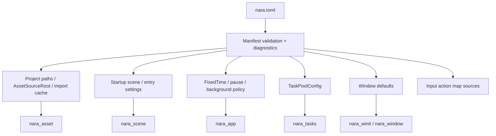

# ADR 0035: Project Manifest and Runtime Settings Authority

**Status**: Accepted
**Date**: 2026-07-09
**Refined By**: ADR 0039: Main Loop, Time Domains, Pause, and Runtime State; ADR 0041:
Input Routing, Actions, Text Input, UI Focus, and Accessibility

## Context

ADR 0020 established `nara.toml` plus conventional project directories, but it intentionally left
the concrete manifest authority open. That is now becoming a cross-cutting risk. Asset roots,
import cache paths, default scenes, runtime profiles, task-pool sizing, window defaults, and input
maps should not each grow a private configuration format.

nara also needs to stay code-first. A library user should be able to construct an `App` without a
project file, while a file-backed game, editor session, or AI-generated project needs one stable
manifest authority.

## Decision

`nara.toml` is the project-level settings authority for file-backed projects. Runtime embedding may
override it through explicit `App` resources, but no engine subsystem should invent a second
persistent project configuration source for the same setting.

The manifest contract is:

- `schema_version` is required and gates future manifest migrations.
- `[project]` owns project name and optional stable project identity.
- `[paths]` owns logical project roots such as assets, scenes, prefabs, scripts, and generated
  `.nara/import-cache`.
- `[startup]` owns the default startup scene or entry point when a project is launched from files.
- `[runtime]` owns fixed timestep defaults and pause/background policy defaults.
- `[tasks]` owns task-pool sizing policy. Programmatic `TaskPlugin` configuration remains valid for
  embedded apps and tests.
- `[window]` owns default primary-window settings for file-backed desktop launches.
- `[input]` owns named input action map files or inline action-map settings once ADRs define the
  input-action model.
- `[profiles.<name>]` provides platform/build/profile overrides. Overrides patch manifest values;
  they do not replace the manifest authority.

Manifest parsing and validation should produce structured diagnostics. It should not create GPU
resources, platform windows, task threads, or asset values directly. Instead, startup code lowers the
validated manifest into normal nara resources and plugin configuration.

## Rules

- `nara.toml` values are project data and should be serializable, reviewable, and AI-generatable.
- Code-first callers may construct equivalent resources manually. This is an override path, not a
  competing persistent format.
- Generated/cache directories are configurable only through the manifest or explicit embedding
  resources.
- Profile overlays must be deterministic: a project plus profile name resolves to one effective
  settings document.
- Domain crates may define their own settings structs, but the persistent owner is the project
  manifest layer.

## Alternatives Considered

### Option A: Each subsystem owns local config files

**Pros**: Local autonomy and quick implementation.

**Cons**: Asset roots, input maps, task pools, and startup scenes would drift. AI-generated projects
would need to understand many authorities.

**Decision**: Rejected.

### Option B: Editor-owned project database

**Pros**: Strong editor workflow and central indexing.

**Cons**: Conflicts with code-first authoring and makes the editor a source of truth for runtime
configuration.

**Decision**: Rejected as the primary model.

### Option C: `nara.toml` as authority with code overrides

**Pros**: Simple for projects and AI agents, compatible with editor tooling, still works for
library-style embedded apps.

**Cons**: Requires careful schema versioning and validation diagnostics.

**Decision**: Chosen.

## Success Metrics

| Metric | Target | Measurement |
|---|---:|---|
| Single project authority | Asset roots, startup scene, task defaults, window defaults, and input-map sources resolve from one manifest for file-backed apps | Manifest tests |
| Code-first compatibility | Minimal examples can still configure `App` without `nara.toml` | Example check |
| Deterministic profiles | Same manifest plus profile name yields same effective settings | Unit test |
| Diagnostic quality | Invalid required fields report structured diagnostics | Unit test |

## Risks and Mitigations

| Risk | Severity | Likelihood | Mitigation |
|---|---|---:|---|
| Manifest becomes a dumping ground | Medium | Medium | Keep manifest project-level; scene, prefab, asset, and material data stay in their own files. |
| Embedded users feel forced into files | Medium | Low | Keep resource/plugin configuration as an explicit override path. |
| Profile overlays become order-dependent | Medium | Medium | Require deterministic overlay resolution and tests. |
| Early schema overfits desktop | Medium | Medium | Keep profile fields platform-neutral and let adapters lower settings. |

## Consequences

- ADR 0020 remains the layout decision; this ADR defines the settings authority inside that layout.
- Future `nara_project` or manifest code should be a pure validation/lowering layer, not a hidden
  runtime service.
- Open questions about required `nara.toml` fields and configurable directories are settled at the
  policy level; implementation still needs the concrete schema structs and parser.

## Open Questions

- What exact TOML names should the first implementation expose for every field?
- Should project stable identity be required immediately or optional until packaging/export exists?
- Should profile overlays live inline in `nara.toml` only, or may they be split into profile files
  later while preserving one effective manifest authority?
