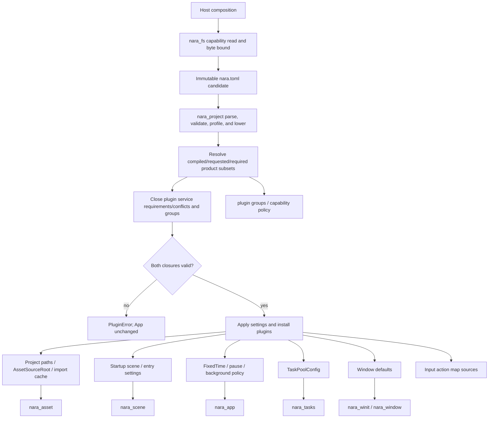

# ADR 0035: Project Manifest and Runtime Settings Authority

**Status**: Accepted
**Date**: 2026-07-09
**Refines**: ADR 0020: Project Source Layout
**Refined By**: ADR 0039: Main Loop, Time Domains, Pause, and Runtime State; ADR 0041: Input Routing,
Actions, Text Input, UI Focus, and Accessibility; ADR 0046: Plugin Metadata and Default Plugin
Groups; ADR 0056: Headless Runtime and Dedicated Server Readiness; ADR 0070: Capability-Oriented
Filesystem Substrate; ADR 0079: Root Product Capabilities and Placeholder Domain Retirement

## Context

ADR 0020 established `nara.toml` plus conventional project directories, but it intentionally left
the concrete manifest authority open. That is now becoming a cross-cutting risk. Asset roots,
import cache paths, default scenes, runtime profiles, task-pool sizing, window defaults, and input
maps should not each grow a private configuration format.

nara also needs to stay code-first. A library user should be able to construct an `App` without a
project file, while a file-backed game, editor session, or AI-generated project needs one stable
manifest authority.

## Decision

`nara.toml` is the project-level settings authority for file-backed projects. Runtime embedding may
override it through explicit `App` resources, but no engine subsystem should invent a second
persistent project configuration source for the same setting.

The manifest contract is:

- `schema_version` is required and gates future manifest migrations.
- `[project]` owns project name and optional stable project identity.
- `[paths]` owns logical project roots such as assets, scenes, prefabs, scripts, and generated
  `.nara/import-cache`.
- `[startup]` owns the default startup scene or entry point when a project is launched from files.
- `[runtime]` owns pause, time scale, maximum frame delta, fixed timestep, per-frame fixed work,
  bounded debt, catch-up policy, and a narrow runtime preset.
- Project capability settings request an additive subset of the host's compiled product
  capabilities. Preset implications and explicit requests normalize to one inspectable set.
- `[tasks.io]`, `[tasks.compute]`, and `[tasks.async_compute]` own non-zero worker/pending limits;
  `[tasks.shutdown]` owns bounded drain/cancel/join timeouts. Production settings are threaded.
  Programmatic `TaskPlugin` configuration remains valid for embedded apps, while the inline driver
  remains test-only.
- `[window]` owns default primary-window settings for file-backed desktop launches.
- `[input]` owns named input action map files or inline action-map settings once ADRs define the
  input-action model.
- `[profiles.<name>]` provides platform/build/profile overrides, including future `headless`,
  `server`, `editor`, `dev`, and `release` profiles. Overrides patch manifest values; they do not
  replace the manifest authority.

Canonical version 1 spells product selection as:

```toml
[runtime]
preset = "local-headless"

[capabilities]
requested = ["runtime-2d", "render-wgpu"]
```

The runtime preset is one of `minimal`, `local-headless`, or `server`. Capability IDs are the
coarse ADR 0079 feature names. A profile capability patch replaces the requested set rather than
merging it, so one manifest plus profile has one auditable request.

Host/composition code opens and bounds `nara.toml` through a host-issued `nara_fs` capability, then
passes an immutable byte or UTF-8 candidate into `nara_project`. The project crate owns parsing,
validation diagnostics, profile overlays, and lowering; it exposes no ambient `File::open` or
authorization-checked raw-path API.

`EffectiveProjectSettings` contains validated domain values. The root product host first publishes
an immutable `ProjectSettingsCandidate` only after the runtime preset and additive request fit the
compiled product ceiling. RGF-U4 then proves the resolved plan's required product capabilities fit
that request and closes plugin service requirements/conflicts and group membership before touching
`App`. Candidate ingest returns `ProjectCandidateError`; plugin closure and installation return
`PluginError`. Only a valid plan may apply resources and install plugins. `nara_project` itself
remains side-effect-free.



## Rules

- `nara.toml` values are project data and should be serializable, reviewable, and AI-generatable.
- File-backed hosts obtain manifest bytes through `nara_fs`; `nara_project` accepts immutable
  candidates and never acquires ambient filesystem authority.
- Code-first callers may construct equivalent resources manually. This is an override path, not a
  competing persistent format.
- Generated/cache directories are configurable only through the manifest or explicit embedding
  resources.
- Profile overlays must be deterministic: a project plus profile name resolves to one effective
  settings document.
- Domain crates may define their own settings structs, but the persistent owner is the project
  manifest layer.

## Alternatives Considered

### Option A: Each subsystem owns local config files

**Pros**: Local autonomy and quick implementation.

**Cons**: Asset roots, input maps, task pools, and startup scenes would drift. AI-generated projects
would need to understand many authorities.

**Decision**: Rejected.

### Option B: Editor-owned project database

**Pros**: Strong editor workflow and central indexing.

**Cons**: Conflicts with code-first authoring and makes the editor a source of truth for runtime
configuration.

**Decision**: Rejected as the primary model.

### Option C: `nara.toml` as authority with code overrides

**Pros**: Simple for projects and AI agents, compatible with editor tooling, still works for
library-style embedded apps.

**Cons**: Requires careful schema versioning and validation diagnostics.

**Decision**: Chosen.

## Success Metrics

| Metric | Target | Measurement |
|---|---:|---|
| Single project authority | Asset roots, startup scene, task defaults, window defaults, and input-map sources resolve from one manifest for file-backed apps | Manifest tests |
| Code-first compatibility | Minimal examples can still configure `App` without `nara.toml` | Example check |
| Deterministic profiles | Same manifest plus profile name yields same effective settings | Unit test |
| Diagnostic quality | Invalid required fields report structured diagnostics | Unit test |
| Applied task policy | Manifest worker/queue/shutdown values equal installed `TaskPools::config()` | Facade integration test |
| Capability-bound ingest | `nara_project` contains no ambient manifest open and bounded host bytes parse identically | Boundary and parser tests |
| Atomic composition | A missing compiled capability, unrequested plan product capability, missing plugin service, or conflict leaves `App` unchanged and retryable | Facade integration test |

## Risks and Mitigations

| Risk | Severity | Likelihood | Mitigation |
|---|---|---:|---|
| Manifest becomes a dumping ground | Medium | Medium | Keep manifest project-level; scene, prefab, asset, and material data stay in their own files. |
| Embedded users feel forced into files | Medium | Low | Keep resource/plugin configuration as an explicit override path. |
| Profile overlays become order-dependent | Medium | Medium | Require deterministic overlay resolution and tests. |
| Early schema overfits desktop | Medium | Medium | Keep profile fields platform-neutral and let adapters lower settings. |
| Validation and installation closures drift | Critical | Medium | Install from the same inspectable resolved plan that preflight validated and compare installed membership in tests. |

## Consequences

- ADR 0020 remains the layout decision; this ADR defines the settings authority inside that layout.
- Future `nara_project` or manifest code should be a pure validation/lowering layer, not a hidden
  runtime service.
- File-backed launch composition owns manifest capabilities and bytes; project data cannot grant or
  reconstruct filesystem authority.
- Runtime presets and additive capabilities replace the mutually exclusive product plugin-plan
  shape; product subset gates and the separate plugin service closure reject before any `App`
  mutation.
- Invalid duration quantization/overflow, zero/non-finite values, per-kind limits, aggregate task
  limits, and shutdown timeout limits are rejected before lowering.

## Open Questions

- Should project stable identity be required immediately or optional until packaging/export exists?
- Should profile overlays live inline in `nara.toml` only, or may they be split into profile files
  later while preserving one effective manifest authority?
