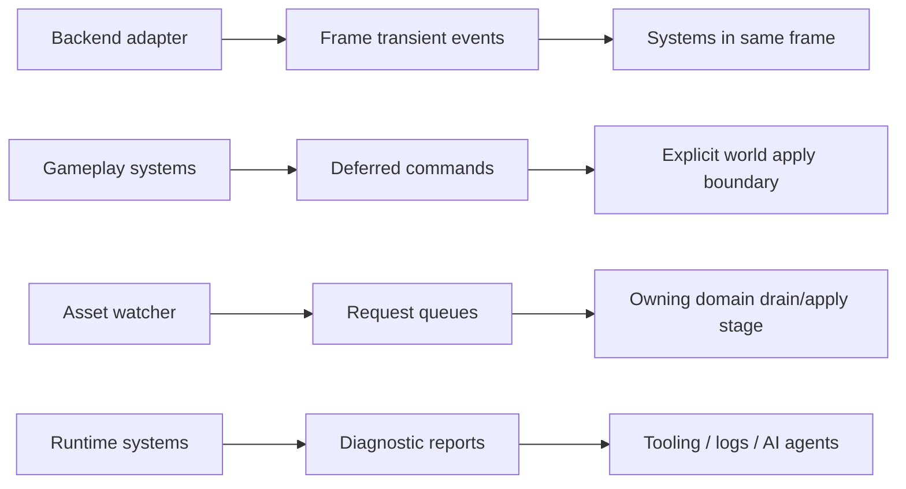

# ADR 0036: Event, Message, and Resource Queue Lifetime

**Status**: Accepted
**Date**: 2026-07-09

## Context

ADR 0023 chose ECS-native events/messages and deferred commands as nara's communication model.
Implementation has since added several resource-backed queues: `WindowEvents`, `AssetEvents`,
`AssetSourceChanges`, `AssetReloadRequests`, input button transitions, UI interaction state, and
diagnostic reports.

Those resources are not inherently wrong. The risk is undocumented lifetime. If each subsystem owns
an ad hoc queue with different retention, clearing, fixed/update behavior, and replay semantics,
tooling and gameplay systems cannot reason about observations consistently.

## Decision

nara uses typed ECS resources or ECS-native message buffers as the transport substrate, but every
transient channel must declare its lifetime contract. The product contract is nara's lifecycle, not
the concrete storage type.

Every event/message/queue resource must document:

- producer and consumer stages;
- retention policy;
- cleanup or drain stage;
- whether it belongs to frame update, fixed update, task update, or authoring/editor flow;
- whether it is replay-recordable;
- whether it is diagnostic/observational or command/request intent.

## Channel Classes

| Class | Examples | Retention | Cleanup owner |
|---|---|---|---|
| Frame transient events | `WindowEvents`, pointer/button transitions | Same frame unless documented otherwise | Producer domain or `CoreStage::Last` |
| Fixed transient events | Future physics contacts | One fixed-step tick or configured replay window | Fixed-step owner |
| Request queues | `AssetSourceChanges`, `AssetReloadRequests` | Until the owning domain drains or resolves them | Owning domain stage |
| Runtime state projections | `UiInteractionState`, `RenderBackendStatus` | Last known state until replaced | Owning domain |
| Diagnostics | `DiagnosticReport`, asset reload diagnostics | Retained until explicit clear/replace policy | Diagnostic owner |
| Authoring patches | `ScenePatchDocument` | Persistent document data | Scene/tooling owner |

## Rules

- Do not introduce an untyped global event bus.
- Do not add a new resource queue without documenting its lifecycle in code docs or an ADR section.
- Request queues are allowed when they represent durable intent pending domain ownership, for
  example asset reload requests.
- Event resources should prefer drain/read APIs that make retention explicit.
- Diagnostics are not gameplay events. They should be observable by tools and optionally bridged to
  tracing, but implicit logging is not the source of truth.
- Replay capture must record channel class and stage, not only payload type.

## Alternatives Considered

### Option A: Force every transient channel through `bevy_ecs` messages

**Pros**: One substrate and familiar semantics for Bevy users.

**Cons**: Some nara channels are request queues or retained status resources rather than messages.
Forcing all of them into message buffers would hide domain ownership.

**Decision**: Rejected as a hard rule.

### Option B: Let every subsystem define its own queue semantics

**Pros**: Quick and locally flexible.

**Cons**: Creates inconsistent lifetimes, weak replay support, and unclear tooling behavior.

**Decision**: Rejected.

### Option C: Typed ECS channels with explicit nara lifecycle classes

**Pros**: Fits existing code, keeps ECS access typed, and makes retention/replay/tooling rules
auditable.

**Cons**: Requires discipline and documentation for every new queue.

**Decision**: Chosen.

## Success Metrics

| Metric | Target | Measurement |
|---|---:|---|
| Documented channels | New event/queue resources state producer, consumer, retention, and cleanup | Code review |
| No hidden bus | No untyped global event bus in core runtime | Dependency/API review |
| Replay readiness | Fixed/frame/request/diagnostic channels are classifiable | ADR and future replay tests |
| Diagnostics visibility | Asset/watch/source-change errors are observable without tracing | Unit tests |

## Risks and Mitigations

| Risk | Severity | Likelihood | Mitigation |
|---|---|---:|---|
| Resource queues drift into hidden buses | High | Medium | Require owner, lifetime, and drain policy for every queue. |
| Events disappear before tools read them | Medium | Medium | Treat diagnostics/status separately from frame transient events. |
| Fixed-step and frame events mix accidentally | Medium | Medium | Require channel class and stage in docs/tests. |
| Replay capture overfits current storage | Medium | Low | Capture by lifecycle class and stage, not by Rust container type. |

## Consequences

- ADR 0023 is refined: ECS-native communication remains the model, but nara may use typed resource
  queues when the lifecycle is explicit.
- Existing queues should be audited and documented incrementally instead of replaced all at once.
- Asset reload source-change errors should become structured diagnostics rather than silently
  dropped failures.

## Open Questions

- Should nara provide a small reusable `Events<T>`/`Requests<T>` wrapper with stage metadata?
- Which channels belong in future deterministic replay capture first?
- Should diagnostics have a bounded ring-buffer mode for long-running editor sessions?
