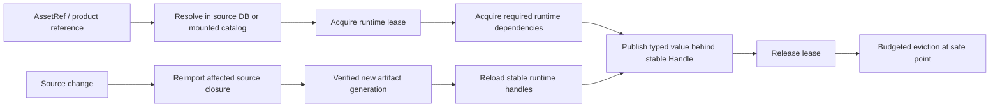
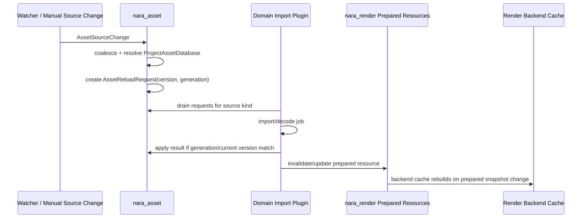

# ADR 0037: Runtime Asset Acquisition, Reload, and Lifetime Policy

**Status**: Accepted
**Date**: 2026-07-09
**Refined By**: ADR 0050: Asset Root, Symlink, Junction, and Package Trust Policy; ADR 0051:
Persistent File Envelope, Migration, and Golden Fixtures

## Context

ADR 0033 defined the asset import to render-resource preparation seam. The implementation now has
stable asset IDs, `.meta` records, importer registry metadata, import artifacts, typed `Assets<T>`,
`LoadState`, reload generations, dependency-aware reload requests, async image imports, and backend
GPU caches.

The missing contract is the public lifetime model: how runtime acquisition differs from source
reload, how failures are observed, when cached runtime values remain alive, how stale task results
are rejected, and how prepared/render backend resources are evicted.

## Decision

`nara_asset` owns source asset identity, request scheduling, runtime load state, reload
generations, source-change diagnostics, and typed runtime asset tables. Domain asset crates own
decode/import logic and typed value application. Render crates own prepared render resources and
backend GPU caches.

Runtime acquisition and source reload are separate operations:

The first lifetime policy is:

- `Handle<T>` is runtime identity. It is stable across reloads but not persistent scene data.
- `AssetRef` is persistent semantic identity. Authoring hosts resolve it through the project asset
  database; packaged runtimes resolve it through a validated mounted content catalog. Resolution
  does not itself imply residency.
- A runtime acquisition request resolves identity, acquires a lease, loads required runtime
  dependencies, decodes or materializes a typed value, and publishes it behind a stable handle.
  Release and budgeted eviction are later lifetime operations.
- A source reload request represents an already known source/product whose authoring inputs or
  importer recipe changed. It is not the public runtime load request.
- `AssetSourceChange` values are coalesced into generation-stamped `AssetReloadRequest` values.
- Each reload request carries expected asset version and load generation. Domain apply systems must
  reject stale results.
- A failed first load stores no asset value and sets `LoadState::Failed`.
- A failed reload preserves the last good typed asset value when one exists, records
  `LoadState::Failed`, and emits a failure event.
- In a source-backed authoring database, removing a source clears typed runtime values and
  prepared render resources derived from that source generation.
- Removing authoring source is distinct from unmounting a packaged generation. A runtime may keep
  using a verified mounted artifact even when no authoring tree is present.
- Source-change translation or scheduling failures produce structured diagnostics; they must not be
  silently dropped.
- Prepared render resources are backend-neutral cache entries. Backend-native GPU objects remain in
  backend caches and are invalidated from prepared resource identity/version changes.

## Cache Modes

The first implementation may keep a simple default cache behavior, but public design should reserve
these modes:

| Mode | Meaning | First implementation |
|---|---|---|
| Automatic | Asset may unload when no strong runtime owner requires it | Default policy, exact eviction may be conservative |
| Pinned | Asset stays resident while a project/runtime setting or tool pins it | Reserved |
| Transient | Asset may be dropped aggressively after use | Reserved |
| Generated | Runtime/editor-generated asset with explicit owner | Reserved |

## Rules

- Asset loading failures must be visible through `AssetEvents`, `LoadState`, diagnostics, or all
  three depending on failure class.
- Watcher adapters translate filesystem events into semantic source changes; `nara_asset` remains
  watcher-agnostic.
- Import artifacts are backend-neutral. GPU objects, bind groups, and render targets are not
  imported artifacts.
- Domain plugins should drain only the source kinds they own.
- Stale generation or expected-version mismatches must not overwrite newer runtime asset state.
- Cache eviction must not invalidate persistent scene data.
- Runtime acquisition and reload queues have distinct request identities, state, cancellation, and
  diagnostics. A load miss must not be fabricated as a source-change event.
- Required dependencies acquire transitively before publication. Soft dependencies remain
  unresolved until explicitly acquired by product policy.
- An in-flight acquisition captures one immutable source-database or mount-set snapshot; a later
  publication cannot redirect it halfway through decode.

## Alternatives Considered

### Option A: Direct synchronous load on every `AssetRef`

**Pros**: Simple mental model.

**Cons**: Blocks hot reload, async import, dependency propagation, progress reporting, and editor
diagnostics.

**Decision**: Rejected.

### Option B: Renderer-owned asset cache

**Pros**: Easy texture upload path.

**Cons**: Leaks backend lifetime into asset identity and breaks non-render assets, scenes, prefabs,
audio, and future editor tooling.

**Decision**: Rejected.

### Option C: Asset-owned acquisition/reload state plus domain apply and backend caches

**Pros**: Matches ADR 0033, keeps backend isolation, supports reload failures and stale-task guards,
and leaves room for cache modes.

**Cons**: More state to test and document.

**Decision**: Chosen.

## Success Metrics

| Metric | Target | Measurement |
|---|---:|---|
| Stale task safety | Old generation results cannot overwrite newer asset state | Unit tests |
| Failure visibility | Source-change scheduling failures emit diagnostics | Unit tests |
| Last-good reload | Failed reload preserves previous typed value | Unit tests |
| Removal cleanup | Removed source clears typed value and prepared resource | Unit tests |
| Backend isolation | `nara_asset` never stores GPU objects | Dependency search |
| Request separation | Runtime acquisition neither creates nor consumes `AssetReloadRequest` | API and state-machine tests |
| Snapshot consistency | One acquisition resolves every required dependency against one immutable database/mount snapshot | Integration tests |

## Risks and Mitigations

| Risk | Severity | Likelihood | Mitigation |
|---|---|---:|---|
| Diagnostics become another event bus | Medium | Medium | Keep diagnostics observational and separate from load intent. |
| Cache modes are overdesigned too early | Medium | Medium | Reserve names now; implement only default behavior until pressure exists. |
| Failed reload behavior surprises users | Medium | Medium | Document last-good preservation and expose failure state clearly. |
| Backend cache eviction drifts from asset state | High | Medium | Route backend invalidation through prepared resource snapshots and versions. |

## Consequences

- ADR 0033 remains the import/render seam. This ADR defines load request and lifetime policy inside
  that seam.
- `AssetSourceChange` resolution failures must become structured diagnostics.
- Public runtime load APIs lower into a dedicated resolve/acquire/dependency/publish request model.
  Source change lowers into reimport/reload generations. The two paths may share typed result and
  stale-generation helpers, but not request meaning or queues.

## Open Questions

- What public API shape should synchronous-looking `load` calls expose while still returning or
  retaining an explicit runtime acquisition lease?
- Which cache mode should be implemented first after automatic retention?
- Should asset progress be a diagnostic/status resource or a dedicated observable asset-load table?
