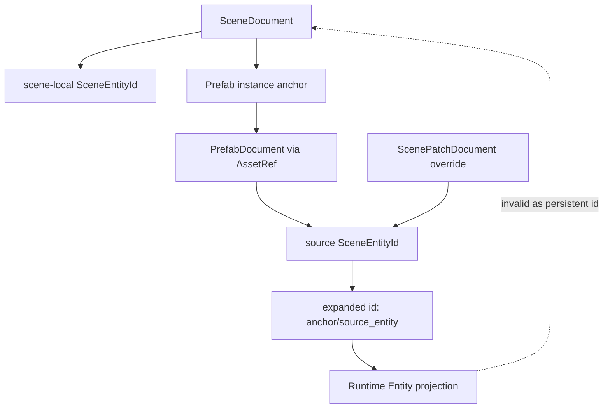

# ADR 0038: Scene/Prefab Authoring Identity and Provenance

**Status**: Accepted
**Date**: 2026-07-09
**Refined By**: ADR 0043: Scene, Prefab, and Patch Document Migration Policy; ADR 0047:
Editor Workspace and Scene Document State

## Context

nara already has stable `SceneEntityId`, `PrefabDocument`, `PrefabInstance`, nested prefab
resolution, patch-based prefab overrides, isolated Play Mode, and a narrow Apply Changes subset.
The remaining high-cost ambiguity is provenance: when an entity appears in an authoring view or
runtime projection, which document owns it, how should prefab-expanded entities be written back, and
what happens when source prefab or scene references are renamed or moved?

If nara leaves this implicit, editor tooling, AI agents, hot reload, and Apply Changes will each
invent write-back rules.

## Decision

Scene/prefab authoring identity is document-relative and provenance-aware.

- `SceneEntityId` identifies an entity inside one authoring document.
- A scene-local entity is owned by the scene document that contains its record.
- A prefab source entity is owned by its prefab document.
- A prefab instance anchor is scene-local, but expanded children are projections of source prefab
  entities.
- Expanded prefab IDs continue to use the deterministic `anchor/source_entity` namespace rule.
- Persistent overrides are `ScenePatchDocument` values applied relative to source prefab entity IDs
  before expansion.
- Runtime `Entity` values never become authoring identity.
- Prefab-expanded write-back must either produce a source-prefab override patch or explicitly
  convert the selected projection into local scene data. Writing a whole expanded entity back as if
  it were scene-local is invalid.
- Cross-document references should use `AssetRef` plus document-relative `SceneEntityId` when they
  become necessary. They must not rely on runtime entity IDs or backend handles.

## Provenance Classes

| Class | Owner | Persistent identity | Write-back policy |
|---|---|---|---|
| Scene local | Scene document | `SceneEntityId` | Patch scene directly |
| Prefab source | Prefab document | source `SceneEntityId` | Patch prefab source document |
| Prefab anchor | Scene document | anchor `SceneEntityId` plus `PrefabInstance.source` | Patch scene anchor or instance overrides |
| Prefab expanded projection | Runtime/authoring projection | `anchor/source_entity` namespace | Write source override or convert to local |
| Runtime-only | Runtime world | `Entity` | Never persistent by default |

## Rules

- Scene and prefab documents must not store runtime `Entity`, runtime `AssetId`, or backend handles.
- Rename/move tools must preserve document-relative IDs unless the user explicitly requests an ID
  rename patch.
- `AssetRef::StableId` is preferred for robust prefab source identity when project databases are
  available; `AssetRef::Path` remains valid for hand-authored and AI-generated projects.
- Source prefab moves should update project asset metadata or path references through normal asset
  ref migration, not by changing expanded IDs.
- Apply Changes may remain narrow. Any future prefab-expanded write-back must declare whether it is
  producing an override patch, editing the prefab source, or converting to local scene data.

## Alternatives Considered

### Option A: Treat expanded prefab IDs as scene-local IDs

**Pros**: Simple editor selection and patch application.

**Cons**: Loses source ownership, makes overrides ambiguous, and risks writing generated projection
IDs into scene documents.

**Decision**: Rejected.

### Option B: Runtime entity IDs as universal identity

**Pros**: Easy ECS lookup.

**Cons**: Runtime IDs are unstable, non-serializable as authoring truth, and incompatible with
document diffs, hot reload, and AI-generated patches.

**Decision**: Rejected.

### Option C: Document-relative IDs plus explicit provenance

**Pros**: Matches existing scene/prefab data, supports deterministic expansion, preserves source
ownership, and gives editor/AI write-back a clear contract.

**Cons**: Requires tooling to carry provenance alongside selected entities.

**Decision**: Chosen.

## Success Metrics

| Metric | Target | Measurement |
|---|---:|---|
| Persistent identity safety | Scene/prefab docs never contain runtime `Entity` or runtime `AssetId` | Serialization tests |
| Prefab projection clarity | Expanded IDs are deterministic and namespace source IDs under anchors | Unit tests |
| Write-back safety | Prefab-expanded Apply Changes rejects or produces explicit override/localization flow | Tooling tests |
| Reference migration readiness | Cross-document references can be represented as `AssetRef` plus `SceneEntityId` | Design review |

## Risks and Mitigations

| Risk | Severity | Likelihood | Mitigation |
|---|---|---:|---|
| Tooling forgets provenance after projection | High | Medium | Carry provenance with inspector/editor selection models. |
| Override patches become hard to explain | Medium | Medium | Keep overrides as normal `ScenePatchDocument` values against source IDs. |
| Path-based prefab refs break on rename | Medium | Medium | Prefer stable IDs when project databases exist; path refs remain hand-authoring friendly. |
| Conversion to local duplicates source data accidentally | Medium | Low | Make convert-to-local an explicit command with diagnostics. |

## Consequences

- ADR 0006 and ADR 0034 remain valid; this ADR defines the authoring identity/provenance contract
  they rely on.
- Future editor selection and Apply Changes expansions should carry provenance explicitly.
- Prefab-expanded entity write-back stays unsupported until it can produce source override patches
  or an explicit convert-to-local command.

## Open Questions

- What exact Rust type should represent projected entity provenance in tooling models?
- Should cross-scene references be accepted before scene streaming exists?
- How should ID rename patches update references inside the same document and across project files?
