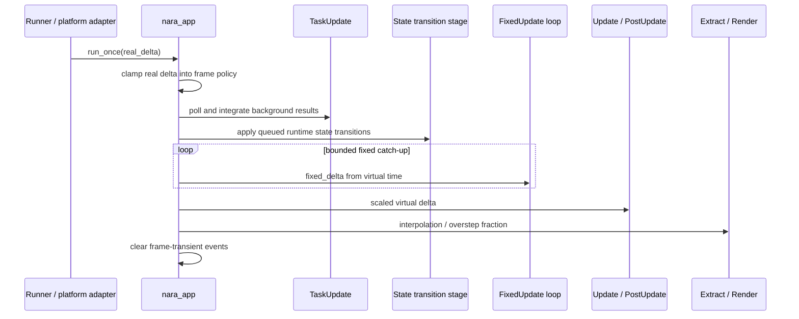

# ADR 0039: Main Loop, Time Domains, Pause, and Runtime State

**Status**: Accepted
**Date**: 2026-07-09
**Refines**: ADR 0013, ADR 0018, ADR 0024, ADR 0035, ADR 0036
**Refined By**: ADR 0057: Authoritative Fixed-Tick and Command Ingress

## Context

ADR 0013 split runners from platform adapters, ADR 0018 selected fixed-step simulation, and ADR
0024 made fixed update the deterministic-friendly simulation path. The current implementation has
`run_once(delta)` plus `FixedTime`, which is enough for headless tests and the first runtime loop,
but it leaves high-cost semantics implicit:

- whether `delta` is real, scaled, paused, clamped, or fixed time;
- how pause affects fixed update, UI, assets, diagnostics, and rendering;
- where state transitions and `OnEnter` / `OnExit`-style hooks belong;
- how desktop redraw policy interacts with `Poll` / `Wait`, background throttling, and fixed-step
  catch-up;
- when transient frame resources such as window events are cleared.

Mature engine behavior needs these contracts before physics, UI text input, Play Mode, scripting,
audio, and networking each grow their own time model.

## Decision

nara will model the main loop through explicit time domains and runtime state transitions. A runner
submits real elapsed time; `nara_app` lowers that into virtual/game time and fixed simulation time
according to runtime settings.

The product contract is:

- **Real time** is unscaled wall-clock/runtime elapsed time. It drives task polling, diagnostics,
  window housekeeping, asset IO observation, and backend liveness.
- **Virtual time** is scaled and pausable game time. Gameplay `Update` systems that should obey
  pause read virtual time.
- **Fixed time** is the authoritative simulation tick domain. `FixedTime` exposes the current
  monotonic tick, per-tick delta, elapsed duration, whole-tick debt, and sub-tick remainder. It
  advances immediately before each fixed schedule run.
- **Render interpolation** uses fixed overstep/interpolation data and must not mutate simulation
  state.
- `run_once(delta)` receives real elapsed time. It must not silently mean virtual or fixed delta.
- `time_scale`, pause state, maximum frame delta, fixed step duration, maximum fixed steps per
  frame, and background policy come from effective runtime settings. File-backed projects lower
  these from `nara.toml`; embedded apps may configure equivalent resources directly.
- File-backed project input may request at most 256 fixed steps per app frame and retain at most
  16,384 whole fixed ticks of debt. Base manifests and profile overlays reject larger values rather
  than clamping them into a different runtime policy.
- Pause is a scheduler/time policy, not a hidden freeze of the `World`. Real-time services, input
  collection, task result integration, diagnostics, window event processing, asset reload
  scheduling, render backend health, and tooling observation continue unless explicitly disabled.
- Fixed simulation does not catch up without bound. `DiscardExcess` runs the per-frame cap, discards
  remaining whole ticks, and retains only the interpolation remainder. `PreserveDebt` retains whole
  ticks up to `max_debt_steps`; exceeding that bound rejects the frame before any clock or Core
  schedule mutation. Paused or zero-scale frames neither add virtual time nor consume existing debt.
- Startup is a separate once-only committed lifecycle phase. On the first run it completes before
  frame planning, may configure time resources, and is not rolled back if the subsequent frame is
  rejected. A retry does not rerun Startup; it plans from the committed Startup state.
- Fixed schedules declare `Prepare`, `Simulate`, and `Finalize` sets with deferred-command flushes
  between them. The fixed status and interpolation data are published before variable update,
  extraction, and rendering.
- A successfully completed frame consumes exit requests and then calls `World::clear_trackers()`
  exactly once after `Last`, establishing Bevy removal/change tracker retention at the app boundary.
- Runtime state is ordinary typed ECS state plus an explicit transition queue/stage. State
  transitions may run `OnExit`, transition, and `OnEnter` schedules, but they must not be coupled to
  a Godot-style scene tree or object lifecycle.
- Editor/tooling mode (`Edit`, `Play`, `Paused`) is separate from gameplay state. Tooling may map
  its mode into runtime pause/time policy, but it is not the global app state model.

## Runner and Redraw Policy

Desktop adapters such as `nara_winit` remain responsible for platform event loops, but the policy
is explicit runtime settings:

- `Poll` favors low-latency continuous rendering.
- `Wait` favors idle efficiency and redraw-on-demand.
- background/blurred windows may throttle real-time frames, pause virtual time, or keep running,
  depending on runtime settings.
- redraw requests should be driven by configured frame policy, dirty render state, visible windows,
  and backend readiness rather than hardcoded inside an opaque draw loop.

`WindowEvents` and similar frame-transient resources follow ADR 0036: they are produced by the
platform adapter, consumed by same-frame systems, and cleared in a defined cleanup stage.

## Alternatives Considered

### Option A: Keep a single `delta` resource

**Pros**: Minimal API and easiest implementation.

**Cons**: Pause, fixed update, background throttling, animation, physics, and replay semantics
become ambiguous. Subsystems would infer different meanings from the same value.

**Decision**: Rejected.

### Option B: Godot-style per-node process modes

**Pros**: Mature pause/process control model and strong editor familiarity.

**Cons**: nara has no node tree as behavior owner. Per-object process flags would fight strict ECS
and make scheduling less transparent.

**Decision**: Rejected as the primary model.

### Option C: Explicit time domains plus ECS state transitions

**Pros**: Fits Rust ECS scheduling, keeps pause observable, supports deterministic fixed steps, and
remains compatible with headless tests and platform adapters.

**Cons**: Requires clearer schedule labels, resources, and tests than a single-delta loop.

**Decision**: Chosen.

## Success Metrics

| Metric | Target | Measurement |
|---|---:|---|
| Time clarity | Real, virtual, fixed, and interpolation time have distinct resources/API docs | API review |
| Pause semantics | Pausing virtual time does not stop task polling, diagnostics, or backend health updates | Unit/integration tests |
| Fixed catch-up bounded | Discard/preserve policies bound work and debt while interpolation stays in `[0, 1)` | Unit tests |
| ECS frame boundary | Removed/change trackers rotate once after every successful frame | Unit tests |
| State transitions | `OnEnter` / `OnExit`-style schedules can be driven without scene-tree lifecycle hooks | Schedule tests |
| Runner portability | Headless and winit runners both call the same app runtime tick contract | Runner tests |

## Risks and Mitigations

| Risk | Severity | Likelihood | Mitigation |
|---|---|---:|---|
| Too many time resources confuse users | Medium | Medium | Keep gameplay prelude focused and document which schedule reads which time domain. |
| Pause policy becomes hidden run-condition magic | Medium | Medium | Make pause state and schedule membership explicit resources/sets. |
| Background throttling differs across platforms | Medium | Medium | Keep adapter policy configurable and observable through diagnostics/status resources. |
| State model overgrows into framework control flow | Medium | Low | Keep state as ECS resources and schedules; scenes/prefabs remain data documents. |

## Consequences

- `RealTime`, `VirtualTime`, `FixedTime`, and `RenderTime` are separate resources with explicit
  meanings.
- Invalid, zero, non-finite, overflowed, or debt-exceeding time configuration/state returns a
  structured error instead of being clamped into a different policy.
- `WindowEvents` and input event queues need defined cleanup stages instead of caller-owned
  clearing.
- Project manifest runtime settings in ADR 0035 lower into validated time resources before the
  selected product plugin bundle is installed.

## Open Questions

- Should runtime state support stacks, independent state domains, or only single typed states in the
  first implementation?
