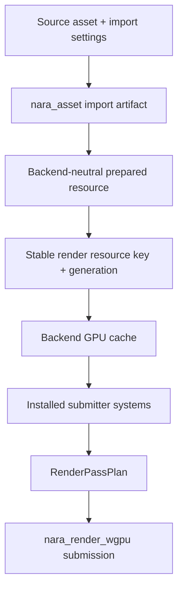

# ADR 0040: Render Resource Lifetime and Submitter Ownership

**Status**: Accepted
**Date**: 2026-07-09
**Refines**: ADR 0010, ADR 0017, ADR 0032, ADR 0033, ADR 0037
**Refined By**: ADR 0046: Plugin Metadata and Default Plugin Groups

## Context

ADR 0017 intentionally deferred a full render graph while requiring graph-ready phases. ADR 0032
defined backend integration through main-world extraction data and backend-owned resources. ADR
0033 connected asset import to backend-neutral render resource preparation.

The next expensive ambiguity is render resource lifetime. GPU textures, buffers, samplers, bind
groups, pipelines, intermediate targets, font atlases, and UI/text resources cannot be treated as
temporary implementation details forever. The current renderer is allowed to be simple, but the
product contract must prevent:

- immediate per-frame cache pruning that causes unnecessary texture/bind-group churn;
- gameplay/domain crates depending on wgpu handles;
- `WgpuRenderPlugin` permanently owning all sprite/UI submitter installation policy;
- public UI contracts becoming locked to sprite instance semantics;
- `RenderPassDependency` looking like a graph/topological-sort contract before nara has a graph.

## Decision

nara keeps the Phase 1 renderer phase-first and graph-ready, but render resource lifetime and
submitter ownership are explicit contracts.

Rules:

- Domain/gameplay crates store semantic handles, authoring descriptors, or backend-neutral prepared
  resource keys. They never store `wgpu` handles.
- Backend caches own GPU textures, buffers, samplers, bind groups, pipelines, and surface-specific
  objects.
- Cache identity is based on prepared resource identity plus descriptor/generation data, not raw
  file paths or runtime entity IDs.
- Resource invalidation is generation-based and observable. Reload failure preserves last-good typed
  assets and does not require immediate GPU object destruction unless the backend decides it is
  unsafe.
- Backend caches should use explicit eviction policy: budget limits, generation invalidation,
  device loss, explicit asset removal, and grace-period unused eviction. A resource should not be
  rebuilt merely because it was unused for one frame.
- Upload work should eventually be budgeted per frame and reported through render diagnostics or
  backend status resources.
- Device loss clears backend-native caches, but prepared backend-neutral resources remain the source
  for rebuilding after recovery.
- `RenderPassPlan` remains the static pass-order contract. `RenderPassDependency` is an assertion
  that required earlier pass inputs exist in the static plan, not a general topological sorter. If
  nara needs computed ordering, transient graph resources, or pass-produced resource lifetimes, that
  is the trigger to promote the model into a real `RenderGraph`.
- `WgpuRenderPlugin` owns wgpu device/surface/backend resources. Sprite, tilemap, UI, text, gizmo,
  and future 3D submitters should be installed by their own domain plugins or explicit plugin
  groups. Backend examples may install convenient default groups, but unconditional long-term
  submitter coupling is not the contract.
- Internal aliasing such as using sprite-like quad instances for UI is acceptable as a backend
  implementation detail. Public UI render contracts must remain UI-owned (`UiBatches`, UI material
  keys, clip data, text runs later) rather than exposing sprite semantics as UI API.

## Alternatives Considered

### Option A: Adopt a Bevy-style render app and graph now

**Pros**: Strong separation and mature render-resource lifecycle model.

**Cons**: Large complexity before nara has enough passes, targets, or 3D pressure; risks copying
Bevy's surface area instead of nara's narrower product boundary.

**Decision**: Rejected for now.

### Option B: Keep renderer lifetime as private wgpu implementation detail

**Pros**: Fastest path for simple sprites and UI panels.

**Cons**: Asset hot reload, UI text, editor viewports, post-processing, and device loss would each
retrofit incompatible cache rules.

**Decision**: Rejected.

### Option C: Static pass plan with explicit backend cache lifetime

**Pros**: Preserves Phase 1 simplicity while making resource identity, invalidation, diagnostics,
and submitter ownership mature enough for 2D, UI, and later 3D.

**Cons**: Requires cache policy code and diagnostics before a full graph exists.

**Decision**: Chosen.

## Success Metrics

| Metric | Target | Measurement |
|---|---:|---|
| Backend isolation | Only backend crates own `wgpu` resources | Dependency boundary search |
| Cache stability | Unused-for-one-frame resources are not eagerly reuploaded by policy | Unit/smoke tests |
| Reload behavior | Asset reload invalidates prepared/gpu resources by generation | Reload tests |
| Plugin decoupling | UI/sprite/text submitters can be enabled independently from device/surface setup | Plugin tests |
| Graph trigger clarity | Need for topological ordering or transient resource lifetimes points to `RenderGraph` work | Design review |

## Risks and Mitigations

| Risk | Severity | Likelihood | Mitigation |
|---|---|---:|---|
| Cache policies diverge between sprites, UI, text, and 3D | High | Medium | Centralize backend cache diagnostics and use shared key/generation vocabulary. |
| Static pass dependencies are mistaken for a graph | Medium | Medium | Document `RenderPassDependency` as validation only until graph promotion. |
| Submitter plugins become tedious for examples | Low | Medium | Provide convenience plugin groups while keeping individual plugins explicit. |
| Device loss recovery is under-tested | High | Low | Keep backend-neutral prepared resources rebuildable and add recovery smoke tests when supported. |

## Consequences

- `nara_render_wgpu` should grow explicit cache lifetime/eviction diagnostics before more resource
  classes are added.
- `WgpuRenderPlugin` may keep convenience behavior temporarily, but long-term submitter ownership
  belongs to domain plugins or plugin groups.
- The full render graph remains deferred, but resource lifetime is no longer deferred.

## Open Questions

- What exact cache eviction defaults should desktop Phase 1 use: grace frames, memory budget, or
  both?
- Should render diagnostics live in `nara_render` as backend-neutral resources or in each backend
  with a shared reporting adapter?
- Which feature first forces `RenderGraph`: editor viewports, post-processing, render-to-texture,
  3D depth/prepass, or text/UI composition targets?
