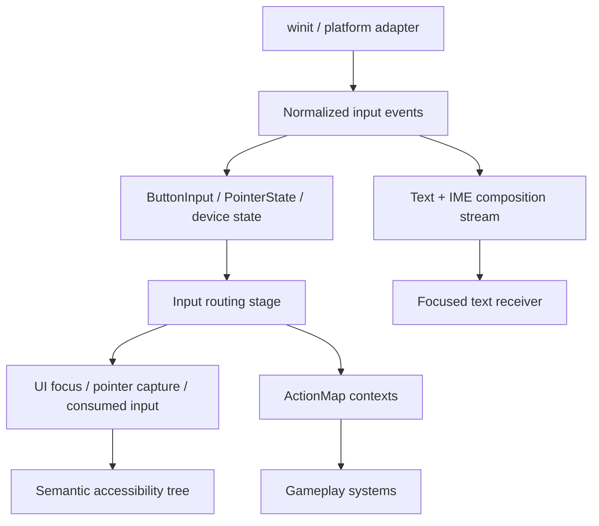

# ADR 0041: Input Routing, Actions, Text Input, UI Focus, and Accessibility

**Status**: Accepted
**Date**: 2026-07-09
**Refines**: ADR 0013, ADR 0025, ADR 0035, ADR 0036, ADR 0039
**Refined By**: ADR 0056: Headless Runtime and Dedicated Server Readiness

## Context

The current `nara_input` foundation exposes button and pointer state, and `nara_ui` has basic
hover/press/focus state. That is a good first slice, but a mature engine needs a stronger contract
before runtime UI, editor shortcuts, gameplay actions, text fields, IME composition, gamepads, and
accessibility all compete for input semantics.

The most important distinction is that physical input, action mapping, UI routing, text input, and
accessibility are related but not the same thing.

## Decision

nara will route input through layered ECS data, not raw platform callbacks or editor-only shortcut
paths.

Rules:

- Platform adapters translate raw backend events into nara-normalized input events and state.
  Gameplay and UI do not depend on `winit` event types.
- `ButtonInput<KeyCode>`, `ButtonInput<MouseButton>`, and pointer state remain useful low-level
  observations, but semantic gameplay should prefer action maps once available.
- Action maps are project/runtime data. File-backed projects may source them from `nara.toml` or
  manifest-referenced action-map files; embedded apps may configure them directly.
- Action maps support named actions, binding contexts, device scopes, chords/modifiers, analog
  values, dead zones, and priority/enable state over time. The first implementation may be smaller,
  but it must not collapse actions into hardcoded key checks.
- Action maps should be able to produce semantic gameplay commands or action outcomes that can be
  consumed by replay, AI drivers, and future server-authoritative worlds without exposing raw
  device events.
- UI routing happens before gameplay action delivery for inputs captured or consumed by focused UI,
  unless a context explicitly opts into global shortcuts.
- Text input and IME composition are separate from key/button actions. Composition text, commit
  text, caret movement, and editing commands are delivered to the focused text receiver, not to
  generic gameplay key actions.
- Pointer capture has a single owner per pointer/device stream. Dragging, sliders, scrollable
  panels, editor gizmos, and viewport tools must not infer capture from hover alone.
- Focus is explicit UI state. Keyboard/gamepad navigation targets focused widgets or focus scopes
  before falling back to gameplay contexts.
- Accessibility is a runtime UI responsibility, not an editor overlay. UI nodes should eventually
  expose semantic role, label, value, state, bounds, and actions through an accessibility tree.
- Input diagnostics and replay capture record normalized events, routing decisions, and semantic
  action outcomes at defined stages.

Frame-transient input/window events follow ADR 0036 and ADR 0039 cleanup rules. Retained input
state such as pressed buttons, focused element, and pointer capture persists until changed.

## Alternatives Considered

### Option A: Gameplay systems read raw keys and mouse state directly

**Pros**: Simple and ergonomic for tiny examples.

**Cons**: UI focus, rebinding, gamepad support, IME, replay, editor shortcuts, and accessibility all
become retrofits.

**Decision**: Rejected as the long-term contract.

### Option B: UI owns all input routing privately

**Pros**: Strong widget behavior and editor-like control.

**Cons**: Gameplay actions, replay, headless tests, and non-UI input become second-class.

**Decision**: Rejected.

### Option C: Engine-level normalized input, routing, action maps, text, and accessibility layers

**Pros**: Keeps platform adapters narrow, makes UI/gameplay conflict resolution explicit, and gives
AI/editor tooling structured data to inspect.

**Cons**: More up-front design than button state alone.

**Decision**: Chosen.

## Success Metrics

| Metric | Target | Measurement |
|---|---:|---|
| Platform isolation | Gameplay/UI crates do not import `winit` input types | Dependency search |
| UI consumption | Focused/captured UI can prevent gameplay actions in the same frame | Routing tests |
| Text correctness | IME composition is represented separately from key presses | Text input tests |
| Action maps | Actions can be rebound without changing gameplay systems | Unit tests |
| Accessibility readiness | UI semantic nodes can be exported without depending on editor toolkit | API/design review |

## Risks and Mitigations

| Risk | Severity | Likelihood | Mitigation |
|---|---|---:|---|
| Input pipeline becomes too complex for simple games | Medium | Medium | Keep low-level button state available while documenting actions as the scalable path. |
| UI and gameplay both consume shortcuts unexpectedly | High | Medium | Make context priority, global shortcut rules, and consumed-input diagnostics explicit. |
| IME support is postponed too long | High | Medium | Keep text/IME as a first-class route even before full text widgets ship. |
| Accessibility is treated as late-only work | Medium | Medium | Reserve semantic tree fields in UI model before editor dogfooding. |

## Consequences

- `nara_input` should eventually grow normalized input event buffers, action maps, and routing
  diagnostics in addition to retained button/pointer state.
- `nara_ui` focus and pointer capture should become engine-level state consumed by the input router.
- Editor shortcuts and viewport tools should use the same routing/action model as runtime UI, not a
  private egui-only shortcut path.
- Replay, AI-driver, and future server-authoritative boundaries should consume semantic gameplay
  commands/action outcomes rather than raw device events.

## Open Questions

- What is the smallest Phase 1 action-map schema that still supports rebinding and UI/gameplay
  context priority?
- Which platform text/IME features must be represented before the first text widget?
- How should multi-window and multi-viewport focus compose with pointer capture?
