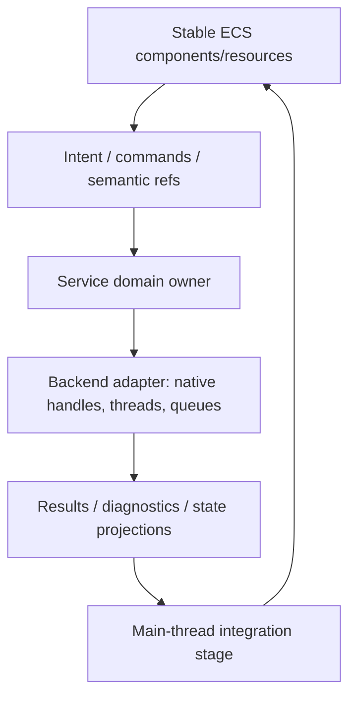

# ADR 0042: Runtime Service and Backend Boundary

**Status**: Accepted
**Date**: 2026-07-09
**Last Revised**: 2026-07-15
**Refines**: ADR 0008, ADR 0016, ADR 0019, ADR 0021, ADR 0028, ADR 0030, ADR 0031
**Refined By**: ADR 0048: Runtime Diagnostics and Observability Bus; ADR 0052: Task
Backpressure, Cancellation, and Long-Running Diagnostics; ADR 0056: Headless Runtime and Dedicated
Server Readiness; ADR 0076: Play Runtime Debug Control and Observation; ADR 0078: Render Host
Affinity, WebGPU Initialization, and Device Recovery; ADR 0080: Domain-Owned TaskUpdate
Integration Sets

## Context

Physics, audio, text shaping, scripting, networking, file watching, and rendering all share the same
architectural hazard: native handles, background threads, queues, and external runtimes can leak
into ECS data if every domain designs its own boundary.

nara already has the right direction in individual ADRs: stable ECS data, backend adapters, and
main-thread integration. This ADR makes that a shared runtime service contract.

## Decision

Runtime services use a four-layer boundary:

Rules:

- ECS components express stable intent and observations, not native backend ownership.
- Persistent scene/prefab/save data stores semantic references, component values, and stable IDs.
  It does not store backend handles, runtime entity IDs, OS handles, sockets, audio device handles,
  physics body pointers, font-cache pointers, or script VM handles.
- A service/backend owns native handles, worker threads, external runtime state, queues, and
  backend-specific diagnostics.
- When ownership crosses adapters, the stable boundary is a narrow lifecycle authority rather than
  an untyped service locator. The window adapter owns providers/native targets, the render backend
  owns surfaces, and one unique typed lease orders their teardown. First-party surface owners retain
  that lease through explicit cleanup and an RAII fallback; a platform runner acts only on targets
  it registered.
- Background work must not mutate `World` directly. It submits typed results, commands, events, or
  diagnostics that integrate on the main thread at declared stages.
- Every service declares its schedule sets, time domain, pause behavior, replay/determinism policy,
  request/result retention, and diagnostics surface.
- A runtime-local backend may begin as plugin-installed resources/systems when it needs no
  process/platform authority and its complete lifetime is owned by one runtime generation. A
  backend that needs exclusive device/event-loop ownership, thread or JavaScript-agent affinity,
  Host-issued native authority, waitable startup/close, or an independent process is selected and
  retained by the concrete Host through a domain Adapter; `Plugin::build` may declare the
  requirement but cannot acquire that authority.
- First-party and external Adapters for one supported domain use the same public selection,
  lifecycle, diagnostics, and conformance boundary. "Trusted" means the user explicitly selected
  native in-process Rust, not that the implementation is first-party or allowlisted. Exact traits
  should still be proven by a fake or second implementation, but the ability to supply an external
  Adapter must not remain behind a private first-party hook when Nara promises replacement for that
  domain.
- Domain data is stable even when backend choice changes. For example, high-level physics
  components should survive replacing Rapier/Box2D/Avian; audio authoring components should survive
  replacing the playback backend.
- Service diagnostics are structured data and may be bridged to tracing, but logs are not the source
  of truth.

## Domain Examples

| Domain | Stable ECS intent | Backend-owned state | Main-thread integration |
|---|---|---|---|
| Physics | bodies, colliders, materials, joints | solver world, broadphase, native body handles | transform/contact events after fixed step |
| Audio | play/stop commands, listener, source refs | device, mixer, decoder streams, sinks | command drain, state/diagnostics update |
| Text | font refs, text runs, shaping intent | font cache, shaping cache, atlas state | glyph runs / prepared resources |
| Scripting | script refs, exported component data, commands | VM/runtime, module cache, sandboxes | validated commands/events |
| Networking | replication components, channels, snapshots | sockets, protocol sessions, buffers | received commands/state reconciliation |
| Rendering target | window/target identity, retirement intent, scoped retirement driver | platform provider, non-cloneable surface owner, surface, acquired texture | owner-Drop acknowledgement before provider/native teardown |

## Alternatives Considered

### Option A: Store backend/native handles in components

**Pros**: Direct and fast for a single backend.

**Cons**: Breaks serialization, hot reload, editor inspection, backend replacement, and AI-generated
data. Rust lifetime/threading constraints leak into gameplay APIs.

**Decision**: Rejected.

### Option B: Define generic traits for every service now

**Pros**: Looks extensible and testable.

**Cons**: Traits become speculative without real adapters; they can freeze the wrong abstraction and
increase API surface.

**Decision**: Rejected as a blanket rule.

### Option C: Service-owned backends with stable ECS intent and staged integration

**Pros**: Keeps data durable, preserves backend replacement, supports threading safely, and matches
existing task/app scheduling decisions.

**Cons**: Requires explicit integration queues and diagnostics per domain.

**Decision**: Chosen.

## Success Metrics

| Metric | Target | Measurement |
|---|---:|---|
| Persistent data safety | Scene/prefab/save schemas contain no native handles | Serialization tests/review |
| Main-thread ownership | Background jobs never mutate `World` directly | Code review and tests |
| Backend replaceability | At least one domain can add a fake/test backend without changing authoring components | Adapter test |
| External Adapter parity | A clean-room external Adapter for a supported domain can be selected without a package-specific core match or first-party allowlist and must pass the same lifecycle/diagnostic conformance suite | Independent workspace and Host integration fixture |
| Diagnostics | Service failures are observable as structured diagnostics | Unit/integration tests |
| Pause/time clarity | Services declare real/virtual/fixed time behavior | ADR/API review |

## Risks and Mitigations

| Risk | Severity | Likelihood | Mitigation |
|---|---|---:|---|
| Service queues become hidden global buses | High | Medium | Apply ADR 0036 channel classes and owner/cleanup rules. |
| Adapter traits arrive too late | Medium | Medium | Introduce traits when the second implementation appears, not never. |
| Too much indirection hurts performance | Medium | Low | Keep integration data typed and domain-specific; avoid object-safe abstraction in hot paths unless needed. |
| Replay behavior differs by backend | High | Medium | Require determinism/replay policy per service and mark nondeterministic outputs. |

## Consequences

- Future physics, audio, text, scripting, and networking implementations should follow the same
  boundary vocabulary.
- Existing asset/watch/render backend seams are examples of this pattern and should stay aligned
  with it.
- Domain-specific Host Adapter selection is an explicit composition operation. It does not make a
  normal runtime plugin less capable inside ECS, and it does not make `Plugin::build` a universal
  native-authority callback.
- Runtime services must document their pause/time behavior when introduced.

## Open Questions

- Which service should get the first fake/test backend contract: physics, audio, or text?
- Which service diagnostics should publish to the shared runtime diagnostics bus immediately, and
  which should stay domain-only until tooling needs them?
- Which service outputs must be replay-recordable in the first deterministic replay slice?
