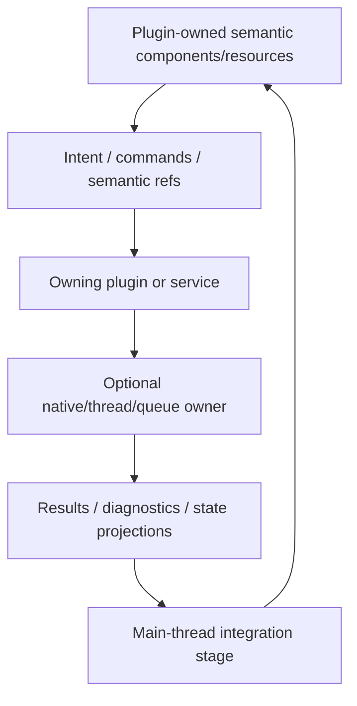

# ADR 0042: Runtime Service and Backend Boundary

**Status**: Accepted
**Date**: 2026-07-09
**Last Revised**: 2026-07-15
**Refines**: ADR 0008, ADR 0016, ADR 0019, ADR 0021, ADR 0028, ADR 0030, ADR 0031
**Refined By**: ADR 0048: Runtime Diagnostics and Observability Bus; ADR 0052: Task
Backpressure, Cancellation, and Long-Running Diagnostics; ADR 0056: Headless Runtime and Dedicated
Server Readiness; ADR 0076: Play Runtime Debug Control and Observation; ADR 0078: Render Host
Affinity, WebGPU Initialization, and Device Recovery; ADR 0080: Domain-Owned TaskUpdate
Integration Sets; ADR 0095: Plugin-Owned Specialized Domains and Project Configuration

## ADR 0095 Refinement

The four-layer flow below is a useful pattern for domains that actually own native handles,
background threads, or asynchronous queues; it is not mandatory topology for every specialized
plugin. Stable ECS intent means stable within the owning plugin's contract, not portable across
unrelated implementations. First- and third-party plugins share Nara's App and safety substrate,
but they need not implement one Nara-owned provider selection or conformance Interface.

## Context

Physics, audio, text shaping, scripting, networking, file watching, and rendering can share an
architectural hazard when they own native handles, background threads, queues, or external
runtimes: process-local ownership can leak into persistent data or bypass the runtime's `World`
authority.

nara therefore needs shared ownership and safety invariants. It does not need one shared service
topology for domains whose execution and lifetime differ.

## Decision

Domains with native, threaded, or asynchronous ownership may use this four-layer pattern:

Rules:

- Persistent components express stable semantics within their owning plugin contract, not native
  backend ownership or cross-implementation portability.
- Persistent scene/prefab/save data stores semantic references, component values, and stable IDs.
  It does not store runtime `Entity`/`AssetId`, Rust/Bevy runtime IDs, native/backend handles,
  pointers, sockets, capabilities, callbacks, session indices, caches, or opaque process-local
  blobs.
- A plugin or service that actually has native handles, worker threads, external runtime state, or
  queues owns them and proves their finite truthful terminal state. A synchronous ECS plugin does
  not manufacture a service session or close participant.
- When ownership crosses adapters, the stable boundary is a narrow lifecycle authority rather than
  an untyped service locator. The window adapter owns providers/native targets, the render backend
  owns surfaces, and one unique typed lease orders their teardown. First-party surface owners retain
  that lease through explicit cleanup and an RAII fallback; a platform runner acts only on targets
  it registered.
- Background work must not mutate `World` directly. It submits typed results, commands, events, or
  diagnostics through the owning domain's declared integration stage. This rule does not force all
  ordinary ECS systems to run serially or require every domain to own a result queue.
- Every domain documents only the lifecycle dimensions it uses: schedule participation, time/pause,
  request/result retention, replay/determinism, diagnostics, and shutdown where applicable.
- A runtime-local backend may begin as plugin-installed resources/systems when it needs no
  process/platform authority and its complete lifetime is owned by one runtime generation. A
  backend that needs exclusive device/event-loop ownership, thread or JavaScript-agent affinity,
  Host-issued native authority, waitable startup/close, or an independent process is selected and
  retained by the concrete Host through a domain Adapter; `Plugin::build` may declare the
  requirement but cannot acquire that authority.
- First-party and external plugins use the same public App, schedules, schema, asset, diagnostic,
  and lifecycle substrate without a first-party allowlist. They need not implement one provider
  selection, lifecycle, or conformance Interface unless a separate Accepted ADR promises
  portability for that domain.
- Domain data remains stable within its owner/version contract. Changing physics, audio, text, or
  another implementation may require explicit source and cross-schema migration.
- Domain diagnostics are structured data. A shared runtime-diagnostics bridge is added only when a
  concrete headless, tooling, or cross-domain consumer needs it; logs never become authority.

## Domain Examples

The entries below are examples of domain-owned shapes, not a common Interface or required queue
model.

| Domain | Possible plugin-owned semantic data | Private/native state | Possible integration |
|---|---|---|---|
| Physics | bodies, colliders, materials, joints | solver world, broadphase, native body handles | transform/contact events after fixed step |
| Audio | play/stop commands, listener, source refs | device, mixer, decoder streams, sinks | command drain, state/diagnostics update |
| Text | font refs, text runs, shaping intent | font cache, shaping cache, atlas state | glyph runs / prepared resources |
| Scripting | script refs, exported component data, commands | VM/runtime, module cache, sandboxes | validated commands/events |
| Networking | replication components, channels, snapshots | sockets, protocol sessions, buffers | received commands/state reconciliation |
| Rendering target | window/target identity, retirement intent, scoped retirement driver | platform provider, non-cloneable surface owner, surface, acquired texture | owner-Drop acknowledgement before provider/native teardown |

## Alternatives Considered

### Option A: Store backend/native handles in components

**Pros**: Direct and fast for a single backend.

**Cons**: Breaks serialization, hot reload, editor inspection, backend replacement, and AI-generated
data. Rust lifetime/threading constraints leak into gameplay APIs.

**Decision**: Rejected.

### Option B: Define generic traits for every service now

**Pros**: Looks extensible and testable.

**Cons**: Traits become speculative without real adapters; they can freeze the wrong abstraction and
increase API surface.

**Decision**: Rejected as a blanket rule.

### Option C: Shared Safety Invariants with Domain-Owned Mechanisms

**Pros**: Keeps persistent data durable and threaded/native ownership safe without forcing unrelated
domains through one abstraction.

**Cons**: Different domains expose different APIs and replacement may require migration.

**Decision**: Chosen.

## Success Metrics

| Metric | Target | Measurement |
|---|---:|---|
| Persistent data safety | Scene/prefab/save schemas contain no native handles | Serialization tests/review |
| Main-thread ownership | Background jobs never mutate `World` directly | Code review and tests |
| Owner truth | Every long-lived native/thread owner reaches a finite truthful terminal state and retains incomplete ownership | Fault/lifecycle tests |
| Ordinary plugin freedom | A synchronous external plugin needs no Service/provider/Host ceremony | Clean-room fixture |
| Diagnostics | Admitted shared producer failures are observable as structured diagnostics | Unit/integration tests |
| Pause/time clarity | Domains that consume time declare real/virtual/fixed behavior | ADR/API review |

## Risks and Mitigations

| Risk | Severity | Likelihood | Mitigation |
|---|---|---:|---|
| Service queues become hidden global buses | High | Medium | Apply ADR 0036 channel classes and owner/cleanup rules. |
| A genuinely shared trait arrives late | Medium | Medium | Introduce it when real portability pressure and a challenged second implementation appear, not never. |
| Too much indirection hurts performance | Medium | Low | Keep integration data typed and domain-specific; avoid object-safe abstraction in hot paths unless needed. |
| Replay behavior differs by backend | High | Medium | Require determinism/replay policy per service and mark nondeterministic outputs. |

## Consequences

- Future physics, audio, text, scripting, and networking plugins share the safety invariants but own
  their domain vocabulary and mechanisms.
- Existing task, asset/watch, window, and render owners demonstrate different valid lifecycle
  shapes; they are not templates that every domain must copy.
- Domain-specific Host Adapter selection is an explicit composition operation. It does not make a
  normal runtime plugin less capable inside ECS, and it does not make `Plugin::build` a universal
  native-authority callback.
- Runtime domains document pause/time behavior only when they consume those time domains.

## Open Questions

- Which concrete domain owner next exposes a lifecycle or diagnostics gap in the shared substrate?
- Which named consumer needs a domain diagnostic projected into the shared bus?
- Which real portability workflow, if any, justifies a Nara-owned cross-implementation Interface?
