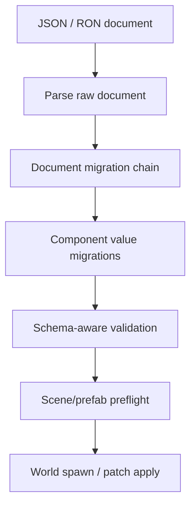

# ADR 0043: Scene, Prefab, and Patch Document Migration Policy

**Status**: Accepted
**Date**: 2026-07-09
**Refines**: ADR 0006, ADR 0011, ADR 0026, ADR 0038

## Context

`SceneDocument`, `PrefabDocument`, and `ScenePatchDocument` now have format versions and validation
rules. Component-level migrations exist through `nara_reflect`, but document-level migrations are
still a separate problem.

If nara only migrates component values, it cannot safely rename document fields, change prefab
instance shape, change patch operation encoding, alter provenance records, or split/merge document
sections. Rejecting every older document would be simple but too brittle for a mature engine,
editor, and AI-generated content workflow.

## Decision

nara distinguishes document-format migration from component-value migration.

Rules:

- Scene, prefab, and patch documents each own a `schema_version` / `format_version` migration chain.
- Document migrations are pure transformations from one known document version to the next. They do
  not mutate the live `World`, asset server, or source file in place.
- Component migrations run after the document shape has been migrated into a version whose component
  payload locations and patch operation payloads are known.
- Unsupported future document versions fail with structured diagnostics.
- Missing migration steps fail with structured diagnostics. nara must not best-effort guess unknown
  document shapes.
- Patch documents migrate before validation/apply. Undo/redo stacks should store current-version
  inverse patches once they are produced by the active editor session.
- Migrations must preserve authoring identity and provenance. They may rewrite IDs only through an
  explicit documented migration that also updates references and overrides.
- AI/editor tooling should emit the current format. Loading old formats is compatibility behavior,
  not the preferred authoring output.
- Automatic write-back of migrated files is an explicit tool/editor action. Runtime loading should
  not rewrite source files silently.

## Alternatives Considered

### Option A: Reject all non-current document versions

**Pros**: Simple validation and no migration bugs.

**Cons**: Makes early projects brittle, weakens editor upgrades, and forces AI/tooling output to be
perfectly in lockstep with engine versions.

**Decision**: Rejected as the long-term policy.

### Option B: Handle migrations ad hoc inside each loader

**Pros**: Easy to add one-off fixes near parsing code.

**Cons**: Hard to audit, hard to test, and likely to diverge between scene, prefab, patch, JSON, and
RON loaders.

**Decision**: Rejected.

### Option C: Formal document migration chains before component migration

**Pros**: Separates document shape from component payload evolution, supports editor upgrades, and
keeps validation deterministic.

**Cons**: Requires migration registry/testing and careful diagnostics.

**Decision**: Chosen.

## Success Metrics

| Metric | Target | Measurement |
|---|---:|---|
| Versioned loading | Known old scene/prefab/patch versions load through migration chains | Golden-file tests |
| Future version safety | Future versions fail with structured diagnostics | Unit tests |
| Component migration order | Component migrations run after document migration | Migration tests |
| Source safety | Runtime load does not rewrite source files silently | Loader tests/review |
| Provenance preservation | Prefab overrides and source IDs remain valid after migration | Scene/prefab tests |

## Risks and Mitigations

| Risk | Severity | Likelihood | Mitigation |
|---|---|---:|---|
| Migration bugs corrupt authored data | High | Medium | Keep migrations pure, test golden inputs/outputs, and require explicit save action. |
| Too many old versions become maintenance burden | Medium | Medium | Support migration chains for documented pre-1.0 formats and retire only through ADR. |
| Patch migration changes undo semantics | Medium | Medium | Store active session undo entries in current-version inverse patch format. |
| Component and document migrations conflict | High | Low | Run document migration first and component migration only through registry-known payload paths. |

## Consequences

- `nara_scene` should add document migration registries or modules before changing document shape
  again.
- Current hard rejection of unknown/future versions remains valid; known older versions should
  eventually migrate through explicit chains.
- Component migration ADR 0011 remains valid but does not cover document shape evolution.

## Open Questions

- What is the first current-version marker naming convention across scene, prefab, patch, manifest,
  and asset metadata?
- Should migration diagnostics include machine-readable repair suggestions for AI agents?
- How long should pre-1.0 document versions be supported once the engine starts shipping examples?

