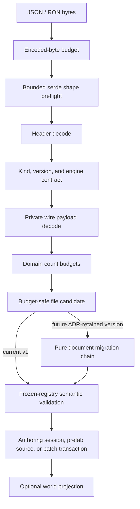

# ADR 0043: Scene, Prefab, and Patch Document Migration Policy

**Status**: Accepted
**Date**: 2026-07-09
**Amended**: 2026-07-10 for the unreleased canonical-version reset policy
**Implemented Slice**: RGF-U1 on 2026-07-12
**Refines**: ADR 0006, ADR 0011, ADR 0026, ADR 0038
**Refined By**: ADR 0049: Untrusted Project Input and Parse Budget Policy; ADR 0051: Persistent
File Envelope, Migration, and Golden Fixtures

## Context

Scene, prefab, and standalone patch files now share the ADR 0051 envelope. `SceneDocument` and
`PrefabDocument` payloads intentionally carry no duplicate file version. `ScenePatchDocument`
retains its own record version because prefab instances embed that record without embedding a
second file envelope. Component-level migrations exist through `nara_reflect`; document-shape
migration remains a separate, currently empty compatibility mechanism.

If nara only migrates component values, it cannot safely rename document fields, change prefab
instance shape, change patch operation encoding, alter provenance records, or split/merge document
sections. A mature released engine needs explicit document migrations, but nara has not shipped a
persistent compatibility promise yet. Preserving prototype shapes now would turn known design debt
into a permanent reader and fixture burden.

## Decision

nara distinguishes document-format migration from component-value migration and distinguishes an
unreleased canonical reset from a real compatibility window.

Rules:

- The corrected scene, prefab, and standalone patch file envelopes are canonical
  `format_version = 1`. Superseded prototype readers are deleted; corrected Rust types use
  canonical unsuffixed names.
- Each document kind publishes a strict compatibility matrix. Until an ADR grants a compatibility
  window, the only readable version is canonical version 1.
- A document migration chain is added only when an ADR names the retained version, owner, fixtures,
  support window, and removal trigger.
- Document migrations are pure transformations from one known document version to the next. They do
  not mutate the live `World`, asset server, or source file in place.
- Component migrations run after the document shape has been migrated into a version whose component
  payload locations and patch operation payloads are known.
- Component migration results are revalidated iteratively against the candidate's depth, node,
  container, single-string, cumulative-string, and logical component-value budgets before
  publication. A migration cannot publish a value that the same file boundary would reject.
- Whole-component patch values may use the registered component migration chain. A field write from
  an older component schema version is rejected until an explicit field-value migration contract
  exists; a stable field ID proves identity, not that an old scalar or asset-reference value keeps
  the same semantics. Identity-only removal may resolve the stable ID against the current schema.
- Unsupported future document versions fail with typed format errors.
- Prototype, unknown, and missing migration steps fail with typed format errors. nara must not
  best-effort guess unknown document shapes.
- Patch documents migrate before validation/apply. Undo/redo stacks should store current-version
  inverse patches once they are produced by the active editor session.
- Migrations must preserve authoring identity and provenance. They may rewrite IDs only through an
  explicit documented migration that also updates references and overrides.
- AI/editor tooling emits canonical version 1. Loading another version is supported only when the
  compatibility matrix links to its authorizing ADR.
- Automatic write-back of migrated files is an explicit tool/editor action. Runtime loading should
  not rewrite source files silently.
- In-repository prototype source files are updated in the breaking implementation unit. External
  experimental files require the documented manual/offline source action; runtime does not carry a
  hidden prototype reader.

### Current Compatibility Matrix

| File kind | Envelope versions read/written | Payload version | Migration chain |
|---|---|---|---|
| `scene` | 1 | none | none |
| `prefab` | 1 | none | none |
| `scene_patch` | 1 | embedded patch record 1 | none |

Decode produces a `SceneDocumentCandidate`, `PrefabDocumentCandidate`, or
`ScenePatchDocumentCandidate`; it does not publish authoring or runtime state. Scene candidates
enter `SceneAuthoringSession` only after validation against a frozen registry. Prefab candidates
enter a resolver only after the resolver owner validates them. Patch candidates are validated in
the target document transaction and can enter authoring revision/undo history through the session
API. The top-level document types do not implement public `Deserialize`; direct Rust construction
remains a trusted programmatic path rather than a file loader.

RGF-U1 implements no non-v1 document migration registry because the matrix contains no retained
older version. Format errors are typed local errors; bridging them into the ADR 0048 runtime
diagnostic bus remains the consuming host's responsibility.

## Alternatives Considered

### Option A: Reject all non-current document versions forever

**Pros**: Simple validation and no migration bugs.

**Cons**: Cannot support real released projects when a future compatibility promise exists.

**Decision**: Rejected as the permanent policy.

### Option B: Handle migrations ad hoc inside each loader

**Pros**: Easy to add one-off fixes near parsing code.

**Cons**: Hard to audit, hard to test, and likely to diverge between scene, prefab, patch, JSON, and
RON loaders.

**Decision**: Rejected.

### Option C: Preserve every prototype version through formal migration chains

**Pros**: Avoids breaking any experimental file.

**Cons**: Freezes known prototype mistakes and creates compatibility code before there is a shipped
contract or user population.

**Decision**: Rejected.

### Option D: Canonical reset before release, explicit migration windows afterward

**Pros**: Ships one correct version-1 contract while preserving a rigorous migration mechanism for
future compatibility promises.

**Cons**: Experimental projects must perform an explicit source rewrite during foundation work.

**Decision**: Chosen.

## Success Metrics

| Metric | Target | Measurement |
|---|---:|---|
| Canonical loading | Corrected version-1 scene/prefab/patch fixtures load and reserialize canonically | Golden-file tests |
| Prototype rejection | Removed draft shapes fail instead of entering a hidden compatibility path | Negative fixture tests |
| Retained compatibility | Every non-v1 readable version has an authorizing ADR and pure chain | Ledger and golden tests |
| Future version safety | Future versions fail with typed local format errors | Unit tests |
| Component migration order | Component migrations run after document migration | Migration tests |
| Migration output safety | Scene, prefab, and patch migration growth cannot bypass any shape or value budget | Post-migration budget tests |
| Field-value safety | Old-version field writes fail instead of being reinterpreted as current values | Patch candidate tests |
| Source safety | Runtime load does not rewrite source files silently | Loader tests/review |
| Provenance preservation | Prefab overrides and source IDs remain valid after migration | Scene/prefab tests |

## Risks and Mitigations

| Risk | Severity | Likelihood | Mitigation |
|---|---|---:|---|
| Migration bugs corrupt authored data | High | Medium | Keep migrations pure, test golden inputs/outputs, and require explicit save action. |
| Prototype files are reused after the reset | Medium | Medium | Reject removed shapes strictly and document the required source rewrite. |
| Too many retained versions become maintenance burden | Medium | Medium | Add a chain only for an ADR-backed compatibility window with a removal trigger. |
| Patch migration changes undo semantics | Medium | Medium | Store active session undo entries in current-version inverse patch format. |
| Component and document migrations conflict | High | Low | Run document migration first and component migration only through registry-known payload paths. |

## Consequences

- `nara_scene` should expose migration registries only when the compatibility matrix contains an
  ADR-retained version; it must not retain prototype readers speculatively.
- Current hard rejection of prototype, unknown, and future versions remains valid.
- Component migration ADR 0011 remains valid but does not cover document shape evolution.
- The breaking unit updates all repository-owned source documents and records the source action in
  the migration guide instead of adding `V1`/`V2` APIs.
