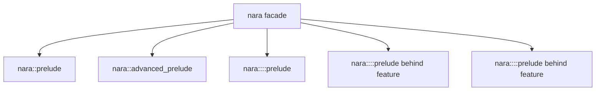

# ADR 0044: Root Facade and Prelude Layering Policy

**Status**: Accepted
**Date**: 2026-07-09
**Refines**: ADR 0001, ADR 0012, ADR 0015, ADR 0032
**Refined By**: ADR 0046: Plugin Metadata and Default Plugin Groups; ADR 0055: Feature Matrix,
Boundary Checks, and Compatibility Fixtures

## Context

The root `nara` facade is the product surface most users and AI agents will copy from examples.
Because nara is pre-1.0, it is acceptable to break and clean up early, but the facade must not teach
the wrong dependency shape.

The current root prelude is useful but broad. Optional backend/tooling/debug types can drift into
the default gameplay import path, making it easy for examples to depend on `winit`, `wgpu`, egui,
extracted render data, or backend diagnostics without noticing.

## Decision

nara will layer its facade and preludes by audience.

Rules:

- `nara::prelude` is gameplay-first, code-first, and backend-free. It should remain stable enough
  for examples, AI-generated gameplay, and small projects.
- The default prelude may include `App`, `Plugin`, ECS basics, schedules commonly used by gameplay,
  core math/color, transforms, scene hierarchy components, semantic asset handles/refs, sprite,
  tilemap, camera, material authoring, runtime UI authoring, and common input/action types.
- The default prelude should not export backend-native types, `winit`/`wgpu` adapters, egui/dear
  imgui adapters, render extraction/queue/batch internals, GPU cache internals, tooling-only
  inspector state, or low-level task/backend diagnostics by default.
- `nara::advanced_prelude` may expose low-level engine extension types: custom schedule labels,
  task resources, diagnostics, render pass planning, prepared render resources, and domain
  extension hooks.
- Backend feature modules such as `nara::render_wgpu` or `nara::winit` may expose their own
  preludes, but enabling a feature must not silently expand the gameplay prelude with backend
  internals.
- Tooling/editor adapters expose explicit module preludes. Runtime/gameplay examples should not
  import egui tooling accidentally through the root prelude.
- Pre-1.0 cleanup should remove misplaced exports rather than preserve compatibility aliases unless
  an ADR marks the alias as intentionally stable.

## Alternatives Considered

### Option A: One large root prelude

**Pros**: Convenient for examples and quick prototyping.

**Cons**: Hides architecture boundaries, leaks backend/tooling concepts into gameplay, and makes AI
agents import the wrong layer.

**Decision**: Rejected.

### Option B: No root prelude

**Pros**: Maximum explicitness and clean dependency awareness.

**Cons**: Poor first-hour DX and noisier code-first examples.

**Decision**: Rejected.

### Option C: Layered gameplay, advanced, backend, and tooling preludes

**Pros**: Keeps the common path ergonomic while preserving architectural boundaries and teaching the
right imports.

**Cons**: Requires periodic facade audits as crates grow.

**Decision**: Chosen.

## Success Metrics

| Metric | Target | Measurement |
|---|---:|---|
| Backend-free default | `nara::prelude` does not expose `wgpu`, `winit`, egui, or backend handles | API/dependency review |
| Example clarity | Basic examples use `nara::prelude`; backend examples import backend modules explicitly | Example review |
| Internal isolation | Extracted/queued/batch/render-cache internals are not in the default gameplay prelude | API review |
| Feature discipline | Optional features do not silently widen the default gameplay prelude with backend internals | Feature tests/review |
| AI ergonomics | Generated gameplay can import one small prelude without learning backend crates | Example smoke test |

## Risks and Mitigations

| Risk | Severity | Likelihood | Mitigation |
|---|---|---:|---|
| Users cannot find advanced types | Low | Medium | Provide `advanced_prelude` and domain preludes with clear docs. |
| Prelude cleanup breaks examples | Medium | Medium | This is acceptable pre-1.0; update examples in the same change. |
| Backend modules duplicate exports | Low | Medium | Keep module preludes narrow and feature-gated. |
| Gameplay prelude grows too wide over time | Medium | Medium | Audit root facade when adding new crates or optional features. |

## Consequences

- The root facade should be audited soon. Backend/tooling/debug/internal render types should move
  out of `nara::prelude` into advanced or module-specific preludes.
- Examples should demonstrate explicit imports for backend adapters and tooling.
- `AGENTS.md` should treat root prelude layering as an architecture rule.

## Open Questions

- Which scheduling/task/diagnostic types are common enough for gameplay prelude versus
  `advanced_prelude`?
- Should `nara::minimal_prelude` exist, or is `nara::prelude` already the minimal gameplay surface?
- How should generated API docs group facade exports so new users see the intended import path?
