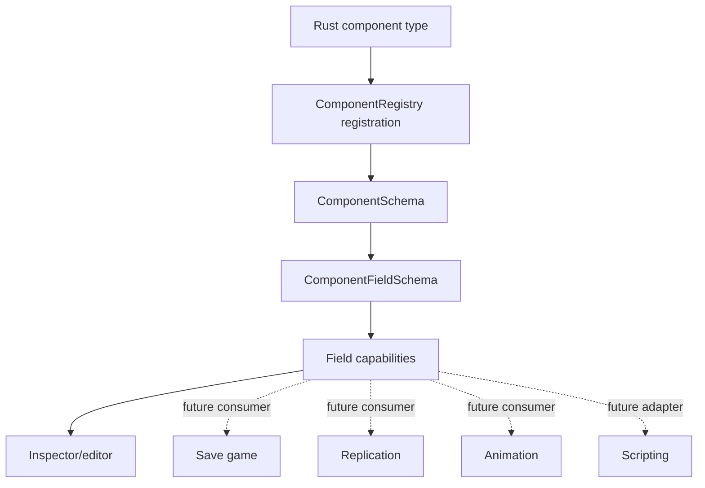

# ADR 0045: Component Schema Capability Metadata

**Status**: Accepted
**Date**: 2026-07-09
**Implemented Slice**: RGF-U1 canonical-v1 vocabulary on 2026-07-12
**Refines**: ADR 0004, ADR 0011, ADR 0015, ADR 0021, ADR 0027, ADR 0028, ADR 0029
**Refined By**: ADR 0051: Persistent File Envelope, Migration, and Golden Fixtures;
ADR 0081: Schema Source, Stable Identity, Catalog, and Runtime Binding

## Context

`nara_reflect::ComponentRegistry` now owns stable component IDs, schema versions, field schemas,
value codecs, and component migrations. That gives scenes, prefabs, patches, tooling, and AI agents
one structural description of component data.

The remaining risk is that structure alone is not enough. Save games, networking, animation,
scripting, editor inspection, editor mutation, and accessibility/debug views all need to know which
fields are eligible for their domain. If each subsystem adds its own side metadata, nara will get
conflicting answers for the same field.

Examples:

- A runtime cache field may be inspectable but not scene-serializable.
- A transform field may be animatable and replicated, but a local editor-only note may not be.
- A field may be script-readable but not script-writable.
- A field may be valid in scene data but excluded from save games.

## Decision

Component schemas include stable capability metadata at both component and field granularity.

The capability contract is:

- Capabilities describe **eligibility**, not automatic behavior. A field marked `replicate` is
  allowed to participate in replication, but the networking domain still decides authority,
  compression, frequency, and conflict handling.
- Component-level capabilities describe coarse eligibility. Field-level capabilities refine the
  same domain gate for a current value locator.
- Capabilities are part of the exported schema catalog so editor UI, AI agents, validators, and
  code generation can make consistent decisions.
- Defaults are conservative. New capabilities should be explicit in registration helpers rather
  than inferred from Rust visibility, serde derives, or field names.
- Schema capability changes are versioned. If a capability change affects persistent behavior, the
  owning component should consider whether a component migration or document migration is needed.
- Unknown canonical-v1 capabilities are rejected. A future best-effort policy requires a new
  format-version decision; v1 never silently ignores an unsupported capability.
- Capabilities do not replace validation. Component codecs and domain systems still enforce value
  ranges, references, permissions, and runtime invariants.

## Canonical Version-1 Vocabulary

| Capability | Scope | Meaning |
|---|---|---|
| `scene` | component/field | Eligible for scene/prefab documents and scene patches |
| `inspect` | component/field | Visible in tooling/debug inspectors |
| `edit` | component/field | Mutable through editor/AI authoring commands |
| `asset_ref` | field | Contains a semantic asset reference |
| `entity_ref` | field | Contains a stable entity/document reference |

`ComponentCapability` is a closed enum stored in a `BTreeSet`; schemas use explicit builder
methods, and defaults are empty. Built-in persistent fields use the minimum required subset;
reference fields add `asset_ref` or `entity_ref`. Runtime-only components remain absent from the
persistent catalog rather than carrying a `runtime_only` capability.

Save, animation, replication, script read/write, and diagnostic projection are accepted product
directions, not canonical-v1 wire values. Each enters the enum only when a concrete consumer owns
its behavior, tests, and format impact. Domain policy payloads remain outside this base eligibility
set.

RGF-U1 implements schema eligibility and mixed-capability whole-value projection checks. The local
Inspector filters components and fields through `inspect`, and editor commands additionally require
`edit`. It does not implement a general observation/disclosure pipeline: remote transport, logging,
and persistence still require the independent ADR 0076 allowlist and redaction policy.

## Alternatives Considered

### Option A: Each subsystem owns separate metadata

**Pros**: Local implementation speed and domain freedom.

**Cons**: Save, network, animation, scripting, and editor tooling can disagree about the same field.
AI agents would need to query many registries before changing one component.

**Decision**: Rejected.

### Option B: Component-level capabilities only

**Pros**: Simple and compact.

**Cons**: Too coarse for real components. Many components contain a mix of persistent, runtime,
inspectable, editable, replicated, and hidden fields.

**Decision**: Rejected.

### Option C: Field-level capability metadata in `ComponentSchema`

**Pros**: Keeps component structure and domain eligibility in one versioned catalog while leaving
domain policy to each subsystem.

**Cons**: Requires careful defaults and schema migration discipline.

**Decision**: Chosen.

## Success Metrics

| Metric | Target | Measurement |
|---|---:|---|
| Canonical eligibility source | Current scene/inspect/edit/reference consumers query one catalog | API review and catalog tests |
| Conservative defaults | Fields do not become save/replicate/script-write eligible by accident | Unit tests |
| Field precision | Mixed persistent/runtime components can mark fields independently | Schema tests |
| Tooling readiness | Exported schema includes the five machine-readable v1 capabilities | Catalog format tests |
| Migration awareness | Capability changes that affect persistent behavior are versioned/reviewed | Code review |

## Risks and Mitigations

| Risk | Severity | Likelihood | Mitigation |
|---|---|---:|---|
| Capability flags become a dumping ground | Medium | Medium | Keep base vocabulary small and push domain policy to domain metadata. |
| Users mistake eligibility for behavior | Medium | Medium | Document that capabilities gate participation; systems still own policy. |
| Too many explicit flags make registration noisy | Low | Medium | Provide registration helper presets for common component categories. |
| Forward compatibility hides important unsupported flags | Medium | Low | Canonical v1 rejects every unknown capability; a later best-effort policy requires a new format decision. |

## Consequences

- `ComponentSchema` and `ComponentFieldSchema` carry the five canonical-v1 capability values.
- `ComponentSchemaCatalog` exports those values for local tooling and future adapters.
- Built-in persistent registrations use explicit capability presets, and whole-value paths reject
  mixed eligibility instead of silently projecting fields.
- Save, network, animation, scripting, and remote observation remain domain-owned future consumers;
  they do not reserve wire values in advance.

## Open Questions

- Which concrete save, animation, replication, or adapter workflow first justifies a new wire
  capability and format review?
- Should future domain-specific policy use separate maps keyed by stable field ID, or a
  versioned domain-owned schema extension?
