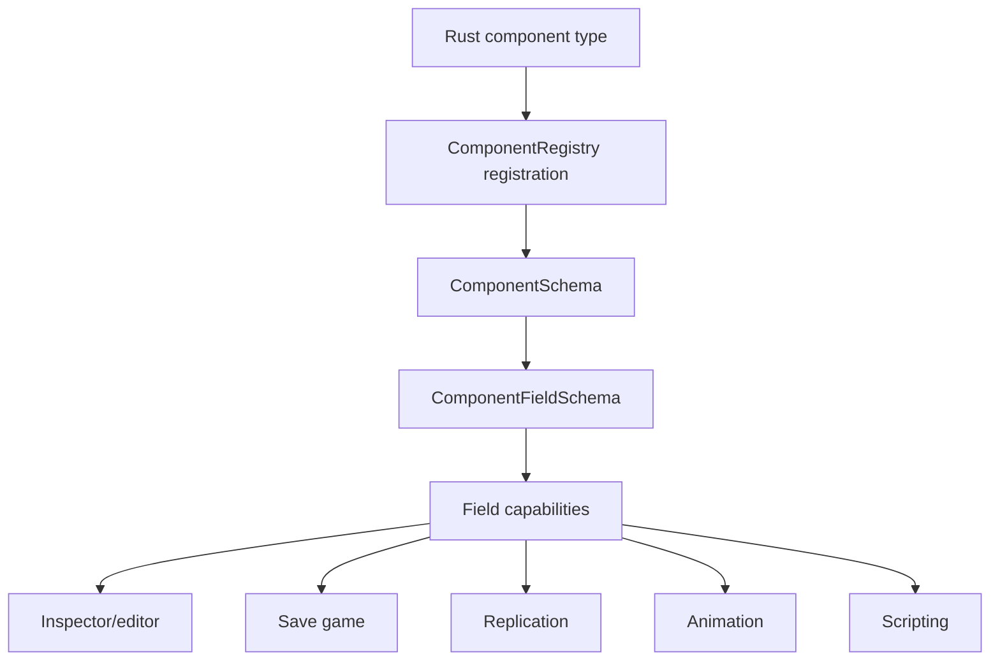

# ADR 0045: Component Schema Capability Metadata

**Status**: Accepted
**Date**: 2026-07-09
**Refines**: ADR 0004, ADR 0011, ADR 0015, ADR 0021, ADR 0027, ADR 0028, ADR 0029

## Context

`nara_reflect::ComponentRegistry` now owns stable component IDs, schema versions, field schemas,
value codecs, and component migrations. That gives scenes, prefabs, patches, tooling, and AI agents
one structural description of component data.

The remaining risk is that structure alone is not enough. Save games, networking, animation,
scripting, editor inspection, editor mutation, and accessibility/debug views all need to know which
fields are eligible for their domain. If each subsystem adds its own side metadata, nara will get
conflicting answers for the same field.

Examples:

- A runtime cache field may be inspectable but not scene-serializable.
- A transform field may be animatable and replicated, but a local editor-only note may not be.
- A field may be script-readable but not script-writable.
- A field may be valid in scene data but excluded from save games.

## Decision

Component schemas include stable capability metadata at both component and field granularity.

The capability contract is:

- Capabilities describe **eligibility**, not automatic behavior. A field marked `replicate` is
  allowed to participate in replication, but the networking domain still decides authority,
  compression, frequency, and conflict handling.
- Component-level capabilities describe coarse domain eligibility such as scene data, save data,
  inspectable, editor-visible, script-visible, animatable, replicable, runtime-only, and tooling-only.
- Field-level capabilities refine the component contract with flags such as scene-serializable,
  save-serializable, inspectable, editable, animatable, replicate, script-read, script-write,
  entity-reference, asset-reference, and diagnostic-only.
- Capabilities are part of the exported schema catalog so editor UI, AI agents, validators, and
  code generation can make consistent decisions.
- Defaults are conservative. New capabilities should be explicit in registration helpers rather
  than inferred from Rust visibility, serde derives, or field names.
- Schema capability changes are versioned. If a capability change affects persistent behavior, the
  owning component should consider whether a component migration or document migration is needed.
- Unknown capabilities in future schema documents should be diagnosable and ignored only when the
  consumer explicitly opts into forward-compatible best-effort behavior.
- Capabilities do not replace validation. Component codecs and domain systems still enforce value
  ranges, references, permissions, and runtime invariants.

## Initial Capability Vocabulary

| Capability | Scope | Meaning |
|---|---|---|
| `scene` | component/field | Eligible for scene/prefab documents and scene patches |
| `save` | component/field | Eligible for save-game serialization |
| `inspect` | component/field | Visible in tooling/debug inspectors |
| `edit` | field | Mutable through editor/AI authoring commands |
| `animate` | field | Addressable by animation tracks |
| `replicate` | component/field | Eligible for networking replication |
| `script_read` | field | Readable from script bindings |
| `script_write` | field | Writable from script bindings |
| `asset_ref` | field | Contains a semantic asset reference |
| `entity_ref` | field | Contains a stable entity/document reference |
| `runtime_only` | component/field | Not persistent project data |
| `diagnostic` | component/field | Observational/debug data, not gameplay authoring state |

The vocabulary should stay small and stable. Domain-specific policy details, such as replication
authority or animation interpolation mode, belong in domain metadata layered on top of the
capability gate.

## Alternatives Considered

### Option A: Each subsystem owns separate metadata

**Pros**: Local implementation speed and domain freedom.

**Cons**: Save, network, animation, scripting, and editor tooling can disagree about the same field.
AI agents would need to query many registries before changing one component.

**Decision**: Rejected.

### Option B: Component-level capabilities only

**Pros**: Simple and compact.

**Cons**: Too coarse for real components. Many components contain a mix of persistent, runtime,
inspectable, editable, replicated, and hidden fields.

**Decision**: Rejected.

### Option C: Field-level capability metadata in `ComponentSchema`

**Pros**: Keeps component structure and domain eligibility in one versioned catalog while leaving
domain policy to each subsystem.

**Cons**: Requires careful defaults and schema migration discipline.

**Decision**: Chosen.

## Success Metrics

| Metric | Target | Measurement |
|---|---:|---|
| Single eligibility source | Editor, save, networking, animation, and scripting can query one schema catalog | API review |
| Conservative defaults | Fields do not become save/replicate/script-write eligible by accident | Unit tests |
| Field precision | Mixed persistent/runtime components can mark fields independently | Schema tests |
| AI/tooling readiness | Exported schema includes machine-readable capabilities | Catalog snapshot test |
| Migration awareness | Capability changes that affect persistent behavior are versioned/reviewed | Code review |

## Risks and Mitigations

| Risk | Severity | Likelihood | Mitigation |
|---|---|---:|---|
| Capability flags become a dumping ground | Medium | Medium | Keep base vocabulary small and push domain policy to domain metadata. |
| Users mistake eligibility for behavior | Medium | Medium | Document that capabilities gate participation; systems still own policy. |
| Too many explicit flags make registration noisy | Low | Medium | Provide registration helper presets for common component categories. |
| Forward compatibility hides important unsupported flags | Medium | Low | Emit diagnostics for unknown capabilities unless best-effort loading is explicit. |

## Consequences

- `ComponentFieldSchema` should grow capability metadata before save/network/animation/script APIs
  are implemented.
- `ComponentSchemaCatalog` should export capabilities for tools and AI agents.
- Existing serializable component registrations can be migrated to explicit capability presets.
- Future editor workspace and Apply Changes features should respect field editability instead of
  assuming every registered serializable field is editable.

## Open Questions

- What exact Rust API should registration helpers use: bitflags, enum sets, or builder methods?
- Should capability metadata include domain-specific policy payloads, or should domains register
  separate policy maps keyed by `ComponentTypeId` and `ComponentFieldPath`?
- Which existing built-in fields should be editable versus inspect-only in the first implementation?

