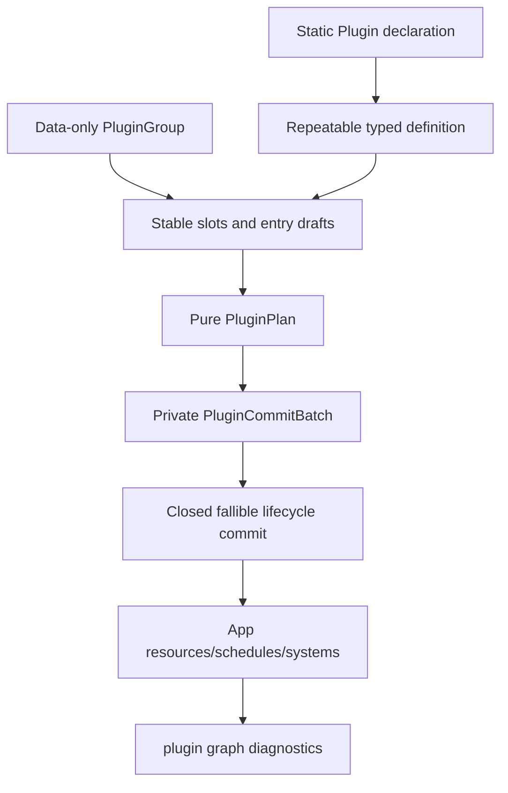

# ADR 0046: Plugin Metadata and Default Plugin Groups

**Status**: Accepted
**Date**: 2026-07-09
**Last Revised**: 2026-07-16
**Refines**: ADR 0003, ADR 0010, ADR 0035, ADR 0040, ADR 0044
**Refined By**: ADR 0056: Headless Runtime and Dedicated Server Readiness; ADR 0079: Root Product
Capabilities and Placeholder Domain Retirement

## Context

nara owns its `App` and `Plugin` lifecycle, with fallible plugin installation and duplicate
protection. That is the right product boundary. The next risk is composition: as rendering, input,
asset import, UI, physics, tooling, and editor adapters grow, ad hoc plugin ordering and convenience
installation will obscure what a project actually enabled.

There is already pressure:

- Before this ADR was implemented, `WgpuRenderPlugin` installed sprite and UI render submitters for
  convenience.
- `MinimalPlugins` can drift from a truly minimal runtime base.
- Generated docs, diagnostics, editor views, and AI agents need to inspect installed capabilities.
- File-backed project settings need to lower into predictable plugin groups.

## Decision

nara plugins expose lightweight metadata and nara provides explicit default plugin groups.

The plugin metadata contract is:

- Every plugin type owns one static `Plugin::declaration()` containing a stable `PluginId` suitable
  for diagnostics, generated docs, and project inspection. Constructed instances and entry drafts
  records do not provide competing metadata authorities. Rust `TypeId` may support private typed
  erasure, but it is not a public or persistent identity.
- Plugins declare provided capabilities, required capabilities/plugins, conflicts, and a short
  category such as core, asset, render, platform, input, tooling, service, or backend. These facts
  do not vary with instance configuration.
- Every `PluginId` is unique in a resolved plan. The unused open-ended non-unique flag is removed;
  a future proven multi-instance lifecycle requires explicit stable entry identity.
- A repeatable `PluginDefinition` combines a stable versioned `PluginDefinitionId`, the canonical
  declaration, explicit immutable configuration, its canonical representation/versioned digest,
  and one admitted private typed factory binding. A raw direct plugin instance remains one-shot and
  cannot enter a replayable runtime recipe. `PluginDefinition` is an opaque advanced authoring
  value returned by typed domain helpers; ordinary authors do not construct definition IDs,
  fingerprints, canonical bytes, or erased factories.
- Metadata is declarative and diagnostic first. Composition closes declared capabilities,
  requirements, conflicts, and group membership into one inspectable plan; this is validation, not
  a general-purpose dependency solver.
- Plugin groups are data-only ordered product bundles. Their builder records stable slots,
  repeatable definitions, nested groups, disable/configure/relative-order intent, and no `App`
  mutation. One resolved entry collection derives membership, order, slot state, and full
  group provenance; there is no parallel static member array.
- Duplicate entry drafts may merge provenance during pure resolution only when their stable
  slot occurrence identity (or the same un-slotted unique `PluginId`) and complete admitted
  definition key match. Configuration
  equality compares private canonical representations after a digest match; hash equality alone is
  insufficient. Different plugins cannot claim the same stable slot. Divergent
  IDs/configurations/bindings are errors; public `add_plugin_if_missing` and first/last-wins
  selection are not composition policy.
- Duplicate group IDs converge only when an intrinsic group-definition fingerprint over canonical
  expanded occurrences, definition keys, order intent, and nested group fingerprints matches. The
  fingerprint excludes outer edits and accumulated provenance, which merge only after equality.
- Missing required capabilities and conflicts produce structured diagnostics before any `App`
  mutation. Pure plan failures use `PluginPlanError`; product capability failures use
  `CompositionError`; repeatable factory preparation uses `PluginPrepareError`; App-level plugin
  hook failures use `PluginError`. Panic-based prerequisite checks remain invalid.
- Schema-contributing declarations name stable provider IDs. Root product resolution binds the
  selected IDs to exact typed provider definitions with an explicit stable versioned native
  binding ID, rejects divergent bindings or multiple plugin
  owners, registers them into a scratch `ComponentRegistry`, and freezes that registry before
  publishing `SchemaValidationInput`. A `RuntimePlan` retains the sorted provider IDs and catalog
  fingerprint without retaining an App, World, native authority, or live plugin instance.
- `App::add_plugins` preserves a Bevy-like single/group/tuple call through a sealed input trait, but
  all inputs lower through collection, resolution, optional private preparation, and closed commit.
  Plugin build/finish hooks cannot install hidden dependencies.
- First-party and third-party runtime plugins use the same public `App` and domain Interfaces. A
  closed commit restricts plugin-graph mutation, runner selection, automatic-main-loop insertion,
  and Host-issued authority; it does not turn `Plugin::build` into a behavior whitelist. The runtime
  extension contract must permit trusted plugin code to use its own ECS component types and add
  typed resources, systems, system sets, custom schedules, typed queues, and runtime-local domain
  registrations through public Interfaces.
  Import, editor/tooling, render, cook, and Host-authority roles use their owning contribution
  contracts only after those roles are separately admitted. A known supported runtime/domain
  contribution must not require a first-party ID allowlist or an edit to Nara core merely because
  its crate is external.
- Moving exclusive authority out of `Plugin::build` is not permission to reserve it for Nara.
  `PluginGroup` may aggregate runtime-plugin companions only. A future `PackageDefinition`, product
  preset, or typed root helper may aggregate those plugins with roles that already have their own
  Accepted admission contract so the user still selects one coherent product entry. Render-family,
  exact-GPU, replacement Render Host, service, or platform/runner examples do not become supported
  roles merely by being named here. For each admitted exclusive role, root composition chooses its
  owner explicitly and external candidates use the same supported slot/conformance contract as the
  first-party default.
- Ordinary Rust callers edit groups by plugin type or by a typed definition helper, for example
  `.disable::<TilemapPlugin>()` and `.configure(window::plugin(settings))`. Stable slot IDs remain
  the durable authority for project data, tooling, and later admitted cross-plugin replacement,
  but common same-plugin configuration and disable flows must not require handwritten slot
  constants. Advanced slot-directed methods remain available outside the gameplay prelude.
- The ordinary concept budget is `App`, `Plugin`, `PluginGroup`, tuple, `add_plugins`, `seal`, typed
  domain configuration helpers, and one surfaced `AddPluginsError` for `?` propagation.
  Declaration helpers should generate stable boilerplate; `PluginDefinition`, entry drafts,
  `PluginPlan`, commit batches, definition keys, and fingerprints stay in advanced or private
  modules. One `AddPluginsError` preserves internal phase guarantees while allowing one `?` at the
  call site.
- Optional runtime-side backend bridge plugins stay feature-gated. Enabling a feature exposes the
  plugin, but it does not silently install it unless a chosen group includes it. A Render Host,
  Platform/Runner, or other exclusive Host contribution is registered and selected by product/root
  composition rather than installed through `PluginGroup`.
- Render submitter ownership follows ADR 0040: device/surface backend plugins are separate from
  sprite, UI, text, gizmo, and future 3D submitter plugins. Convenience groups may combine them.

## Default Plugin Groups

Initial group vocabulary:

| Group | Purpose |
|---|---|
| `MinimalPlugins` | Headless component registry, hierarchy, diagnostics, tasks, assets, transform, and normalized input foundations |
| `Runtime2dPlugins` | Transform, render-domain basics, image/material, sprite, and tilemap; no runtime UI |
| `RuntimeUiPlugins` | Runtime UI authoring, layout, interaction, and UI submission without sprite/tilemap ownership |
| `HeadlessRuntimePlugins` | Core runtime plus asset/scene/gameplay-domain systems that can run without window, render, audio-device, editor, or UI toolkit adapters |
| `ServerPlugins` | Dedicated-server-ready headless composition with deterministic-friendly gameplay stages, diagnostics/metrics, and no networking transport unless an optional networking crate is explicitly added |
| `DesktopWinitPlugins` | Backend-neutral window configuration for a desktop profile; top-level Host/code-first authority selects `WinitRunner` separately |
| `WgpuBackendPlugins` | Transitional runtime integration for the already selected stock wgpu Host; it does not select or replace Render Host authority. Sprite and UI submitters are available only under their compiled domain/backend features and join a resolved plan only when requested. |
| `ToolingPlugins` | UI-agnostic tooling models and optional adapter groups |

`MinimalPlugins` should remain small and headless. It should not grow into "everything a sample game
might want." Examples can use richer groups when they need rendering, windowing, asset import, or UI.
The fixed `DesktopWgpuPlugins` bundle is removed; project composition combines runtime presets and
additive product/adapter capabilities after validating the compiled/requested/required product
subsets and the separate plugin service requirement/conflict closure.

## Alternatives Considered

### Option A: Keep ad hoc plugin installation

**Pros**: Simple and flexible while the engine is small.

**Cons**: Dependencies and installed capabilities become invisible. Convenience plugins can
accidentally hardwire unrelated domains together.

**Decision**: Rejected.

### Option B: Copy Bevy's full plugin group implementation model

**Pros**: Mature Rust precedent and familiar ergonomics.

**Cons**: `TypeId` keys, one-shot boxed instances, panic-oriented edits, and public
`PluginGroupBuilder::finish(App)` do not support stable package inspection, replayable generations,
or Nara's candidate containment.

**Decision**: Rejected.

### Option C: Lightweight metadata plus explicit nara groups

**Pros**: Gives diagnostics and product bundles now without committing to a full dependency solver
or Bevy-compatible API surface.

**Cons**: The implemented static member arrays plus imperative group build methods create two
authorities. Instance-owned metadata also requires construction before product planning.

**Decision**: Superseded by implementation evidence.

### Option D: Keep Bevy ergonomics over a stable data-only plan

**Pros**: Preserves `add_plugins(plugin/group/tuple)` and chained group editing while making one
entry collection authoritative, replayable, inspectable, deterministic, and closed before
App mutation.

**Cons**: Requires a breaking migration to static declarations, repeatable definitions, pure group
builders, typed plan errors, and explicit dependencies.

**Decision**: Chosen. Nara adopts Bevy's caller ergonomics, not its process-local identity and
immediate-install semantics.

## Success Metrics

| Metric | Target | Measurement |
|---|---:|---|
| Inspectable plugin graph | Resolved/installed entries expose stable IDs, declarations, slots, and provenance from one source | Unit/API tests |
| Minimal stays minimal | `MinimalPlugins` remains headless and backend-free | Dependency review |
| Backend decoupling | wgpu device/surface setup does not permanently auto-own sprite/UI/text submitters | Plugin tests |
| Diagnostics | Missing prerequisites/conflicts produce structured errors with plugin IDs before mutation | Unit tests |
| Docs/tooling | Plugin groups can be listed for docs/editor/AI tooling | Snapshot/API test |
| Author concept budget | Common code-first examples use only App, Plugin, PluginGroup, tuples, typed group edits, and one `?` | Clean-room compile fixtures |
| Runtime extension freedom | A renamed-dependency external crate uses the same public Interfaces as first-party code to add its own ECS data, resources, systems, sets, typed custom schedule, and runtime-local known-domain registration with zero Nara source edits or first-party allowlist | Independent workspace compile/run and static source audit |
| Explicit authority upgrade | An external package/product helper can pair ordinary runtime plugins with separately declared Host/runner or backend contributions and expose one user-facing selection without pretending `PluginGroup` owns those roles or acquiring authority from a hook | Clean-room package plan, exclusive-slot, and negative hidden-install tests |
| Product separation | Runtime 2D installs no runtime UI; runtime UI pulls no sprite/tilemap group | Group and dependency tests |
| Deterministic plan | Identical inputs produce identical order and fingerprint | Repeated/property tests |
| Closed dependencies | No build/finish hook installs a plugin/group | Static and ignored-error contract tests |

## Risks and Mitigations

| Risk | Severity | Likelihood | Mitigation |
|---|---|---:|---|
| Definition key is rebound or transferred inconsistently | High | Medium | Admit one typed factory binding per stable definition ID/version and preserve the complete key into the private commit batch. |
| Trusted factory ignores canonical config | High | Low | Do not claim runtime self-verification; require domain conformance tests and keep native/authority work outside the factory. |
| Group names overfit early architecture | Low | Medium | Keep groups product-level and allow pre-1.0 breaking refactoring. |
| Users expect automatic dependency solving | Medium | Low | Document that composition validates a declared closure; it does not choose arbitrary plugins. |
| Convenience examples get more verbose | Low | Medium | Provide clear group presets instead of hidden installs. |
| Group membership drifts from installation | High | Medium | Derive both resolved group snapshots and committed installation from one ordered entry collection. |
| Stable infrastructure leaks into ordinary authoring | High | Medium | Keep definition keys, fingerprints, entry drafts, plans, and commit batches out of the gameplay prelude; provide typed helpers and group edits. |
| Declarative metadata is mistaken for a behavior sandbox or exhaustive manifest | High | Medium | State that trusted `build` code remains free inside public App/domain Interfaces; declarations close composition facts and authority requests only. |

## Consequences

- `Plugin` exposes one static declaration with stable ID, category, capabilities, requirements, and
  conflicts; group membership is resolved provenance rather than plugin-owned metadata.
- `PluginGroupBuilder` is data-only, and `App::add_plugins` lowers plugin/group/tuple inputs through
  the same resolver and closed lifecycle commit.
- Pre-resolution occurrences use private entry-draft vocabulary; resolved inspection exposes
  `PluginPlanEntry`. `PluginRegistration` is not a public type because no active registration has
  occurred during pure planning.
- `WgpuRenderPlugin` no longer unconditionally installs or compiles sprite/UI submitters; product
  capability closure selects the base backend and each submitter independently.
- Runtime 2D and runtime UI are separate groups, and desktop window plus wgpu composition is
  additive rather than fixed in `DesktopWgpuPlugins`.
- Root facade/prelude refinement exposes group names deliberately rather than exporting backend/plugin
  internals through the gameplay prelude.
- Closed plugin hooks limit hidden timing and ownership, not reachable engine capability. Advanced
  external packages escalate through explicit domain/Host contributions instead of private
  first-party callbacks.
- `ProjectRuntimePlugins` exposes lineage-bound type-directed edits, while `RuntimePlan` combines
  the immutable plugin plan with required product capabilities and frozen schema-validation input.
  Neither type acquires services or mutates an App.

## Open Questions

- Which canonical configuration encoding/derive gives third-party definition authors deterministic
  fingerprints with the smallest advanced authoring surface?
- Which concrete cross-plugin replacement proves the need for a public slot-conformance evidence
  carrier beyond same-plugin configuration and optional-slot disable?
- Which named project preset, if any, should examples use for the common 2D desktop capability set?
