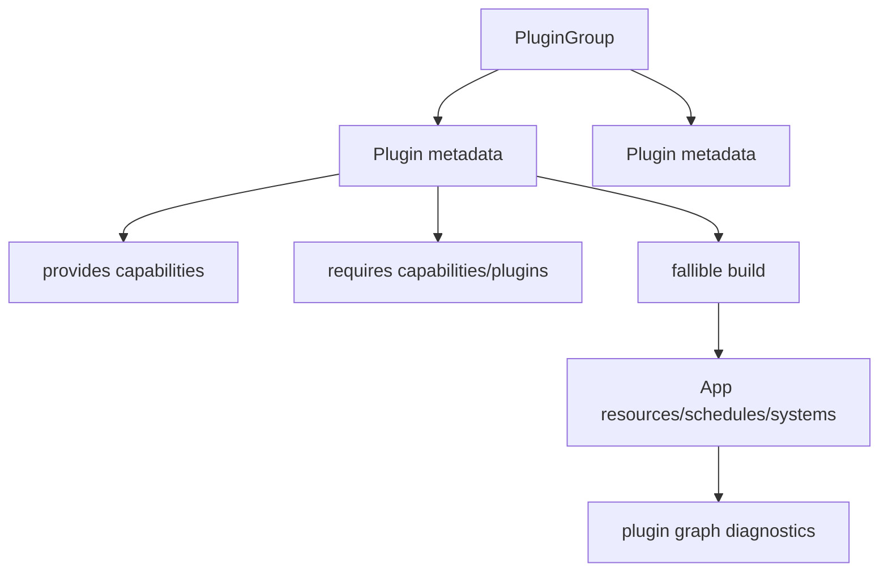

# ADR 0046: Plugin Metadata and Default Plugin Groups

**Status**: Accepted
**Date**: 2026-07-09
**Refines**: ADR 0010, ADR 0035, ADR 0040, ADR 0044
**Refined By**: ADR 0056: Headless Runtime and Dedicated Server Readiness; ADR 0079: Root Product
Capabilities and Placeholder Domain Retirement

## Context

nara owns its `App` and `Plugin` lifecycle, with fallible plugin installation and duplicate
protection. That is the right product boundary. The next risk is composition: as rendering, input,
asset import, UI, physics, tooling, and editor adapters grow, ad hoc plugin ordering and convenience
installation will obscure what a project actually enabled.

There is already pressure:

- Before this ADR was implemented, `WgpuRenderPlugin` installed sprite and UI render submitters for
  convenience.
- `MinimalPlugins` can drift from a truly minimal runtime base.
- Generated docs, diagnostics, editor views, and AI agents need to inspect installed capabilities.
- File-backed project settings need to lower into predictable plugin groups.

## Decision

nara plugins expose lightweight metadata and nara provides explicit default plugin groups.

The plugin metadata contract is:

- Every plugin has a stable `PluginId` suitable for diagnostics, generated docs, and project
  inspection. Rust `TypeId` may support uniqueness internally, but it is not enough as the public
  diagnostic identity.
- Plugins may declare provided capabilities, required capabilities/plugins, conflicts, whether they
  are unique, and a short category such as core, asset, render, platform, input, tooling, service, or
  backend.
- Metadata is declarative and diagnostic first. Composition closes declared capabilities,
  requirements, conflicts, and group membership into one inspectable plan; this is validation, not
  a general-purpose dependency solver.
- Plugin groups are ordered product bundles. They may install plugins with `add_plugin_if_missing`
  for idempotent composition, but their membership is explicit and inspectable.
- Missing required capabilities and conflicts produce structured `PluginError` diagnostics before
  any `App` mutation. Panic-based prerequisite checks remain invalid.
- Optional backend adapters stay feature-gated. Enabling a feature exposes the plugin, but it does
  not silently install it unless a chosen group includes it.
- Render submitter ownership follows ADR 0040: device/surface backend plugins are separate from
  sprite, UI, text, gizmo, and future 3D submitter plugins. Convenience groups may combine them.

## Default Plugin Groups

Initial group vocabulary:

| Group | Purpose |
|---|---|
| `CorePlugins` | App scheduling, diagnostics, tasks, core runtime resources |
| `AssetPlugins` | Asset server, import registry, reload scheduling, optional watch adapter by feature |
| `Runtime2dPlugins` | Transform, render-domain basics, image/material, sprite, and tilemap; no runtime UI |
| `RuntimeUiPlugins` | Runtime UI authoring, layout, interaction, and UI submission without sprite/tilemap ownership |
| `HeadlessRuntimePlugins` | Core runtime plus asset/scene/gameplay-domain systems that can run without window, render, audio-device, editor, or UI toolkit adapters |
| `ServerPlugins` | Dedicated-server-ready headless composition with deterministic-friendly gameplay stages, diagnostics/metrics, and no networking transport unless an optional networking crate is explicitly added |
| `DesktopWindowPlugins` | `nara_window` plus desktop `nara_winit` adapter |
| `WgpuBackendPlugins` | Base wgpu target/backend operation; sprite and UI submitters are available only under their compiled domain/backend features and join a resolved plan only when requested |
| `ToolingPlugins` | UI-agnostic tooling models and optional adapter groups |

`MinimalPlugins` should remain small and headless. It should not grow into "everything a sample game
might want." Examples can use richer groups when they need rendering, windowing, asset import, or UI.
The fixed `DesktopWgpuPlugins` bundle is removed; project composition combines runtime presets and
additive product/adapter capabilities after validating the compiled/requested/required product
subsets and the separate plugin service requirement/conflict closure.

## Alternatives Considered

### Option A: Keep ad hoc plugin installation

**Pros**: Simple and flexible while the engine is small.

**Cons**: Dependencies and installed capabilities become invisible. Convenience plugins can
accidentally hardwire unrelated domains together.

**Decision**: Rejected.

### Option B: Import Bevy's full plugin group model

**Pros**: Mature Rust precedent and familiar ergonomics.

**Cons**: nara intentionally owns a narrower app/product boundary. Copying the full surface now
would add complexity before nara has enough plugins.

**Decision**: Rejected.

### Option C: Lightweight metadata plus explicit nara groups

**Pros**: Gives diagnostics and product bundles now without committing to a full dependency solver
or Bevy-compatible API surface.

**Cons**: Requires future migration from current convenience plugin behavior.

**Decision**: Chosen.

## Success Metrics

| Metric | Target | Measurement |
|---|---:|---|
| Inspectable plugin graph | Installed plugins expose stable IDs and provided capabilities | Unit/API tests |
| Minimal stays minimal | `MinimalPlugins` remains headless and backend-free | Dependency review |
| Backend decoupling | wgpu device/surface setup does not permanently auto-own sprite/UI/text submitters | Plugin tests |
| Diagnostics | Missing prerequisites/conflicts produce structured errors with plugin IDs before mutation | Unit tests |
| Docs/tooling | Plugin groups can be listed for docs/editor/AI tooling | Snapshot/API test |
| Product separation | Runtime 2D installs no runtime UI; runtime UI pulls no sprite/tilemap group | Group and dependency tests |

## Risks and Mitigations

| Risk | Severity | Likelihood | Mitigation |
|---|---|---:|---|
| Metadata becomes inaccurate if build mutates dynamically | Medium | Medium | Treat metadata as declared contract and test group membership. |
| Group names overfit early architecture | Low | Medium | Keep groups product-level and allow pre-1.0 breaking cleanup. |
| Users expect automatic dependency solving | Medium | Low | Document that composition validates a declared closure; it does not choose arbitrary plugins. |
| Convenience examples get more verbose | Low | Medium | Provide clear group presets instead of hidden installs. |
| Preflight metadata drifts from installation | High | Medium | Install from the validated resolved plan and compare its declared closure with group snapshots in tests. |

## Consequences

- `Plugin` now exposes stable metadata with IDs, categories, capabilities, and group membership.
- `WgpuRenderPlugin` no longer unconditionally installs or compiles sprite/UI submitters; product
  capability closure selects the base backend and each submitter independently.
- Runtime 2D and runtime UI are separate groups, and desktop window plus wgpu composition is
  additive rather than fixed in `DesktopWgpuPlugins`.
- Root facade/prelude cleanup exposes group names deliberately rather than exporting backend/plugin
  internals through the gameplay prelude.

## Open Questions

- Should `PluginId` be a static reverse-domain string, a type-backed label, or both?
- Should `requires` name plugins, capabilities, resources, schedule sets, or all of them?
- Which named project preset, if any, should examples use for the common 2D desktop capability set?
