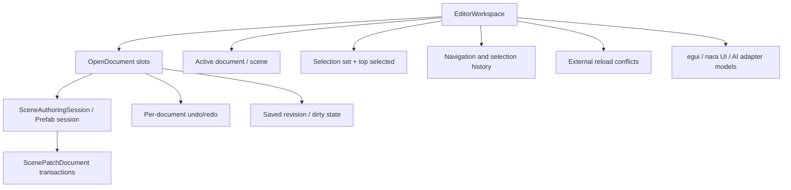

# ADR 0047: Editor Workspace and Scene Document State

**Status**: Accepted
**Date**: 2026-07-09
**Refines**: ADR 0015, ADR 0026, ADR 0034, ADR 0038, ADR 0043

## Context

nara already has strong authoring foundations:

- `SceneDocument` and `PrefabDocument` are persistent data.
- `ScenePatchDocument` is the mutation/undo unit.
- `SceneAuthoringSession` treats the document as truth and projects into a managed live `World`.
- `SceneEditorState` owns Edit/Play/Paused flow and Apply Changes for a narrow safe subset.
- UI adapters render tooling models rather than owning scene mutation.

What is missing is the editor workspace layer. Mature editor behavior needs open documents, active
scene, selection sets, dirty/saved revisions, external file reload conflicts, per-document undo, and
multi-document operations. If this stays implicit, egui, future dear-imgui, future nara UI editor
panels, and AI agents will each invent their own workspace state.

## Decision

`nara_tooling` owns a UI-agnostic editor workspace model above individual authoring sessions.

Rules:

- The workspace is UI-toolkit agnostic and lives in `nara_tooling`, not in egui/dear-imgui adapters.
- Open documents are explicit slots with document kind, stable document ID, optional source path or
  asset reference, loaded document value, source revision, saved revision, dirty state, diagnostics,
  and external reload status.
- `SceneAuthoringSession` remains the per-document scene authoring/live projection boundary. The
  workspace coordinates many sessions; it does not replace patch validation or direct document
  ownership rules.
- Selection is workspace state: a selection set, top-selected item, selection history, and optional
  viewport/tool context. Selection targets use authoring identities and provenance, not runtime
  `Entity` values.
- Undo/redo is per document by default. Cross-document operations must be represented as explicit
  multi-document transactions with per-document patches and rollback diagnostics.
- Dirty/saved state is revision-based. A document is dirty when its current authoring revision
  differs from the last successful save revision.
- External file changes enter as conflict state, not silent overwrite. The editor may offer reload,
  merge, save-as, or keep-local actions, but these are explicit workspace commands.
- Play Mode is anchored to a document snapshot and workspace mode state. Stop Play still discards
  runtime changes by default; Apply Changes flows back through document patches and normal undo.
- Workspace commands are explicit data values. UI adapters render workspace models and submit
  commands; they do not mutate documents or sessions through private paths.
- `ToolingPlugin` should eventually install the workspace resources and scheduling needed for
  tooling models. It should not remain a placeholder once editor workspace features ship.

## Workspace State Vocabulary

| Concept | Meaning |
|---|---|
| `OpenDocumentId` | Stable editor-session ID for one open scene/prefab/asset document |
| `OpenDocumentSlot` | Document value plus path/source identity, revisions, diagnostics, and conflict state |
| `ActiveDocument` | Document currently receiving inspector, viewport, and command focus |
| `SelectionSet` | Ordered selected authoring targets plus top-selected target |
| `DocumentRevision` | Monotonic authoring revision for dirty/saved/conflict checks |
| `ExternalReloadState` | Clean, changed-on-disk, deleted-on-disk, conflict, or reload-failed |
| `WorkspaceCommand` | UI/AI command that resolves to document patches, selection changes, mode changes, or save/reload actions |

## Alternatives Considered

### Option A: Let each UI adapter own workspace state

**Pros**: Fast for the first egui panel.

**Cons**: dear-imgui, nara UI, and AI adapters would diverge. Scene mutation and selection semantics
would leak into UI toolkit code.

**Decision**: Rejected.

### Option B: Use `SceneAuthoringSession` as the whole editor model

**Pros**: Reuses the existing deep module and avoids another layer.

**Cons**: A session is one document projection. It should not own multi-document workspace state,
selection history, save conflicts, or editor-wide mode/navigation concerns.

**Decision**: Rejected.

### Option C: UI-agnostic `EditorWorkspace` above authoring sessions

**Pros**: Preserves document-as-truth, supports multiple adapters, gives AI agents the same command
surface as editor UI, and keeps save/reload/conflict semantics centralized.

**Cons**: Adds a real tooling model before the visual editor exists.

**Decision**: Chosen.

## Success Metrics

| Metric | Target | Measurement |
|---|---:|---|
| UI adapter neutrality | egui and future nara UI editor panels consume the same workspace model | Adapter review |
| Multi-document readiness | Open scene/prefab documents have distinct dirty, saved, undo, and conflict state | Unit tests |
| Safe reload | External file changes never silently overwrite dirty local documents | Unit tests |
| Provenance safety | Selection targets use authoring identities/provenance, not runtime `Entity` | API review |
| Command consistency | UI and AI commands flow through workspace commands and scene patches | Unit/integration tests |

## Risks and Mitigations

| Risk | Severity | Likelihood | Mitigation |
|---|---|---:|---|
| Workspace becomes a hidden editor runtime | Medium | Medium | Keep it as UI-agnostic state/commands; runtime logic stays in app/world systems. |
| Cross-document transactions overcomplicate early tooling | Medium | Medium | Start with per-document undo and reject unsupported multi-document writes with diagnostics. |
| External reload merge is hard | High | Medium | Model conflict state first; merging can be explicit later. |
| Selection state duplicates inspector state | Low | Medium | Make inspector selection a projection of workspace selection once workspace ships. |

## Consequences

- `nara_tooling` should grow `EditorWorkspace` / `OpenDocumentSlot` before editor dogfooding expands.
- `SceneInspectorState` and `SceneEditorState` can remain useful, but they should become parts of a
  broader workspace model rather than independent editor singletons.
- `ToolingPlugin` should install meaningful tooling resources/systems when workspace state lands.
- Save/reload/dirty/conflict behavior should be tested at the tooling layer before a visual editor
  depends on it.

## Open Questions

- Should the first workspace support prefab documents directly, or only scenes plus linked prefab
  source metadata?
- What is the minimal external reload conflict workflow before the editor has a full UI?
- How should project-wide asset documents participate in the same workspace model?

