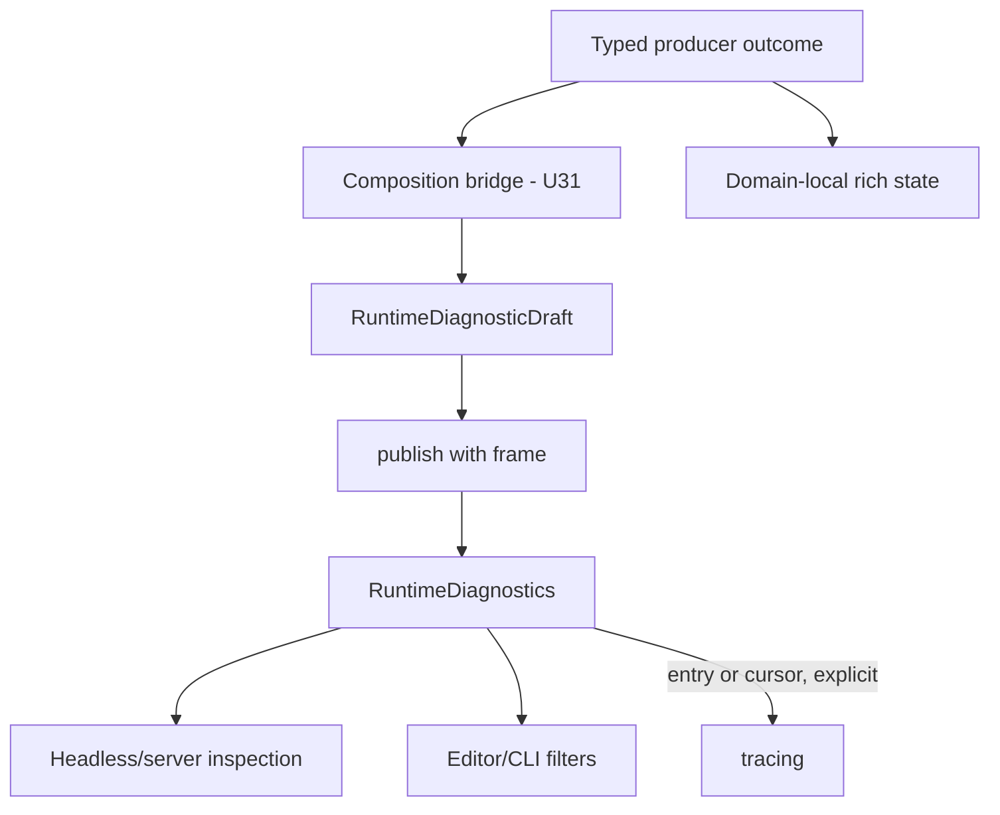

# ADR 0048: Runtime Diagnostics and Observability Bus

**Status**: Accepted
**Date**: 2026-07-09
**Refines**: ADR 0009, ADR 0036, ADR 0042
**Refined By**: ADR 0052: Task Backpressure, Cancellation, and Long-Running Diagnostics;
ADR 0056: Headless Runtime and Dedicated Server Readiness; ADR 0068: Global Resource Budgets,
Metrics, and Diagnostic Privacy

## Context

`DiagnosticReport` serves one bounded validation, import, or patch operation. Runtime failures have
a different lifetime: asset watchers, task pools, render backends, window adapters, and services can
report observations across frames and threads. If each domain exposes only a private queue, headless
operators and editor tools cannot inspect one ordered timeline. If tracing becomes the source of
truth, behavior depends on a subscriber and retained history cannot be queried deterministically.

## Decision

`nara_diagnostic` owns `RuntimeDiagnostics`, the engine-level bounded runtime observation resource.
Producer domains retain their typed errors and local status resources. Composition bridges lower
stabilized producer outcomes into `RuntimeDiagnosticDraft`; those bridges are U31 work and are not
implemented by this core decision.

Rules:

- The bus is observational data. Gameplay and overload policy cannot branch on diagnostics.
- Publication is the only entry path. A draft carries a validated producer, domain, code, severity,
  static safe summary, classified fields, and `None`, `Code`, or `CodeAndFields` dedupe policy.
- Dedupe identity always includes producer, domain, code, and severity. `CodeAndFields` adds sorted
  retained public/project-relative fields including their field class and concrete value variant.
  Sensitive and secret fields never participate, and the internal key is never serialized.
- Publication returns a typed published, deduplicated, or rejected outcome. Sequence exhaustion and
  entries larger than the total retained-byte budget fail structurally; sequence values never wrap.
  Single-entry byte validation occurs before dedupe lookup or mutation.
- Repeat, publish, reject, eviction, expiry, and truncation counters saturate rather than wrap.
- Entry count and retained bytes evict the oldest sequence deterministically. Sequence order,
  entry lookup, and dedupe lookup use separate bounded order and hash indexes so hot dedupe does not
  scan retained history.
- Frame-window cleanup expires by last-observed frame in the named
  `DiagnosticCleanupSet::Retention` during `CoreStage::First`, before runtime producers. A producer
  publishing directly in `First` must declare `.after(DiagnosticCleanupSet::Retention)`. Manual
  retention still obeys count and byte limits. Frame-window resources maintain a sorted expiry
  index and remove only entries whose expiry key is due; steady frames do not scan retained
  history. Diagnostic sequence order may temporarily contain tombstones after expiry, but compacts
  only after tombstones exceed live entries, giving an amortized cleanup cost and a hard
  two-times-live bound between operations.
- Consumers can iterate, filter, or obtain a bounded serialization-only snapshot. There is no public
  arbitrary `clear` API.
- RGF-U22 offline evidence envelopes are a separate trust and retention domain. A collector may
  lower selected diagnostic or pressure observations into the protocol's preclassified typed
  fields, but a runtime snapshot is never itself an evidence envelope. Offline evidence does not
  write back into this bus, participate in gameplay or overload decisions, or move evidence
  ownership into `nara_diagnostic`.
- A tracing sink emits one safe entry or only entries after a caller-owned cursor. The bus does not
  offer an emit-entire-history loop that repeats retained events on every frame, and field values are
  not logged.
- `DiagnosticsPlugin` installs both `RuntimeDiagnostics` and the separate numeric
  `RuntimePressureSnapshots` resource in headless applications. It does not install a tracing
  subscriber or take ownership of the process-global panic hook.

## Resolved Questions

- **Ownership:** The bus lives in `nara_diagnostic`, not `nara_app`. `nara_app` supplies lifecycle,
  frame time, and the `First` schedule ordering point only.
- **Configuration:** Diagnostic settings are validated values owned by `nara_diagnostic`. A host or
  validated project-profile lowering may select them, but project content does not mutate the bus
  directly and cannot bypass hard limits.
- **Replay:** Diagnostics are excluded from the first deterministic gameplay replay contract. An
  explicit tooling capture may serialize bounded snapshots later, but replay behavior cannot depend
  on them.
- **Producer integration:** Asset, watcher, task, window, render, project, and editor bridges remain
  U31. Until those bridges land, this ADR's shared core is intentionally implementation-partial.

## Alternatives Considered

### Option A: Domain-specific queues only

**Pros**: Each subsystem retains its richest state.

**Cons**: Tools must integrate many APIs and cannot form one stable timeline.

**Decision**: Rejected as the engine-wide observation surface. Rich domain state remains useful
behind bridges.

### Option B: Use tracing as the bus

**Pros**: Mature sink ecosystem.

**Cons**: Subscriber-dependent, difficult to query, easy to duplicate, and not an enforceable
privacy or retention boundary.

**Decision**: Rejected as the source of truth.

### Option C: Bounded shared bus with late producer bridges

**Pros**: Gives every runtime profile a stable observation resource without making foundation
errors depend upward.

**Cons**: Requires explicit lowering at each composition boundary.

**Decision**: Chosen.

## Consequences

- Runtime tools have one headless-safe diagnostic resource and stable filters.
- Domain crates keep typed error ownership; `nara_diagnostic` does not become an error-string sink.
- U31 must add and verify each producer bridge after its typed outcomes stabilize.
- Metrics and pressure values remain outside the event buffer under ADR 0068.
- Offline product evidence remains outside both runtime observation resources and crosses its own
  bounded expected-identity boundary before trusted publication.

## Success Metrics

| Metric | Target | Measurement |
|---|---:|---|
| Bounded storage | Count and retained-byte limits hold under load | Eviction tests |
| Dedupe | Repeated events aggregate without cross-domain collisions | Dedupe tests |
| Retention | Manual and frame-window behavior is deterministic | Cleanup tests |
| Headless inspection | Both observation resources work without UI/tracing | Plugin integration test |
| Logging split | Cursor emission never repeats an unchanged history | Thread-local subscriber test |
| Producer coverage | All named runtime domains bridge typed outcomes | U31 integration tests |

## Risks and Mitigations

| Risk | Severity | Likelihood | Mitigation |
|---|---|---:|---|
| The bus becomes gameplay control flow | High | Medium | Expose observations and outcomes only; no policy callback or `should_reject` API. |
| High-frequency failures hide useful entries | High | Medium | Count/byte eviction, explicit dedupe, and saturating drop statistics. |
| Consumers replay retained history into logs | Medium | Medium | Entry-level sink and caller-owned monotonic cursor only. |
| Producer bridges leak source detail | High | Medium | ADR 0068 classification is mandatory and bridge tests use secret canaries. |
