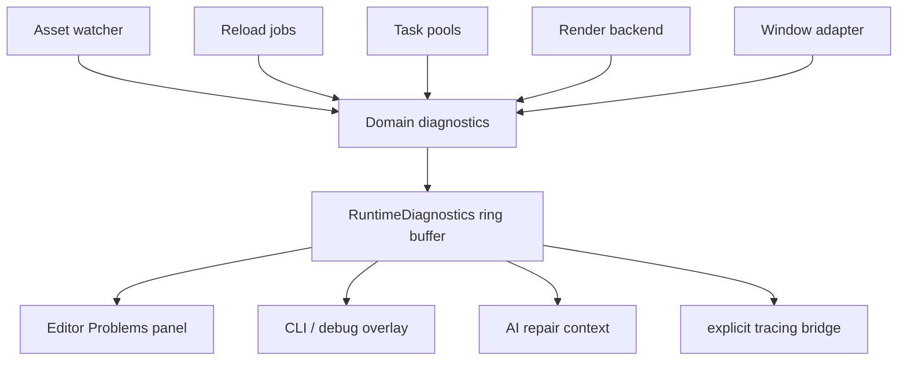

# ADR 0048: Runtime Diagnostics and Observability Bus

**Status**: Accepted
**Date**: 2026-07-09
**Refines**: ADR 0009, ADR 0036, ADR 0042
**Refined By**: ADR 0052: Task Backpressure, Cancellation, and Long-Running Diagnostics; ADR 0056:
Headless Runtime and Dedicated Server Readiness

## Context

`DiagnosticReport` is the right model for validation, import, and patch operations that return a bounded report to a caller.
Runtime failures have a different shape.
Asset watchers, reload jobs, task pools, render backends, window adapters, and runtime services can emit problems over many frames and from multiple threads.
If every domain keeps a private diagnostics resource, editor Problems panels, CLI status, AI repair loops, and tracing bridges must learn every domain-specific queue.

## Decision

nara will add a runtime diagnostics and observability bus as an engine-level observation surface.
Domain diagnostics remain typed at their source, but they can publish normalized entries into the shared bus.

Rules:

- `RuntimeDiagnostics` is observational data, not gameplay control flow.
- The bus stores bounded entries in a ring buffer with deterministic drop policy.
- Entries carry code, severity, message, source domain, frame index, stage/set when known, task ID when known, window ID when known, backend name when known, asset/source path context when safe, and optional scene/component/field context.
- Dedupe is explicit and key-based. Repeated entries can increment a counter and update first/last frame instead of flooding the buffer.
- Domains may keep specialized diagnostics resources when they need richer local state. Those resources should expose a bridge into the shared bus.
- Logging is not the source of truth. A tracing bridge emits selected diagnostics from the bus or domain resources by explicit system or API call.
- Tooling reads the bus through stable filters: severity, domain, code, frame range, and related object context.
- The bus is cleared or retained by policy, not by arbitrary consumers. Editor Problems may retain history across frames; transient runtime overlays may show only recent entries.

## Alternatives Considered

### Option A: Domain-specific diagnostics only

**Pros**: Simple for each subsystem and keeps local context rich.

**Cons**: Tools must integrate many APIs, diagnostics disappear into private resources, and cross-domain timelines are hard to reconstruct.

**Decision**: Rejected as the engine-wide observability model.

### Option B: Use `tracing` as the runtime diagnostics bus

**Pros**: Mature ecosystem and good subscriber support.

**Cons**: Logs are not stable data for editor UI, tests, replay, or AI agents; filtering structured engine context becomes subscriber-dependent.

**Decision**: Rejected as the source of truth. `tracing` remains an output bridge.

### Option C: Shared bounded diagnostics bus plus domain-specific sources

**Pros**: Gives tools one observation surface while preserving typed domain state and explicit logging.

**Cons**: Requires a normalized entry schema, dedupe policy, and retention tests.

**Decision**: Chosen.

## Success Metrics

| Metric | Target | Measurement |
|---|---:|---|
| Shared visibility | Asset/watch/task/render/window diagnostics can appear in one bus | Integration tests |
| Bounded memory | Diagnostic storage has configured entry limits and deterministic drop behavior | Unit tests |
| Dedupe | Repeated identical runtime failures aggregate without flooding | Unit tests |
| Tooling compatibility | Editor/debug models can query by severity, domain, and code | Tooling tests |
| Logging split | Diagnostics can be inspected without a tracing subscriber | Unit tests |

## Risks and Mitigations

| Risk | Severity | Likelihood | Mitigation |
|---|---|---:|---|
| The bus becomes a second event system | High | Medium | Keep entries observational and prohibit gameplay systems from depending on diagnostics for normal behavior. |
| Context schema becomes too wide | Medium | Medium | Use optional context fields and stable domain-specific extension payloads only when justified. |
| High-frequency diagnostics hide real failures | High | Medium | Require dedupe keys, severity filters, and per-domain rate counters. |
| Sensitive paths leak into reports | Medium | Medium | Store project-relative safe paths by default and gate absolute paths behind tooling/debug policy. |

## Consequences

- `nara_diagnostic` should grow runtime diagnostic entry types or a sibling runtime diagnostics module.
- `nara_asset_watch`, asset reload, render backend status, task pools, and window adapters should bridge their runtime diagnostics into the bus.
- Editor Problems panels should prefer the shared bus and link back to domain details when available.

## Open Questions

- Should the bus live in `nara_diagnostic` or `nara_app`?
- Should diagnostic retention be configured through `nara.toml` once project settings are implemented?
- Which domains need replay capture of diagnostics in the first deterministic replay slice?
