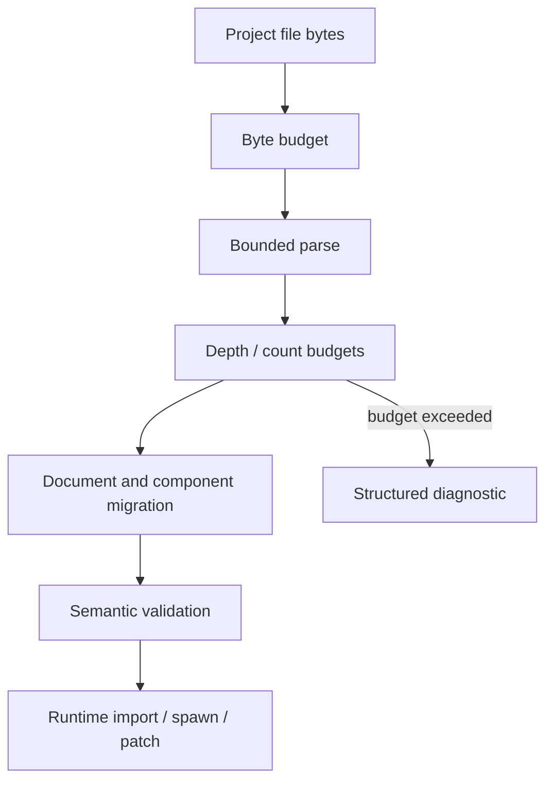

# ADR 0049: Untrusted Project Input and Parse Budget Policy

**Status**: Accepted
**Date**: 2026-07-09
**Last Revised**: 2026-07-18
**Refines**: ADR 0006, ADR 0007, ADR 0009, ADR 0011, ADR 0043
**Refined By**: ADR 0050: Asset Root, Symlink, Junction, and Package Trust Policy; ADR 0068: Global
Resource Budgets, Metrics, and Diagnostic Privacy; ADR 0070: Capability-Oriented Filesystem
Substrate

## Context

nara is code-first, but it intentionally supports JSON/RON scenes, prefabs, patches, asset metadata, imported artifacts, images, and AI-generated project data.
Those files are untrusted input.
Path validation and typed IDs are necessary, but they do not bound memory, CPU, nesting depth, image decode size, patch operation count, or component-value shape.

The immediate risk is simple: a malformed or hostile project file can allocate too much memory, spend too much CPU, or create diagnostics so large that the editor/runtime becomes unusable.
Image import is especially sensitive because encoded files can be small while decoded RGBA buffers are large.

## Decision

nara treats all file-backed project input as untrusted until it passes parse, budget, migration, and validation gates.

Rules:

- File loaders accept an input budget. Defaults are engine-owned and profile-aware; future project settings may lower or raise them within safe limits.
- Budgets cover bytes read, nesting depth, map/list length, component count, field count, string length, patch operation count, prefab expansion count, diagnostic count, and decoded image pixel/byte count.
- Image import must inspect dimensions and format metadata before allocating decoded buffers when the format library permits it.
- Decode and import APIs should use bounded readers or preflight metadata rather than reading unbounded files into memory by default.
- Exceeding a budget returns structured diagnostics with the budget name, observed value when known, and configured limit.
- Budget failure is not a panic and must not partially mutate the target `World`, `AssetServer`, or project database.
- AI/editor repair loops receive enough context to shrink or split the input, but diagnostics themselves are capped.
- Runtime hot reload uses the same budgets as initial load unless a future profile explicitly chooses stricter reload limits.

### Implemented RGF-U1 Slice

Scene, prefab, standalone patch, and component-schema-catalog decoders accept already acquired
`&[u8]` input and enforce encoded-byte, serde shape, string, domain-count, diagnostic-source, and
patch-work limits before publishing a file candidate. Candidate publication remains separate from
frozen-registry semantic validation and target mutation.

This slice does not authorize how a host obtains those bytes. Host-issued bounded file reads,
asset metadata, import artifacts, project-manifest ingest, and ADR 0048 runtime diagnostic bridges
remain owned by their later safety or product-host units.

### Implemented RGF-U10 Slice

`FileCapability::read_to_end_bounded` performs a checked `limit + 1` sentinel read from an
already-authorized handle without retaining an ambient path. `nara_image` pins `png` 0.18.1 and
supports one audited static, non-interlaced PNG path. Before constructing the decoder it performs a
non-allocating signature/IHDR/chunk preflight, rejects Adam7 and `eXIf`, and checks encoded bytes,
width, height, pixels, RGBA bytes, and decoder-work bytes. APNG is rejected during bounded decoder
metadata inspection before pixel buffers are allocated. The importer then atomically reserves the
complete versioned modeled peak before decode.

`ImageBytesImportRequest` owns a fixed-length `Box<[u8]>`. Its caller's earlier acquisition and
allocation are outside this importer model; admission checks the length before PNG scanning and
charges the retained encoded length plus the captured last-good image's actual RGBA length. File
imports own a `FileCapability` and, before dispatch, reserve
`max_encoded_bytes + captured publication overlap`. The bounded read result remains the importer's
single encoded buffer, so no read-to-box duplicate is modeled.
After header preflight, both paths atomically resize the reservation to encoded allocation,
decoder work, new RGBA output, and the captured replacement overlap.

Both paths privately capture the target stable binding, expected version, O(1)
`AssetStateRevision`, and persistent `AssetSlotRevision`. The resulting `ImageImportedAsset` owns
that admission and exposes one
`commit` operation, which revalidates the target and chooses initial load or reload internally
before releasing its charge. A changed or missing last-good value rejects publication, including a
same-length content replacement. An existing value larger than the configured overlap ceiling is
not admitted. A failed initial load publishes no value; a failed reload preserves the last-good
handle, value, source hash, and `AssetVersion` while publishing a static diagnostic code with
classified bounded fields.

`ImageImportBudgetHost` coordinates cloned or separately constructed importers when a process host
explicitly injects the same host-scoped owner. No global or static image-budget owner exists. Its
configured overlap ceiling remains the worst-case admission bound shared by attached importers;
each accepted candidate charges only the immutable prior slot length captured by its revision.
RAII reservations expose aggregate and per-category active/high-water statistics and prove exact
modeled-charge release across success, decode rejection, cancellation, task rejection, panic,
stale completion, and publication failure.

This evidence is PNG-specific. `png::Limits` is defense in depth for decoder-tracked allocations,
not an allocator-capacity, fragmentation, heap, or OS/RSS hard limit; the Nara formula accounts for
requested logical payloads with explicit conservative decoder slack and rejects unbounded decoder
metadata before decode. Other codecs and ADR 0048 runtime-pressure publication remain unproved by
this slice; RGF-U12 composes this importer into a separately budgeted startup closure. Built-in importer
version 2 invalidates version-1 image artifacts; the migration guide requires cache rebuild.
Direct `ImageAsset::new`, serde construction, and raw `Assets<ImageAsset>` mutation are advanced
in-memory paths rather than file-ingest APIs; their callers own any prior allocation budget. Every
state write and value-slot mutation still advances an opaque revision, so those paths invalidate an
in-flight official import candidate instead of silently reusing its publication admission.

### Implemented RGF-U12 Startup Content Slice

The root `ProjectContentLoader` consumes one host-issued project `DirectoryCapability`, one
authorized `ProjectSettingsCandidate`, and one matching `RuntimePlan`. It follows only the declared
startup scene's path-addressed prefab and reflected `AssetRef::Path` image closure. It never scans
the whole asset root, reconstructs authority from logical paths, or accepts `AssetRef::StableId`
without an independently admitted index.

One `ProjectContentBudgetHost` coordinates directory depth/entries, path bytes, open handles,
discovered files, queued and in-flight jobs, dependency edges, encoded bytes, migration/expansion
work, imported artifacts, retained snapshot bytes, and aggregate byte pressure. Every reservation
is RAII-owned, exposes active/high-water evidence, rejects `limit + 1` before publication, and
releases on all failure paths. Snapshot-retained document and image payload charges live until the
last cloned snapshot owner drops; overlapping revisions receive separate charges.

Scene/prefab decoding, canonical asset metadata, structured asset-reference traversal, and the
audited PNG importer all retain their format-specific preflight limits beneath the aggregate host.
Failures return bounded privacy-safe diagnostics and no partial snapshot or asset publication.
Flat explicit post-prefab content succeeds; content requiring unimplemented parent transform or
inherited-visibility semantics rejects. This slice certifies only World-independent document,
schema, digest, and residency truth. RGF-U29 still owns target-World hook/observer eligibility, and
U24 owns runtime materialization without source reopen.

### Implemented RGF-U22 Evidence Transfer Slice

Offline benchmark and workflow evidence crosses an untrusted collector-to-review boundary even
when the collector had no credentials. The version-1 evidence policy checks an encoded-byte ceiling
and caller-supplied outer transfer digest before serde work, then preflights depth, nodes, container
items, single and total string bytes, and duplicate keys. A bounded generic JSON pass enforces
record, per-record field, aggregate field, and raw-log-reference budgets before strict typed decode.

The trusted caller supplies the expected transfer path/table, generator, run, source revision,
protocol digest, subject, complete environment fields, and exact raw-log references independently
of collector bytes. The envelope cannot route itself. Ingestion then validates the subject-owned
record-kind, metric, population, peer, typed-field, and safe-relative-path catalogues, canonical
payload bytes, and the payload digest. Identifier syntax alone is not a privacy guarantee. Sensitive
and secret fields are value-free markers; arbitrary text is rejected instead of heuristically
redacted. Any failure returns no trusted publication.

The only trusted publication entry combines transfer-table preflight with envelope validation. It
accepts only the exact expected regular entry and byte count and rejects links, special files,
traversal, aliases, and unexpected entries before a future extractor may run.
Evidence reuse additionally requires a clean Git-backed opaque revision admission bound to the
explicit repository root, exact HEAD, ancestor/merge-base proof, and complete NUL-delimited change
manifest. Collector bytes cannot self-assert current-source status. Legal Git path spelling is
preserved independently from the envelope's narrower identifier grammar; an unrepresentable path
invalidates all affected evidence rather than enabling selective reuse.
RGF-U22 supplies language-independent fixtures and test-only policy functions, not an archive
parser, network fetcher, production evidence facade, or benchmark framework. U14/U20 own real
artifact acquisition and temporary-root handling.

## Alternatives Considered

### Option A: Trust local project files

**Pros**: Fastest implementation and fewer knobs.

**Cons**: AI-generated files, downloaded packages, and shared projects can still be hostile or accidentally huge.

**Decision**: Rejected.

### Option B: Rely on OS sandboxing and parser errors

**Pros**: Avoids engine-specific budget code.

**Cons**: Does not bound valid-but-huge documents, large decoded images, or combinatorial prefab/patch expansion.

**Decision**: Rejected.

### Option C: Engine-owned parse and import budgets

**Pros**: Gives every file-backed path a predictable safety contract and produces repairable diagnostics.

**Cons**: Requires each loader/importer to thread budget data and tests.

**Decision**: Chosen.

## Success Metrics

| Metric | Target | Measurement |
|---|---:|---|
| Bounded documents | Oversized scene/prefab/patch/component values fail before world mutation | Loader tests |
| Bounded images | PNG encoded/dimension/pixel/RGBA/work/aggregate exact limits pass and limit+1 fails before additional unreserved importer-owned allocation | Owner, facade, and reference-game tests |
| Repairable failures | Budget diagnostics include code, limit, and safe context | Diagnostic tests |
| Consistent policy | Initial load and reload use one owned request, reservation, candidate, and commit path | Integration tests |
| No partial mutation | Budget failures leave target runtime/project state unchanged | Transaction tests |
| Exact release | Every terminal path returns active charges to zero and reserved bytes equal released bytes | Budget snapshot tests |
| Bounded evidence | Every envelope byte/shape/domain limit passes exactly and rejects at limit+1 before trusted publication | `tests/evidence_envelope.rs` |

## Risks and Mitigations

| Risk | Severity | Likelihood | Mitigation |
|---|---|---:|---|
| Budgets reject valid large projects | Medium | Medium | Make limits profile-aware and document how project settings can tune them later. |
| Budget checks are bypassed by a new loader | High | Medium | Require file-backed loaders/importers to accept budget context and add golden oversized tests. |
| Time budgets are hard to enforce safely | Medium | Medium | Prefer deterministic size/count limits first; add cooperative cancellation for long-running tasks. |
| Diagnostics become too large | Medium | Medium | Cap diagnostic counts and summarize repeated failures. |

## Consequences

- Scene, prefab, patch, asset metadata, import artifact, image, and schema catalog loaders should receive budget context.
- Static PNG import uses bounded capability reads, decoder-before-allocation preflight, and a
  reservation-bearing publication transaction; new codecs require their own audited formula.
- Budget defaults should be recorded before project manifest settings expose overrides.

## Open Questions

- Should budget profiles be named `dev`, `editor`, `package`, and `headless`, or derive from project profiles later?
- Which additional image codec has a concrete product consumer and can prove an equivalent bounded
  metadata/decode/publication contract?
