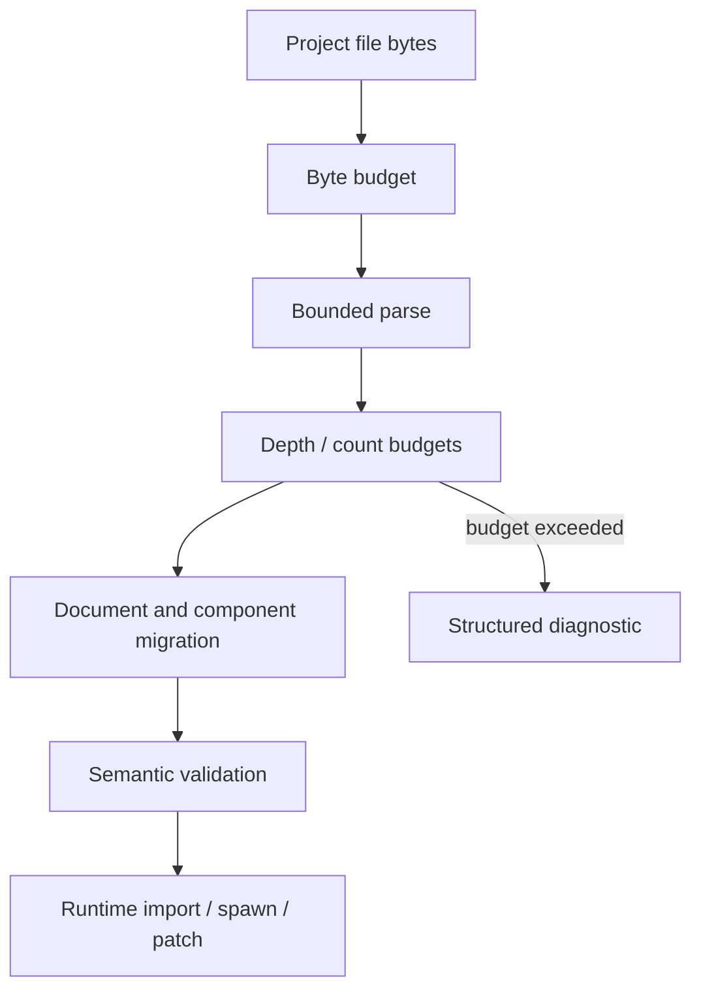

# ADR 0049: Untrusted Project Input and Parse Budget Policy

**Status**: Accepted
**Date**: 2026-07-09
**Refines**: ADR 0006, ADR 0007, ADR 0009, ADR 0011, ADR 0043
**Refined By**: ADR 0068: Global Resource Budgets, Metrics, and Diagnostic Privacy

## Context

nara is code-first, but it intentionally supports JSON/RON scenes, prefabs, patches, asset metadata, imported artifacts, images, and AI-generated project data.
Those files are untrusted input.
Path validation and typed IDs are necessary, but they do not bound memory, CPU, nesting depth, image decode size, patch operation count, or component-value shape.

The immediate risk is simple: a malformed or hostile project file can allocate too much memory, spend too much CPU, or create diagnostics so large that the editor/runtime becomes unusable.
Image import is especially sensitive because encoded files can be small while decoded RGBA buffers are large.

## Decision

nara treats all file-backed project input as untrusted until it passes parse, budget, migration, and validation gates.

Rules:

- File loaders accept an input budget. Defaults are engine-owned and profile-aware; future project settings may lower or raise them within safe limits.
- Budgets cover bytes read, nesting depth, map/list length, component count, field count, string length, patch operation count, prefab expansion count, diagnostic count, and decoded image pixel/byte count.
- Image import must inspect dimensions and format metadata before allocating decoded buffers when the format library permits it.
- Decode and import APIs should use bounded readers or preflight metadata rather than reading unbounded files into memory by default.
- Exceeding a budget returns structured diagnostics with the budget name, observed value when known, and configured limit.
- Budget failure is not a panic and must not partially mutate the target `World`, `AssetServer`, or project database.
- AI/editor repair loops receive enough context to shrink or split the input, but diagnostics themselves are capped.
- Runtime hot reload uses the same budgets as initial load unless a future profile explicitly chooses stricter reload limits.

## Alternatives Considered

### Option A: Trust local project files

**Pros**: Fastest implementation and fewer knobs.

**Cons**: AI-generated files, downloaded packages, and shared projects can still be hostile or accidentally huge.

**Decision**: Rejected.

### Option B: Rely on OS sandboxing and parser errors

**Pros**: Avoids engine-specific budget code.

**Cons**: Does not bound valid-but-huge documents, large decoded images, or combinatorial prefab/patch expansion.

**Decision**: Rejected.

### Option C: Engine-owned parse and import budgets

**Pros**: Gives every file-backed path a predictable safety contract and produces repairable diagnostics.

**Cons**: Requires each loader/importer to thread budget data and tests.

**Decision**: Chosen.

## Success Metrics

| Metric | Target | Measurement |
|---|---:|---|
| Bounded documents | Oversized scene/prefab/patch/component values fail before world mutation | Loader tests |
| Bounded images | Images exceeding pixel or decoded-byte limits fail before large RGBA allocation | Importer tests |
| Repairable failures | Budget diagnostics include code, limit, and safe context | Diagnostic tests |
| Consistent policy | Initial load and reload use the same budget defaults | Integration tests |
| No partial mutation | Budget failures leave target runtime/project state unchanged | Transaction tests |

## Risks and Mitigations

| Risk | Severity | Likelihood | Mitigation |
|---|---|---:|---|
| Budgets reject valid large projects | Medium | Medium | Make limits profile-aware and document how project settings can tune them later. |
| Budget checks are bypassed by a new loader | High | Medium | Require file-backed loaders/importers to accept budget context and add golden oversized tests. |
| Time budgets are hard to enforce safely | Medium | Medium | Prefer deterministic size/count limits first; add cooperative cancellation for long-running tasks. |
| Diagnostics become too large | Medium | Medium | Cap diagnostic counts and summarize repeated failures. |

## Consequences

- Scene, prefab, patch, asset metadata, import artifact, image, and schema catalog loaders should receive budget context.
- Image import should stop treating full-file read plus immediate RGBA decode as the long-term contract.
- Budget defaults should be recorded before project manifest settings expose overrides.

## Open Questions

- Which crate owns the shared `ProjectInputBudget` type?
- Should budget profiles be named `dev`, `editor`, `package`, and `headless`, or derive from project profiles later?
- Which image formats can report dimensions without full decode in the selected decoder stack?
