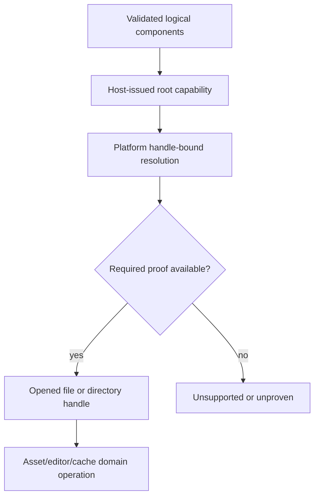

# ADR 0050: Asset Root, Link, Mount, and Package Trust Policy

**Status**: Accepted
**Date**: 2026-07-09
**Refines**: ADR 0007, ADR 0037, ADR 0049
**Refined By**: [ADR 0070: Capability-Oriented Filesystem Substrate](0070-capability-oriented-filesystem-substrate.md)

## Context

`AssetPath` rejects absolute paths, prefixes, empty segments, `.`, and `..`. That lexical rule is
necessary, but it cannot authorize a host filesystem access. Symlinks, Windows junctions and other
reparse points, hard links, mount points, directory replacement, and concurrent rename can change
what a path names between checking and opening it.

The previous decision described canonicalization followed by containment checking. That sequence is
still vulnerable to check/open races and cannot prove that the opened object is the object that was
authorized. Downloaded projects, recovery mode, imports, editor persistence, and generated caches
therefore need a handle-bound policy rather than a stronger path-string convention.

## Decision

nara separates logical asset identity from host filesystem authority and binds authorization to
opened directory or file capabilities as specified by ADR 0070.

Rules:

- `AssetPath` remains a logical project-relative identifier. It is never filesystem authority.
- Asset, editor, cache, recovery, and future export domains receive opaque host-issued capabilities
  and validated relative components. They do not receive an "authorized raw path".
- Authorization and access use the same opened handle chain. `canonicalize`, prefix checks, and
  post-open path comparison may provide diagnostics, but they are not the strict authorization path.
- Strict untrusted/recovery access rejects symbolic links, junctions, every reparse point unless a
  tag-specific policy is explicitly proven and tested, multi-link regular files, unproved
  mount/device/volume transitions, and filesystems that cannot provide the required live-object
  identity evidence.
- A successful open returns the opened handle plus identity evidence. Domain code reads or writes
  through that handle; it does not reopen a checked path.
- Handle-bound resolution proves which object was authorized; it does not freeze that object's
  bytes or link count. A domain that requires stable input verifies an expected digest while reading
  or copies the stream into an engine-owned immutable candidate before publication.
- Trusted local mode may deliberately select a weaker, explicitly reported proof tier for developer
  workflows. It never silently upgrades that tier to strict and never grants out-of-root access from
  project content alone.
- Watcher paths are observations only. Existing targets are resolved again through the source
  capability before publication. A removed or rename-from leaf uses the previously indexed
  live-object identity, a verified parent capability, and an expected generation because the leaf
  can no longer be reopened.
- Import cache and generated artifact roots obey the same capability rules as source roots.
- Diagnostics expose logical or project-relative context by default. Absolute host paths and native
  identifiers are sensitive tooling data.

## Alternatives Considered

### Option A: Validate strings and canonical path prefixes

**Pros**: Portable and easy to implement.

**Cons**: Does not bind the check to the opened object and loses races against link or directory
replacement.

**Decision**: Rejected.

### Option B: Canonicalize, open by path, then compare the final path

**Pros**: Detects many accidental escapes and is available through common APIs.

**Cons**: Post-open comparison cannot prove the intermediate resolution chain, and path-based write
or replacement can race again after validation.

**Decision**: Rejected as strict authorization; allowed only as explicitly weaker trusted evidence.

### Option C: Host-issued capabilities with handle-bound resolution (Chosen)

**Pros**: Keeps ambient filesystem authority out of domains, binds access to evidence, and fails
closed when a platform cannot prove the requested policy.

**Cons**: Requires platform-specific adapters, capability tiers, and more integration testing.

**Decision**: Chosen.

## Success Metrics

| Metric | Target | Measurement |
|---|---:|---|
| Bound access | Domain reads and writes use the handle whose identity was validated | API and boundary tests |
| Traversal resistance | Link/reparse and directory-swap attempts cannot escape a strict capability | Platform integration tests |
| Identity proof | Hard-link and mount/device/volume uncertainty fails closed in strict mode | Negative platform tests |
| Watch safety | Existing targets reopen through a capability; missing targets reconcile from indexed identity and generation | Watch integration tests |
| Safe diagnostics | Default errors do not expose absolute paths or native IDs | Diagnostic tests |

## Risks and Mitigations

| Risk | Severity | Likelihood | Mitigation |
|---|---|---:|---|
| Platform APIs provide different proof strength | High | High | Model proof tiers and `Unsupported` explicitly; never emulate strict access with path checks. |
| Network or custom filesystems report unstable identity | High | Medium | Reject strict mode unless the adapter proves the required identity contract. |
| Trusted mode is mistaken for package safety | High | Medium | Put proof tier in receipts/errors and require the host, not project content, to choose trust. |
| Watch events race with rename | Medium | High | Reopen existing targets; route missing targets through bounded identity/generation reconciliation. |

## Consequences

- `AssetSourceRoot::source_path` cannot remain the authorization boundary.
- RGF-U3 already routes file-backed project-manifest ingest through `nara_fs`; RGF-U12 extends the
  same authority to the startup content closure. Asset-wide enumeration and watch/cache migration
  remain trigger-driven, while editor persistence/recovery belongs to proposed ADR 0091.
- Existing path-based containment checks may remain only for logical validation or safe diagnostics,
  not as evidence that a file access is authorized.
- Unsupported platform/filesystem combinations produce structured failures instead of a permissive
  fallback.

## Open Questions

- Which trusted developer workflows justify an explicitly weaker proof tier after strict package and
  recovery modes are complete?
- Which packaged-game mount providers can issue native capabilities with equivalent identity proof?
