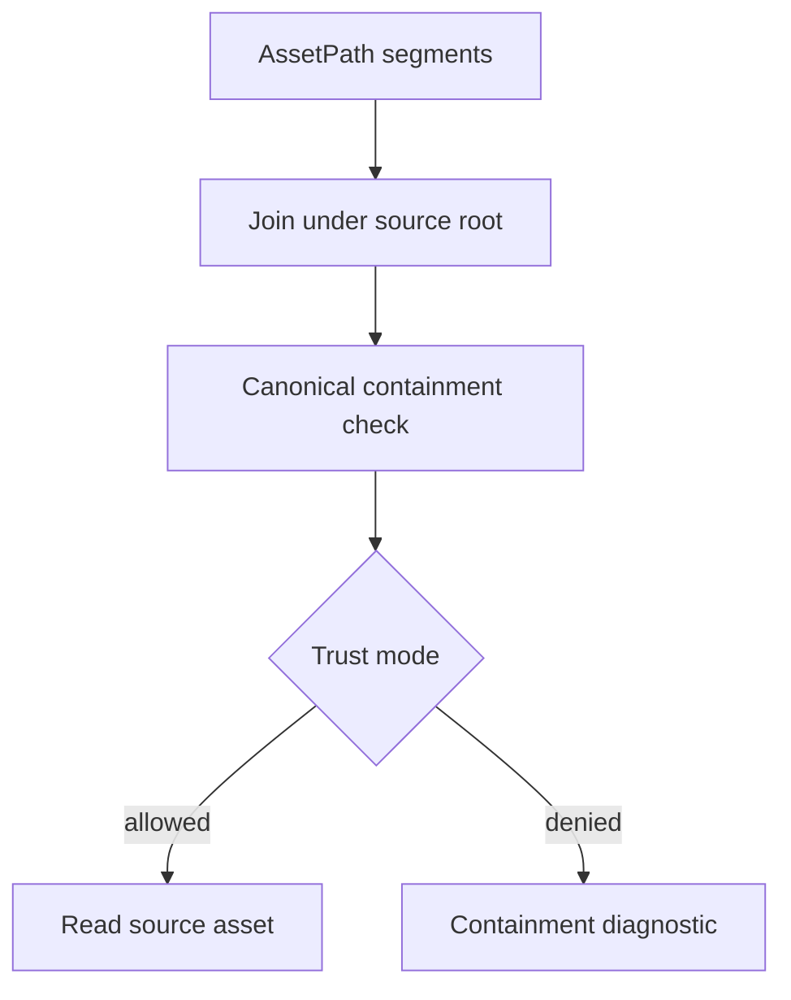

# ADR 0050: Asset Root, Symlink, Junction, and Package Trust Policy

**Status**: Accepted
**Date**: 2026-07-09
**Refines**: ADR 0007, ADR 0037, ADR 0049

## Context

`AssetPath` rejects absolute paths, drive prefixes, empty segments, `.`, and `..`.
That is necessary but not sufficient for file-backed projects.
On real filesystems, symlinks and Windows junctions/reparse points can make a root-joined path resolve outside the asset root.
Package imports and AI-generated projects make this a trust boundary, not only a convenience feature.

## Decision

nara separates logical asset paths from filesystem containment and trust policy.

Rules:

- `AssetPath` remains a logical project-relative identifier. It is not proof of filesystem containment.
- `AssetSourceRoot` owns root canonicalization and containment checks for file-backed sources.
- Symlinks, Windows junctions, and other reparse points are treated as traversal mechanisms.
- Default package/untrusted mode rejects any asset path whose resolved filesystem target escapes the canonical source root.
- Trusted local-project mode may allow in-root symlinks that resolve inside the root. Out-of-root targets still require explicit opt-in policy and diagnostics.
- Import cache paths and generated artifact paths must also stay under their configured root.
- Watcher rename/create events are translated only after containment checks.
- Diagnostics should report logical asset path and safe project-relative context. Absolute resolved paths are tooling/debug detail, not default user-facing output.

## Alternatives Considered

### Option A: String validation only

**Pros**: Simple and portable.

**Cons**: Symlink and junction escapes bypass string-only checks.

**Decision**: Rejected.

### Option B: Always follow symlinks

**Pros**: Convenient for local development and shared asset folders.

**Cons**: Unsafe for packages and downloaded projects; import cache and watcher behavior becomes hard to audit.

**Decision**: Rejected as the default.

### Option C: Trust-mode containment policy

**Pros**: Safe by default for packages while preserving explicit local development flexibility.

**Cons**: Requires platform-specific tests and careful diagnostics.

**Decision**: Chosen.

## Success Metrics

| Metric | Target | Measurement |
|---|---:|---|
| Root containment | Out-of-root symlink/junction targets are rejected by default | Filesystem tests |
| Import cache safety | Generated artifacts cannot escape cache root | Filesystem tests |
| Watch safety | Watch events outside the root do not become asset source changes | Watch tests |
| Developer flexibility | In-root symlinks can be allowed by explicit trusted policy | Policy tests |
| Safe diagnostics | Default diagnostics avoid leaking absolute host paths | Diagnostic tests |

## Risks and Mitigations

| Risk | Severity | Likelihood | Mitigation |
|---|---|---:|---|
| Cross-platform containment differs | High | Medium | Add Windows junction/reparse tests and Unix symlink tests where supported. |
| Local artists rely on out-of-root shared folders | Medium | Medium | Provide explicit trusted-source policy later, not silent follow. |
| Canonicalization fails for missing files | Medium | Medium | Canonicalize existing parent plus final component policy and diagnose missing parents separately. |
| Watcher reports paths after rename race | Medium | Medium | Treat failed containment resolution as diagnostic and do not emit source changes. |

## Consequences

- Asset database scanning, import jobs, hot reload, and watcher translation must call the same containment policy.
- `AssetSourceRoot::source_path` should not be the only filesystem safety gate.
- Package loading and future export/import flows need an explicit trust mode.

## Open Questions

- Should trusted out-of-root folders be declared in `nara.toml` or only in editor/importer sessions?
- How should packaged games represent allowed mounted asset roots?
- What is the minimum Windows junction test that can run reliably on developer machines?

