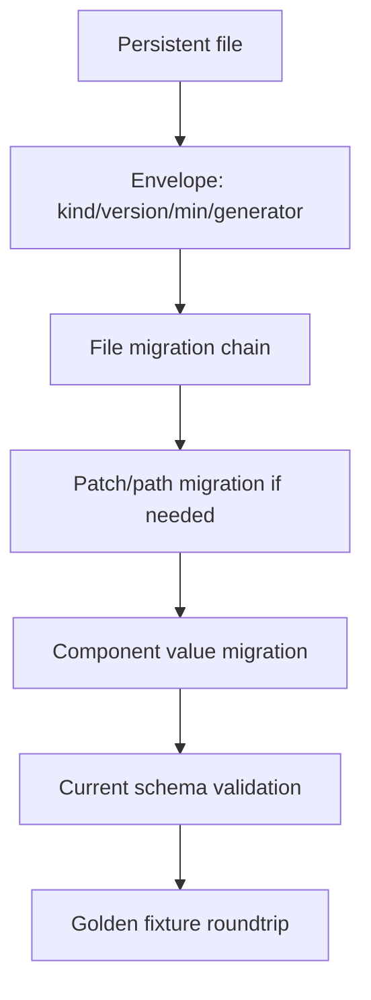

# ADR 0051: Persistent File Envelope, Migration, and Golden Fixtures

**Status**: Accepted
**Date**: 2026-07-09
**Refines**: ADR 0006, ADR 0007, ADR 0011, ADR 0043, ADR 0045
**Refined By**: ADR 0055: Feature Matrix, Boundary Checks, and Compatibility Fixtures

## Context

Scene, prefab, and patch documents have format versions.
Asset metadata and import artifact records do not yet share a file envelope.
Component schema migration exists, and document migration policy exists, but persistent files still lack one consistent header contract and long-term golden fixtures.

Without a shared envelope and fixture strategy, every file format will invent version names, generator metadata, unknown-field behavior, and migration tests separately.
Patch migration is especially sensitive because schema field paths can change across component migrations.

## Decision

Every nara-owned persistent project file uses a small envelope and participates in golden fixture testing once it is file-backed.

Rules:

- Persistent files include at least `kind`, `format_version`, `engine_min_version`, and `generator`.
- Scene, prefab, scene patch, asset meta, import artifact record, component schema catalog, and future project manifest files each have a distinct `kind`.
- Unknown future versions fail with structured diagnostics.
- Known older versions migrate through explicit pure migration chains before validation.
- Runtime load may migrate in memory but must not rewrite source files silently.
- Patch migration runs before patch validation/apply and must rewrite operation payloads and field paths through registered migration data.
- Component field path migrations are part of schema migration review when a field is renamed, moved, split, or merged.
- Golden fixtures live under `tests/fixtures/format-vN/` or an equivalent crate-local fixture directory and cover load, migrate, validate, and canonical reserialize behavior.
- Golden fixtures test codes and structural output, not unstable prose text.

## Alternatives Considered

### Option A: Per-file ad hoc version fields

**Pros**: Easy to add incrementally.

**Cons**: Tooling must know every format's header shape; migrations and diagnostics diverge.

**Decision**: Rejected.

### Option B: Version scene/prefab/patch only

**Pros**: Covers the largest authoring documents first.

**Cons**: Asset metadata, import cache records, and schema catalogs still drift and become hard to upgrade.

**Decision**: Rejected as the long-term policy.

### Option C: Shared envelope plus per-kind migrations

**Pros**: Gives tools one way to identify persistent files while preserving per-format migration logic.

**Cons**: Requires updating existing file structs and adding fixtures.

**Decision**: Chosen.

## Success Metrics

| Metric | Target | Measurement |
|---|---:|---|
| File identification | Every persistent file has `kind` and `format_version` | Fixture tests |
| Safe migration | Known old versions migrate through pure chains | Golden migration tests |
| Future safety | Future versions fail with structured diagnostics | Unit tests |
| Patch compatibility | Field path changes can migrate patch operations | Patch migration tests |
| Stable fixtures | Current canonical output matches golden fixtures | Snapshot/golden tests |

## Risks and Mitigations

| Risk | Severity | Likelihood | Mitigation |
|---|---|---:|---|
| Fixture churn slows refactors | Medium | Medium | Keep fixtures small and semantic; update through intentional migration commits. |
| Envelope changes break hand-authored files | Medium | Medium | Provide clear diagnostics and migration examples. |
| Patch migration loses undo semantics | High | Medium | Store active undo entries in current-version inverse patch format and test migration separately. |
| Import artifact records become over-specified | Medium | Low | Envelope identifies records; cache-key internals remain importer-owned. |

## Consequences

- Existing document structs should converge on envelope fields before their persisted shape changes again.
- `AssetMeta` and `ImportArtifactRecord` need format-version headers, not only cache-key versions.
- Component schema migrations must include field-path migration data when patch documents can reference renamed fields.

## Open Questions

- Should envelope field names be snake_case in both JSON and RON?
- Should `engine_min_version` be a semver string or a structured version object?
- Should golden fixtures live in a workspace-level `tests/fixtures` tree or per-crate fixture trees?
