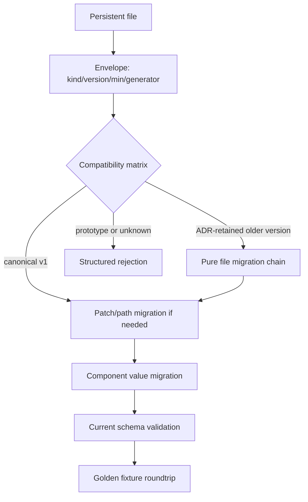

# ADR 0051: Persistent File Envelope, Migration, and Golden Fixtures

**Status**: Accepted
**Date**: 2026-07-09
**Amended**: 2026-07-18 for the RGF-U12 asset-metadata envelope
**Implemented Slices**: RGF-U1 scene, prefab, scene-patch, and component-catalog envelopes; RGF-U12
asset-metadata envelope
**Refines**: ADR 0006, ADR 0007, ADR 0011, ADR 0037, ADR 0043, ADR 0045
**Refined By**: ADR 0055: Feature Matrix, Boundary Checks, and Compatibility Fixtures;
ADR 0081: Schema Source, Stable Identity, Catalog, and Runtime Binding

## Context

Scene, prefab, standalone patch, component-schema-catalog, and asset-metadata files now share the
canonical envelope implementation. Import artifact records and project manifests do not yet share
that file boundary.

Without a shared envelope and fixture strategy, every file format will invent version names,
generator metadata, unknown-field behavior, and compatibility tests separately. Patch migration is
especially sensitive because schema field paths can change across component migrations. However,
nara is unreleased: preserving draft envelopes as historical versions would create a compatibility
promise before any format is fit to become that promise.

## Decision

Every nara-owned persistent project file uses a small envelope and participates in golden fixture
testing once it is file-backed. Corrected draft formats reset to canonical version 1; migration is
conditional on an explicit compatibility ADR rather than automatic for every prototype.

Rules:

- Persistent files include at least `kind`, `format_version`, `engine_min_version`, and `generator`.
- The corrected unreleased shape for each kind is canonical `format_version = 1`. Superseded draft
  readers, structs, and fixtures are removed, and corrected Rust APIs use unsuffixed names.
- Scene, prefab, scene patch, component schema catalog, and asset metadata currently have distinct
  canonical kinds. Import artifact records and a future file-backed project-manifest envelope
  remain long-term participants.
- Unknown future versions fail with structured diagnostics.
- Prototype versions/shapes fail with structured diagnostics rather than using a hidden fallback.
- A non-v1 version is readable only when the format's compatibility matrix links an ADR that names
  its support window, owner, pure migration chain, fixtures, and removal trigger.
- Runtime load may migrate in memory but must not rewrite source files silently.
- Patch migration runs before patch validation/apply and must rewrite operation payloads and field paths through registered migration data.
- Component field path migrations are part of schema migration review when a field is renamed, moved, split, or merged.
- Canonical fixtures live under `tests/fixtures/formats/v1/` or an equivalent format-owner
  directory and cover load, validate, and canonical reserialize behavior. ADR-retained versions add
  migration input/output fixtures under their declared version.
- Golden fixtures test codes and structural output, not unstable prose text.

### Current Compatibility Matrix

| File kind | Written | Readable | Retained migration chain |
|---|---:|---:|---|
| `scene` | 1 | 1 | none |
| `prefab` | 1 | 1 | none |
| `scene_patch` | 1 | 1 | none |
| `component_schema_catalog` | 1 | 1 | none; a successor is checked against its direct predecessor |
| `asset_meta` | 1 | 1 | none |

The eight RGF-U1 JSON/RON golden files intentionally contain empty payload containers. They lock
the common envelope, field names, omission rules, line endings, and empty canonical shape. They do
not prove representative nested payload stability. Non-empty component values, field-ID patches,
embedded prefab overrides, catalog entries, and rejection behavior are covered by construction-based
round-trip and negative tests until a real project fixture is admitted.

RGF-U12 adds strict `asset_meta` JSON decode and canonical serialization around `AssetMeta`.
Unknown fields, wrong kind/version/engine compatibility, malformed stable IDs, over-budget input,
and writer output that would fail the same decoder reject before publication. The committed
reference-game image metadata and `nara_asset` format tests provide the first production-shaped
fixture and round-trip evidence. Import artifact records remain runtime/cache records rather than a
new persistent file kind.

## Alternatives Considered

### Option A: Per-file ad hoc version fields

**Pros**: Easy to add incrementally.

**Cons**: Tooling must know every format's header shape; migrations and diagnostics diverge.

**Decision**: Rejected.

### Option B: Version scene/prefab/patch only

**Pros**: Covers the largest authoring documents first.

**Cons**: Asset metadata, import cache records, and schema catalogs still drift and become hard to upgrade.

**Decision**: Rejected as the long-term policy.

### Option C: Shared envelope plus per-kind migrations

**Pros**: Gives tools one way to identify persistent files while preserving per-format migration logic.

**Cons**: If applied unconditionally, it preserves every prototype mistake as a supported version.

**Decision**: Chosen only for ADR-retained compatibility versions.

### Option D: Shared envelope with a pre-release canonical reset

**Pros**: Establishes one correct version-1 contract and one tooling envelope without carrying
prototype readers or version-suffixed Rust APIs.

**Cons**: Experimental project sources must be rewritten explicitly during the foundation refactor.

**Decision**: Chosen for the current unreleased foundation.

## Success Metrics

| Metric | Target | Measurement |
|---|---:|---|
| File identification | Every persistent file has `kind` and `format_version` | Fixture tests |
| Canonical contract | Corrected version-1 files load and reserialize canonically | Golden tests |
| Prototype removal | Removed draft shapes/readers/fixtures are absent and reject strictly | Negative fixtures and stale searches |
| Safe retained migration | Every non-v1 readable version has an ADR-backed pure chain | Golden migration tests and ledger |
| Future safety | Future versions fail with structured diagnostics | Unit tests |
| Patch compatibility | Field path changes can migrate patch operations | Patch migration tests |
| Stable fixtures | Current canonical output matches golden fixtures | Snapshot/golden tests |

## Risks and Mitigations

| Risk | Severity | Likelihood | Mitigation |
|---|---|---:|---|
| Fixture churn slows refactors | Medium | Medium | Keep fixtures small and semantic; update through intentional migration commits. |
| Canonical reset breaks experimental hand-authored files | Medium | High | Update repository sources together, provide explicit rewrite notes, and reject ambiguously rather than silently reinterpret. |
| Version 1 is reused while an old reader survives | High | Low | Delete stale readers/fixtures and enforce unknown/required-field rejection plus stale-symbol searches. |
| Patch migration loses undo semantics | High | Medium | Store active undo entries in current-version inverse patch format and test migration separately. |
| Import artifact records become over-specified | Medium | Low | Envelope identifies records; cache-key internals remain importer-owned. |

## Consequences

- Existing document structs should converge on one canonical version-1 envelope before their
  persisted shape changes again; prototype alternatives are deleted in the same unit.
- `AssetMeta` and `ImportArtifactRecord` need format-version headers, not only cache-key versions.
- Component schema migrations must include field-path migration data when patch documents can reference renamed fields.
- Runtime readers never perform source write-back. Any source rewrite and cache rebuild/quarantine is
  recorded in the migration guide.
