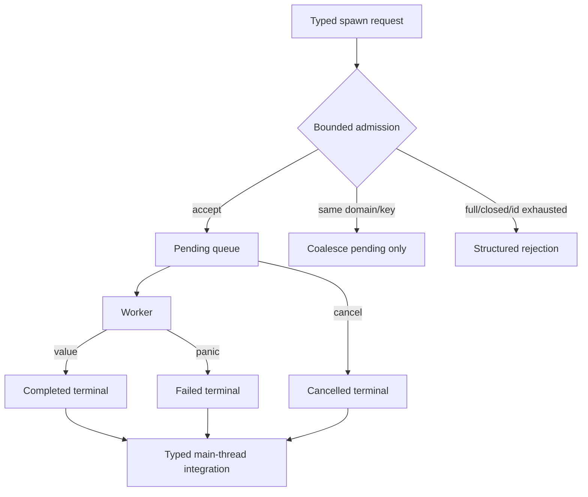

# ADR 0052: Task Backpressure, Cancellation, and Long-Running Diagnostics

**Status**: Accepted
**Date**: 2026-07-09
**Refines**: ADR 0008, ADR 0042, ADR 0048
**Refined By**: ADR 0080: Domain-Owned TaskUpdate Integration Sets

## Context

Asset reload storms, bulk import, image decoding, procedural generation, and editor jobs can submit
work faster than workers finish. An unbounded channel turns overload into memory growth and stale
work. Blocking submission freezes the main schedule. Running work inline after a channel failure
silently changes thread affinity and can execute expensive or untrusted work on the frame thread.

Cancellation, task panic, shutdown, and result ordering are also one state machine. If each caller
interprets those races independently, a completed value can be overwritten by late cancellation, a
worker panic can permanently reduce capacity, and shutdown can wait forever.

## Decision

`nara_tasks` owns bounded threaded pools, explicit admission outcomes, typed first-terminal handles,
and finite shutdown. Domains own typed result integration and overload policy.

### Configuration and admission

- IO, compute, and async-compute pools each have non-zero worker and pending-item limits. Per-kind and
  aggregate worker/pending maxima are validated before any thread is created.
- Submission never blocks for queue capacity and never falls back to caller-thread execution.
- Each request carries an admission tick, `TaskDomainKey`, overload policy, and receives a monotonic
  `TaskId`; together they form `TaskOrderKey`.
- Admission returns `Accepted`, `Coalesced`, or `Rejected`. A rejected closure is discarded without
  execution and the caller receives a typed reason.
- Coalescing matches `(TaskDomainKey, TaskCoalesceKey)`, applies only to pending work, and replaces a
  match even when the queue is not full. The old handle becomes terminally cancelled with the
  replacement ID; running work is never coalesced.

### Execution, cancellation, and statistics

- Every task closure is individually unwind-isolated. Panic becomes the safe classification
  `TaskFailure::Panicked`; panic payload text is not retained in a handle, diagnostic, or dedupe
  key, and the worker continues serving work.
- Rust invokes the process-global panic hook before `catch_unwind`. `nara_tasks` does not replace or
  toggle that global hook. A host that may execute untrusted/recovery work must install a
  process-level redacting hook before starting workers; until that composition policy exists, task
  closures are trusted in-process code and must not place secrets in panic payloads.
- Completed, cancelled, and failed are mutually exclusive first-terminal states. Cancel-after-
  complete cannot erase a value; a detached or late closure cannot overwrite an earlier terminal.
- Cancellation is cooperative for running work. The handle may already be cancelled while the
  closure exits, but physical `running` count and age remain until the worker actually releases it.
- Stats expose admitted, rejected, coalesced, queued, running, started, completed, failed,
  cancelled, taken, oldest queued/running age, shutdowns, shutdown timeouts, and detached workers.
  U18/U31 decide retention and diagnostic bridging; this crate does not log policy decisions.

### Result integration

- Background work never mutates `World`. Domains poll typed handles and apply typed terminals in
  their own declared integration sets. `nara_tasks` defines and configures no business-domain set;
  the asset domain's first concrete vocabulary is `AssetTaskUpdateSet` under ADR 0080.
- `OrderedTaskResults<T>` provides a cross-frame ordered-prefix policy: a larger key remains held
  until every smaller outstanding key is terminal. This makes application order independent of
  worker completion at the explicit cost of head-of-line blocking.
- Domains whose availability is intentionally asynchronous may instead sort one ready snapshot.
  That guarantees stable ordering only within that integration boundary, not across frames. Such a
  domain must not describe the policy as globally completion-order independent.
- Ordering streams should be partitioned by the smallest stable domain key that requires ordering;
  unrelated assets or jobs need not share one global head-of-line barrier.
- No global type-erased result bus exists.

### Test execution and shutdown

- Production and project settings create threaded pools. `TaskPools::inline_for_tests` and
  `run_pending_for_tests` are explicitly test-only drivers of the same bounded admission and terminal
  state machine; there is no production `Deterministic` execution mode.
- Shutdown linearizes with admission, closes queues, attempts bounded drain, cancels remaining
  pending/running handles, and waits only for configured cancel/join deadlines.
- A worker that does not exit by the deadline is detached and reported. Dropping pools never retries
  an unbounded join. Shutdown is idempotent.
- `TaskPlugin` shuts down only pools it created. Externally inserted pools remain externally owned;
  plugin-owned shutdown leaves a typed report in the world for inspection.

## Alternatives Considered

### Option A: Keep unbounded channels

**Pros**: Simple API and no immediate rejection handling.

**Cons**: Overload becomes unbounded memory/stale work, and shutdown has no finite work set.

**Decision**: Rejected.

### Option B: Block submission or run inline when full/closed

**Pros**: Avoids rejecting important work and can look reliable in small tests.

**Cons**: Freezes the frame thread, changes thread affinity, and bypasses cancellation/backpressure
contracts.

**Decision**: Rejected.

### Option C: Bounded queues with typed outcomes and integration policies (Chosen)

**Pros**: Makes overload observable, keeps the main loop responsive, preserves typed ownership, and
lets each domain choose the ordering strength it needs.

**Cons**: Callers must handle rejection/cancellation and ordered-prefix streams can block behind slow
work.

**Decision**: Chosen.

## Success Metrics

| Metric | Target | Measurement |
|---|---:|---|
| Bounded admission | Queue and worker counts never exceed validated limits | Unit tests |
| Explicit overload | Rejection/coalescing returns typed outcomes and updates stats | Unit tests |
| Panic isolation | A panicking task fails its handle and the worker runs later work | Threaded tests |
| Race safety | Exactly one terminal wins cancellation/completion races | Concurrency tests |
| Ordering | Ordered-prefix streams apply reverse completions by key | Typed integration tests |
| Finite shutdown | Uncooperative workers produce timeout/detach reports without blocking drop | Shutdown tests |

## Risks and Mitigations

| Risk | Severity | Likelihood | Mitigation |
|---|---|---:|---|
| Rejection leaves a domain permanently loading | High | Medium | Require every domain to lower rejection/failure into its own terminal state and test it. |
| Ordered prefix causes head-of-line blocking | Medium | Medium | Partition streams narrowly and expose running age/cancellation; use snapshot policy only when semantically valid. |
| Capacity defaults oversubscribe the host | High | Medium | Validate aggregate worker/pending limits and apply project settings before plugin creation. |
| Detached work outlives app state | High | Low | Jobs own inputs only; terminal is first-wins and detached closures cannot mutate `World`. |
| Panic payload leaks secrets | Medium | Medium | Store a stable failure class only; U18 controls safe diagnostic fields. |
| Host panic hook prints a caught payload | High | Medium | Keep hook authority in host composition, require redaction before untrusted work, and never claim `catch_unwind` suppresses stderr. |

## Consequences

- Project task settings configure real `TaskPoolConfig` values before `TaskPlugin` installation.
- Server profiles use threaded bounded pools; deterministic-friendly simulation comes from typed
  admission/application order, not inline execution.
- Asset/import/editor domains must handle every spawn and terminal outcome and declare whether they
  use ordered-prefix or ready-snapshot integration.
- Shutdown timeout/detach is an observable runtime result and later bridges to the diagnostics bus.
- The runtime's safe panic classification does not imply process stderr redaction; host composition
  owns that global policy and U18/U31 own its structured observability bridge.

## Open Questions

- Should real networking or scripting workloads introduce priority classes, or use separate bounded
  pools after latency evidence exists?
- Which domains require an ordered-prefix stream rather than snapshot-local ordering once their
  production workloads are measured?
